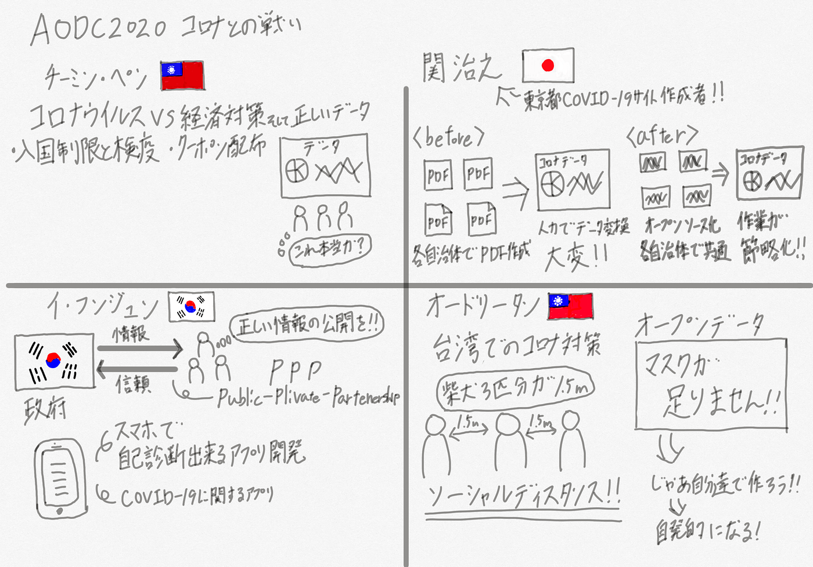

### Asia Open Data Challenge 2020

３年の日向野邦春です。

今回は古橋ゼミ生として初の国際会議に参加しました。コロナウイルスの影響によってオンライン開催となってしまいましたが、会議の議題も「台湾・韓国・日本のコロナ渦における政府のオープンデータ活用の最新事例とこれから」というタイムリーな議題でした。

#### 台湾IT担当大臣 オードリー・タン

この日のメインスピーカーは台湾におけるコロナ対策の中心人物とも言えるオードリー・タン氏でした。彼は台湾が行ってきたコロナウイルス対策でもどれだけ市民にわかりやすくソーシャルディスタンスの取り方を伝えるかなどについて解説をしていました。最初に出ていたのは「ソーシャルディスタンスはしば犬３匹分」という解説です。しば犬３匹分の距離がちょうど１.５mで適切なソーシャルディスタンスだそうです。

他にもオープンデータの正しい発信の仕方として政府がマスクの在庫状況などを公表することによって強制的にマスクを作らせるのではなく自発的にマスク作成に市民が参加するようになるといった画期的なアイデアでした。

#### Cord for Japan 関 治之

次は東京都のCOVID-19情報サイトを作成したCord for Japanの関さんのお話でした。彼は各自治体から送られてくるデータの集約作業の中でPDF版で送られてくる情報に悪戦苦闘したそうです。各自治体でまとめ方がバラバラであるため東京都側で人力でデータを入力していかなければいけない。そこで、関さんは東京都のデータサイトを許可を得てオープンソース化して誰でも同じようなサイトを作れるようにしたそうです。

#### 韓国情報化振興院副代表 イ・フンジュン氏

３人目に韓国情報化振興院の副代表であるイ・フンギュン氏が登壇しました。彼は韓国政府による情報伝達の正確性について挙げていました。市民は常に感染者状況など偽りのないデータを政府に求めているため政府はそれに対して正確なデータを公開していること。また、スマートフォンを利用したコロナウイルス自己診断アプリを開発して感染拡大の防止に努めているそうです。

#### 台湾 チーミン・ペン

最後は台湾の博士であるチーミン・ペン氏が登壇しました。彼は台湾におけるコロナウイルス対策の成功例について解説していました。台湾は厳しい入国制限と検疫体制、保健省大臣による毎日の会見、ソーシャルディスタンスアプリの開発などを行ってきました。そして韓国と同様に市民に対して嘘や偽りのないデータ開示を行ったことによって市民からの支持を得たそうです。加えてアフターコロナの際に経済復興できるようにクーポンけんや補助金を配布することによって経済復興も後押ししていると話していました。

#### スクショ

#### グラレコ

