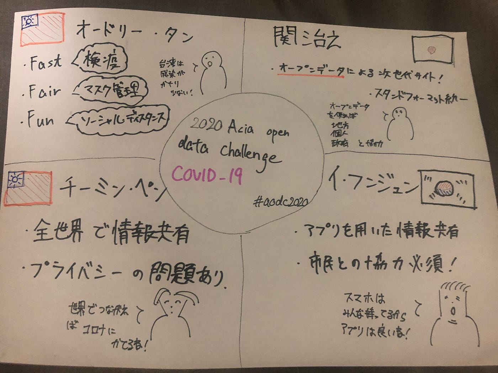
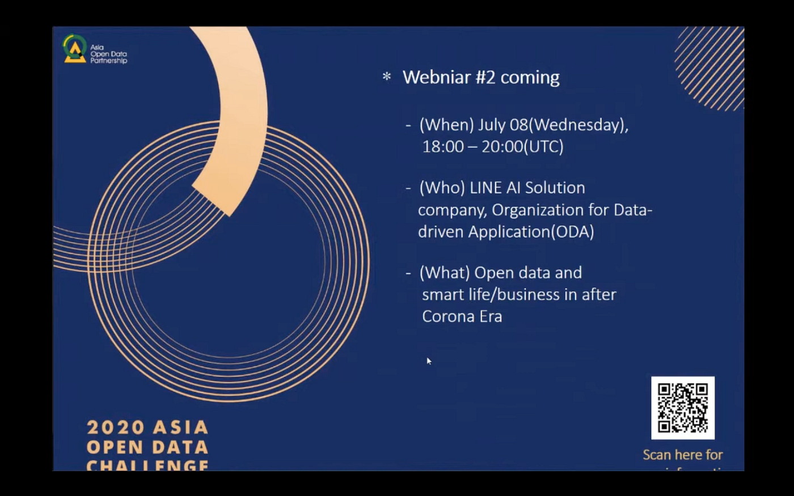

### Asia open data challenge 2020に参加してみました！

[https://www.youtube.com/watch?v=E1j8EhdHRPw&feature=youtu.be](https://www.youtube.com/watch?v=E1j8EhdHRPw&feature=youtu.be)

6月2日に行われた、webinar形式でのオンライン会議「Asia open data challenge」を視聴しました！今回の会議では「台湾・韓国・日本のコロナ禍における政府のオープンデータ活用の最新事例とこれから」をテーマに、台湾からオードリー・タン氏とチーミン・ペン氏、韓国からイ・フンジュン氏、日本から関治之氏からお話を聞かせてもらいました。

**オードリー・タン氏**

台湾のIT担当大臣である彼は、fast fair funの観点の説明を中心に、市民と政府が連携、協力して台湾のコロナウイルス対策について説明されました。fastは他国より早く。コロナウイルスの検疫、情報の入手。fairはマスクの公正化。マスクマップを作り、マスクの在庫の確認。ダッシュボードでの、店でマスクを入手できない方にコンビニでの受け取り。funは、国民の意識、情報拡散のために、イラストを用いたソーシャルディスタンスの説明。

オープンデータから、国民が危機管理をし自主的にマスクを作るなど、国民と政府が情報を開示し合いコロナウイルスの感染を抑止していることが、台湾で感染者が少ない理由だ。

**関治之氏**

東京のコロナ特設サイト設立の開設者。オープンデータを用いることで、全世界から変更、修正可能であり、次世代の政府サイトであることを強調しています。また、これらのサイトは改善が可能であり、事実学生が多くの問題点を改善してくれて、改善による貢献度でモチベーションが上がるのではないかとオープンデータの可能性を説明してくれました。

**イ・フンジュン氏**

nia所属のイ・フンジュン氏は、韓国政府のオープンデータ活用方法について説明されました。誰しもが持っている、スマホからコロナ対策のアプリを作り、誰もが情報を見れるようなシステムを作りました。例えば、マスクマップ、カカオトークでの情報配信です。そして、正確な情報を得るために政府と市民の情報共有が大切と強調しました。

**チーミン・ペン氏**

チーミン氏は、台湾、韓国、日本はもちろん、全世界での情報共有が必要であると説明されました。それは、医療面での貢献につながり、世界がコロナに勝つ方法。しかし、情報の共有というのはプライバシーの問題につながりデータの保護、削除はマストとされました。特に、偽りの情報を流すこと、データの流出が行われる可能性もあり、厳しいともおっしゃっていました。

#aodc2020

