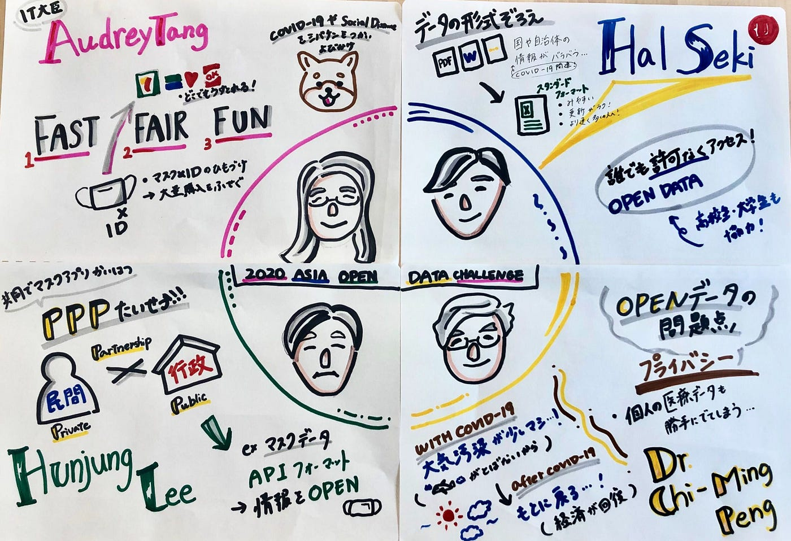
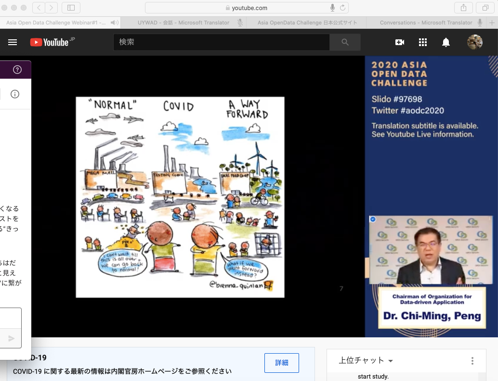
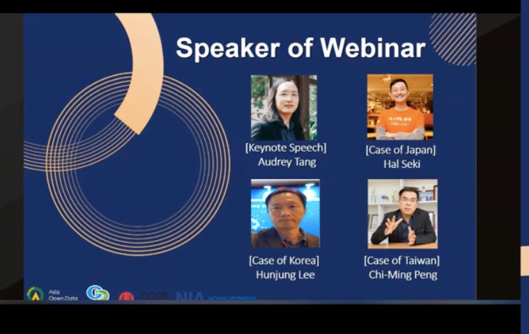

### はじめての国際会議参加

あの”ITの神”と称されるオードリータン氏が参加する「台湾・韓国・日本のコロナ禍における政府のオープンデータ活用の最新事例とこれから」のオンラインイベントに出席してみました。

**あらゆるツールを駆使したイベントスタイル**

このイベントはyoutube上でwebinar方式で行われ、今回のスピーカーの統一の言語である英語はマイクロソフトの[translater](https://translator.microsoft.com/live/join/UYWAD)で日本語翻訳がリアルタイムで閲覧可能、さらに質問は[slido](https://www.sli.do)で受付という現代テクノロジーの恩恵を駆使しまくりなオンラインイベントでした。

アジア諸国からの４人のゲストスピーカーが、COVID-19渦でオープンデータをどのように役立てていったかを事例と共に発表していました。 以下、発表順に登壇者のおはなしをまとめて記述していきます。

**台湾のIT担当大臣 オードリータン氏 、マスク不足を未然に防ぐ！**

トップバッターは[keynote speech](http://archiveblog.legrand.jp/archives/2518)（因みにkeynoteを使用したspeechではありません）として、台湾のIT担当大臣であるオードリータン氏（以下）が台湾のオープンデータを利用したCOVID-19における対策についてお話がありました。まず、タン氏の政策は”FAST FAIR FUN”が特徴的。情報や対策の着手をはやくアクセシビリティをフェアに、そしてCOVID-19渦の大変な時期だからこそユーモアを大切にするという要素が散りばめられています。日本でも話題になった、マスクにIDを紐付け買い占めを不可能にさせるEマスクを導入。販売店のマスクの在庫状況を把握するアプリを開発し、さらにIDと連携させることで本人登録をしネット上で予約販売を可能にし、コンビニで誰がいつでも受け取れるようなシステムをも整備。こうした政策により日本のようなマスク不足を未然に防ぐことができました。 オープンデータとITを積極的に取り入れることで情報を有効活用し必要な物資へのアクセシビリティも高めた事例でした。

**Code for Japan 代表 関治之氏、大量のデータ形式をまとめて誰でも許可なくアクセスを可能に！**

次のスピーカーは日本の関治之氏。東京都のcovid-19の特設サイトを開設し誰もが許可なくCOVID-19に関する情報にアクセスできるようにオープンソースデータを活用。あらゆる情報がさまざまな書式、形式のファイルでごちゃごちゃになっているものを事前にエクセルフォーマットを用意することで編集や更新のしやすさを格段に上げました。サイト開設に高校生や大学生がかかわっていたのも印象的でした。

**Vice President, NIA イ・フンジュン氏、PPPの重要性について**

お次は韓国のイ・フンジュン氏。次の四つを軸にお話をされていました。「 １：PPPの重要性（Public–private partnership ２：国民参加を拡大し、国家問題を一緒に解決する ３：災害に向けた安定的なITインフラの整備 ４：デジタルコラボレーションプラットフォームの準備 」とくにPPPに関するお話は印象的でした。カカオトークなどのアプリを使用しデータを収集しAPIフォーマットでマスクに関する情報などを公開しマスクを検索するアプリを制作しました。行政と民間でどんどんコラボをしていくことで効率的に情報を集め効率的に公開している事例でした。

**Chairman of Organization for Data-driven Application チーミン・ペン氏、オープンデータにおけるプライバシー**

最後は台湾のチーミン・ペン氏。台湾では、国民にマスクを配布、毎日政府が COVID-19の状況について会見をおこなっている。国民の情報を国が収集し管理をしているが、気になるのはオープンデータにおけるプライバシー。オープンデータの有用性と国民の個人情報の保護をあわせておこなう必要性についてお話がありました。また、COVID-19の影響により飛行機が飛ばなくなり、車の走行量がへり大気汚染状況は改善が見られるがアフターCOVID-19で経済再活動がされれば元通りになってしまうことを示唆していました。

以上がスピーカーからのお話にあった各国のCOVID-19へのオープンデータの活用事例でした！改めて情報をオープンにしていく可能性を考えるきっかけになりました。

グラレコ

**スクリーンショット**

