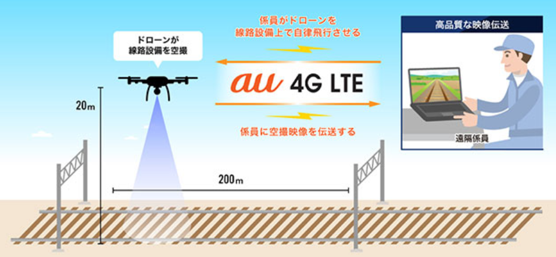
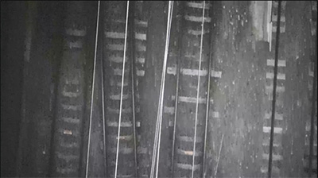
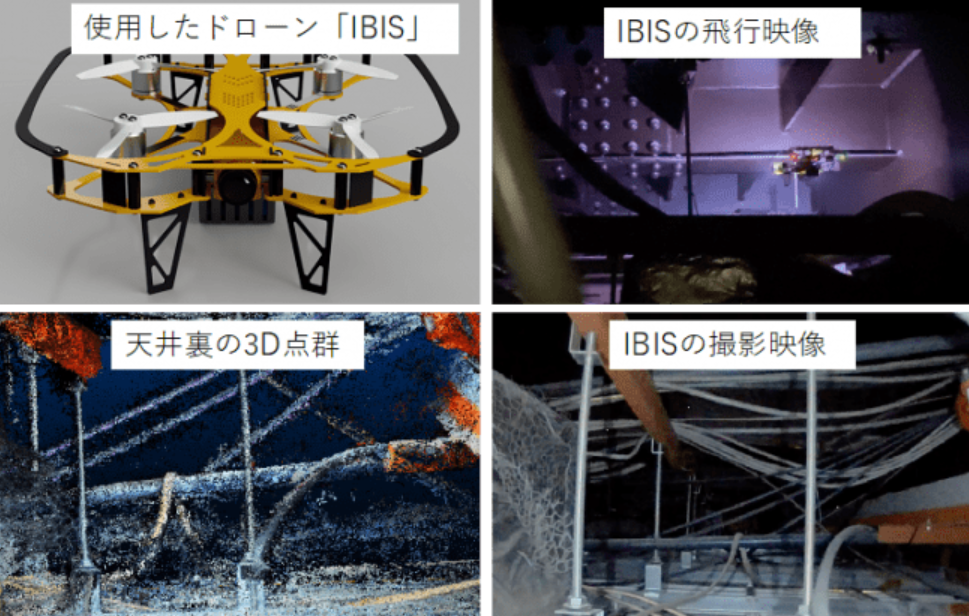
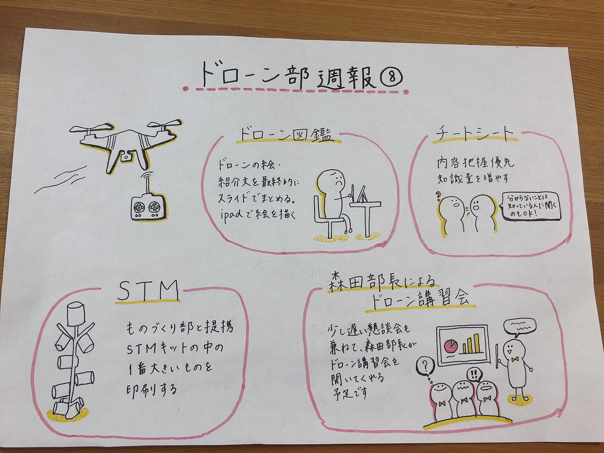

### ドローン週報⑧

**＃議論内容**

- 各To doの進捗具合、今後の進め方の確認

**＃to do**

1. ドローン図鑑

- 先生からiPadを送って頂いたので、各自ドローンの絵を描き始める

- 図鑑は最終的に絵と紹介文をスライドにまとめる形にする

2. チートシート

- 内容把握が優先で、知識量を増やす

- 分からない部分は、知っている人に質問してみる

**3. **STM

- ものづくり部と協力する

- STMキットの1番大きいものを印刷

４．森田部長によるドローン講習会開催予定

**・**森田部長がドローンの知識を教えて下さる講習会を開いてくださる予定です

**＃JR東日本のドローン点検**

今回はJR東日本が設備点検の効率化に向けた実証実験について調べてみました。

まず、線路設備点検です。鉄道会社は異常時に安全確保のために、現地に係員を派遣し、車両や線路設備の点検をします。迅速かつ正確に情報伝達が必要で、この作業には多くの時間と労力を要しています。ですが、ドローンを利用することで移動時間の削減や迅速かつ正確な当該現場の状況の把握の可能が期待されています。

[https://www.drone.jp/news/20200423190016.html](https://www.drone.jp/news/20200423190016.html)

この実証実験では線路設備上空の飛行ルートをドローンが自律飛行し、ドローンに搭載されたカメラやLEDライトを使って線路を撮影しました。昼夜を問わず遠隔地の係員に映像が届くことを確認でき、今後実運用に向けて取り組むそうです。

実証実験で撮影できた線路

[https://travel.watch.impress.co.jp/docs/news/1249025.html](https://travel.watch.impress.co.jp/docs/news/1249025.html)

もう一つは、世界最小クラスの産業用ドローンを使ったJR新宿駅における天井裏点検の実証実験です。株式会社Liberawareが開発した狭小空間特化型ドローン「IBIS」でJR新宿駅の駅舎転住裏を撮影し、その動画から3Dモデルを生成し、配管やケーブルなどの状況確認や計測に成功しました。

今まで、電車の終電から始発までの限られた時間にしか行えなかった作業だったので、業務効率化の可能性を確認でき、今後は人が直接入れない場所の点検においての作業負担軽減を目指して新たな点検手法の確立を目指すそうです。

[https://prtimes.jp/main/html/rd/p/000000080.000034286.html](https://prtimes.jp/main/html/rd/p/000000080.000034286.html)

産業用ドローンの効率化にとても感心し、これからの動向に注目していきたいです。

今回のグラレコです。
