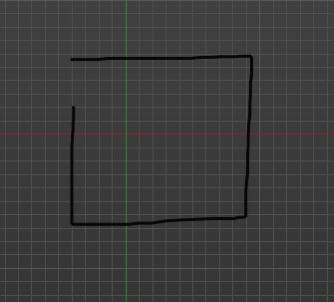
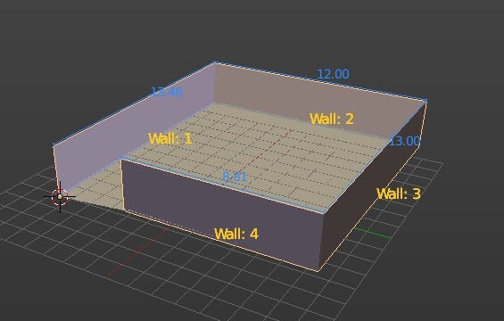
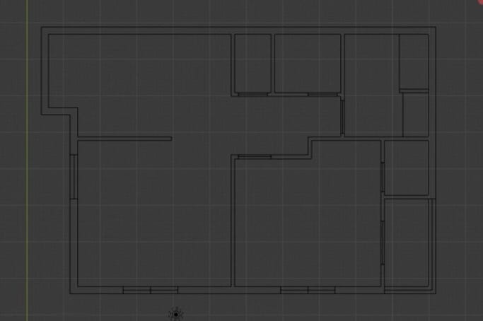
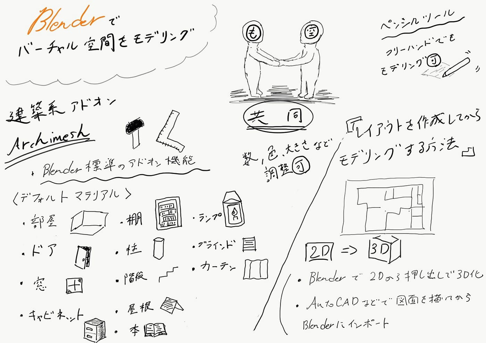

### バーチャル空間をblenderでモデリングするには

次回のハッカソンはclusterでのバーチャル空間、アバター作成をものづくり部と空間デザイン部が共同で取り組んでいくことになりました。そこで今回ものづくり部としては主にblenderを使っての空間作りについて調べてみました。

### ◼︎建築系アドオンArchimeshを使う方法

Archimeshとは建築系のオブジェクトを生成することができるblender標準のアドオン機能です。これを有効にすることである程度の空間を比較的簡単に作ることができるようです。デフォルトで用意されているマテリアルは　「部屋（壁、床、天井）」「ドア」「窓」「キャビネット」「棚」「柱」「階段」「屋根」「本」「ランプ」「ブラインド」「カーテン」です。例えば部屋を作る場合、天井と床にチェックを入れてパラメータの設定値を調整するとマテリアルの数や色、大きさ、壁の厚さなどを変更できます。テクスチャなども木目などに変更できるのでオリジナルにアレンジできるようです。

・[ペンシルツール](https://www.cgradproject.com/archives/783/)

グリースペンシルで描いたラインから部屋を生成することもでき、フリーハンドでモデリングできる便利なツールです。

#### <Archimeshを使った空間作成の参考>

[https://www.pentacreation.com/blog/2020/01/200129.html](https://www.pentacreation.com/blog/2020/01/200129.html)

[https://youtu.be/XiDnW3AwISk](https://youtu.be/XiDnW3AwISk)

### ◼︎レイアウトを作図してからモデリングする方法

この方法は上からみた2Dでの間取りの設計を考えてそれから3Dするというものです。この場合blenderだけで平面の設計をしてから押し出して立体化するかAutoCADなどで先に図面を描いてそれをblenderにインポートするというやり方があります。

〈参考〉

[https://youtu.be/-Y1lP0Q_yfs](https://youtu.be/-Y1lP0Q_yfs)

[AutoCADからdxfファイルをインポート](https://youtu.be/o0k9kZwUhpo)

### 今回のグラレコ

