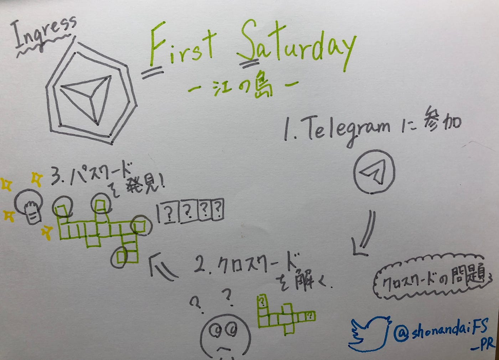
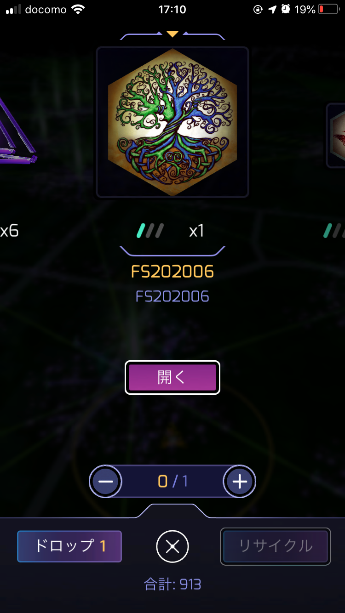

### 位置ゲー部週報

こんにちは！4年平澤彰悟です！ 
今回位置ゲー部は6/6に開催された[First Saturday @江ノ島](https://sites.google.com/view/fujisawa-ingress/)に参加してきました！

今回は、コロナウイルスの影響でオンラインでの開催となりました！
何をやったのかというとみんなでクロスワードを解いてパスワードを手身入れるというミッションを行いました！

オンラインということで、[Telegram](https://telegram.org/)というアプリでコミュニケーションを取っていました！ 私自身Telegramを使うのは初めてで不慣れなところもありましたが、なんとか使いこなしました！

TelegramはWhats upとほぼ同じような仕様であり、本当にチャットに特化したアプリという印象でした！

Telegramでは、主に参加フォームのURLが送られてきたり、不明点などあればメンバー同士で教え合うというような使い方がされていました！
優しい方が多く、私自身とてもまわりの人に助けてもらいました！

そして、なによりクロスワードの問題について、これかも！あれかも！といった具合にみんなで正解を話し合いました！クロスワードの問題は公開されていたので見てみてください！
[https://twitter.com/shonandaiFS_PR/status/1269292313064267776](https://twitter.com/shonandaiFS_PR/status/1269292313064267776)

クロスワードの問題は江ノ島に関わることについて出題されていました！
コアな質問ばかりで、結構難しかったです笑

最終的にはみんなで問題をとき、位置ゲー部員は全員無事にクリアできました！クリアすると以下の写真のアイテムを手に入れることができました！

オンラインということで、不慣れなところもありましたが、家にいながら江ノ島のことを知ることができ、なおかつIngressのアイテムや経験値までもらえるFSはとても新鮮でした！コロナ収束後もこのようにオンラインで開催しているものがあれば、遠方の地域でも参加してみたいです！
