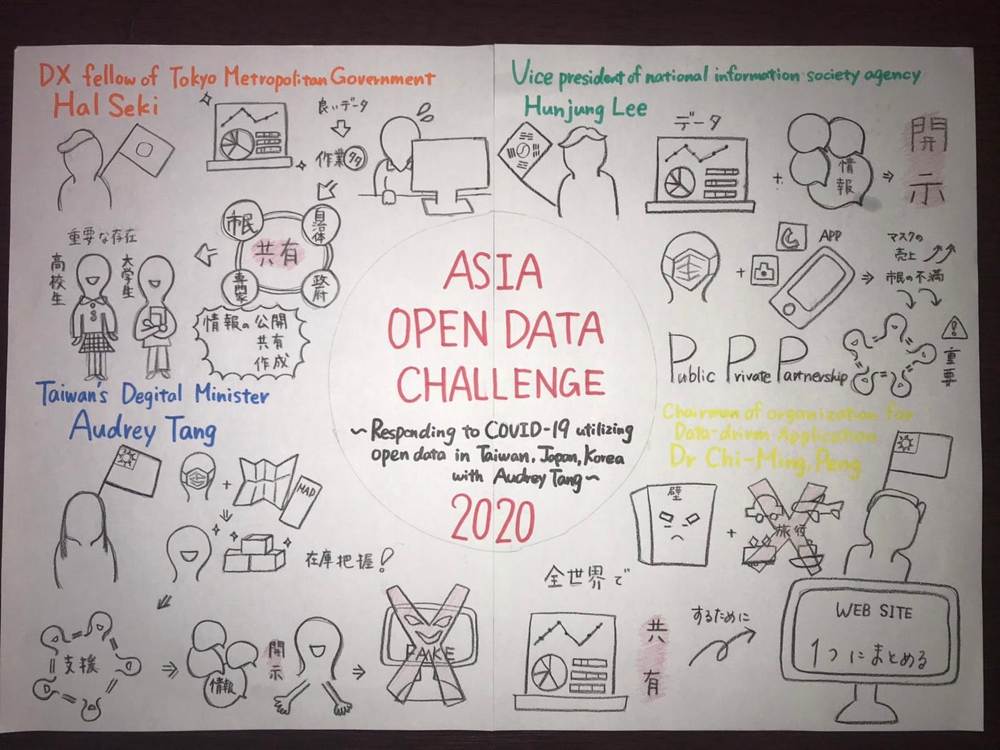
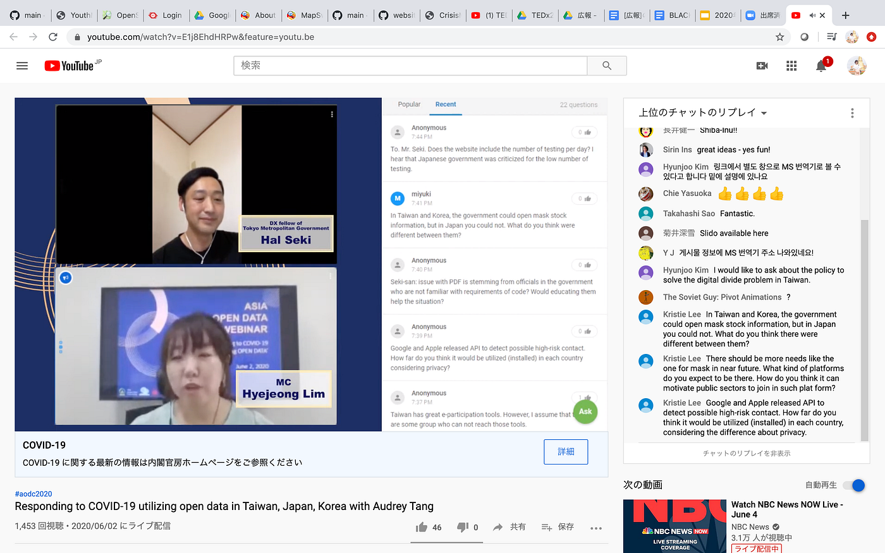
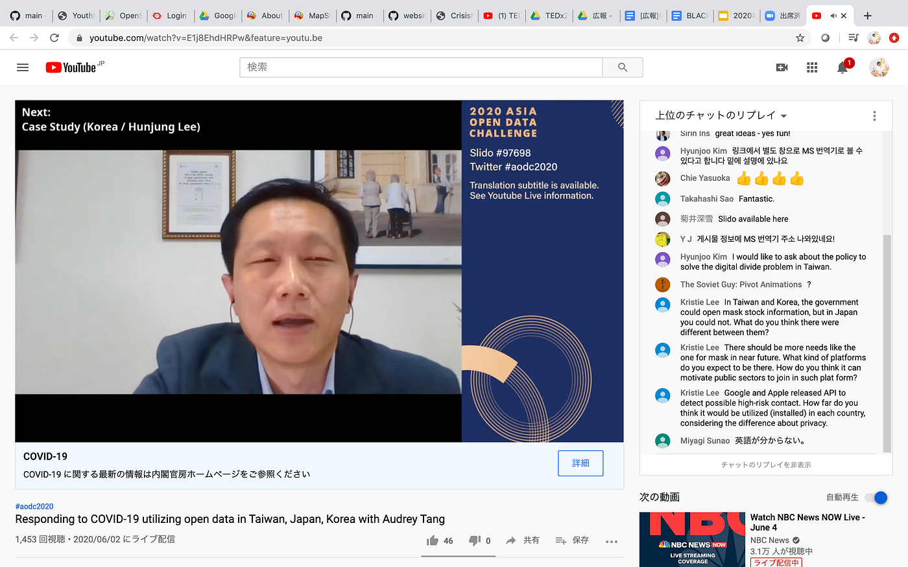
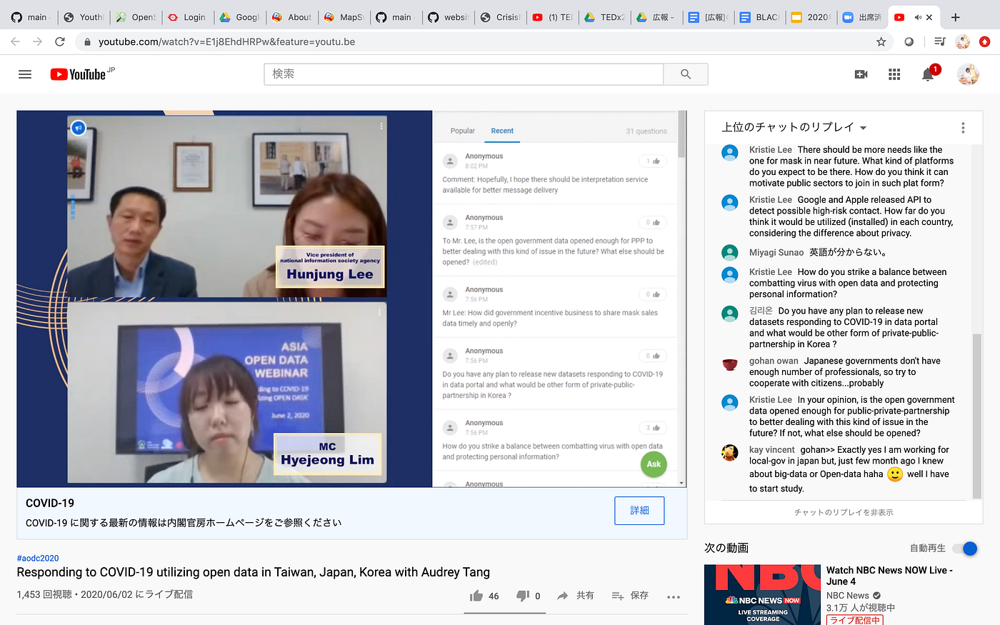

### 初の国際会議！！！

[https://www.youtube.com/watch?v=E1j8EhdHRPw&feature=youtu.be](https://www.youtube.com/watch?v=E1j8EhdHRPw&feature=youtu.be)

6月2日に初めて国際会議を視聴しました！

今回は３カ国から４人のスピーチを聞かせていただきました。台湾のオードリー・タン氏、日本の関治之氏、韓国のイ・フンジュン氏、台湾のチーミン・ペン氏が登壇者の４人です。

４人のスピーチは私にとって非常に難しいものでしたが、共通点を自分なりに発見しました。

それは、情報の公開（開示）、共有です。

自国のデータを隠すことなく、全世界に共有することでFake Newsを防ぐことに繋がり、さらに分析や研究も進みます。

そして我々大学生や高校生を積極的にプログラムに起用したり、全世界で一つのウェブサイトを作ったりと様々なアイデアが出ました。

この国際会議が有意義なものとして働き、一刻も早く、この事態が治まることを願います。

『グラレコ』

『スクショ』

