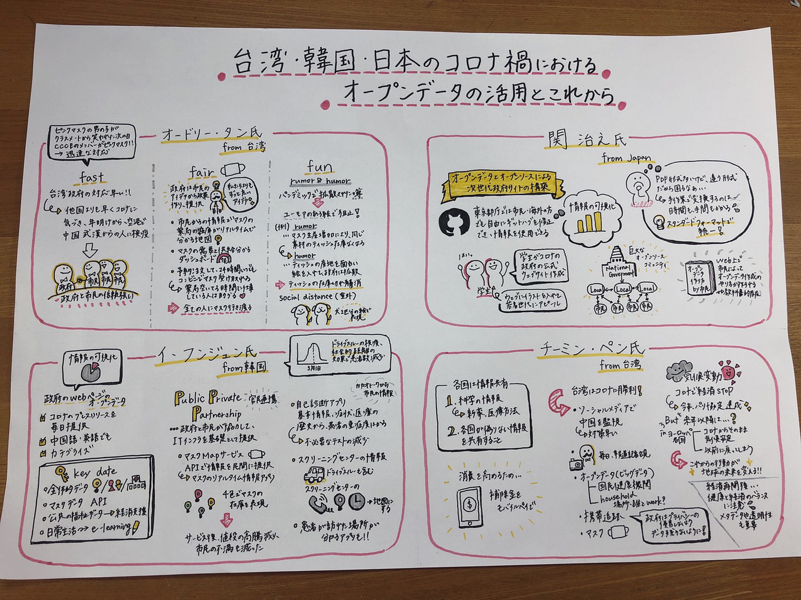
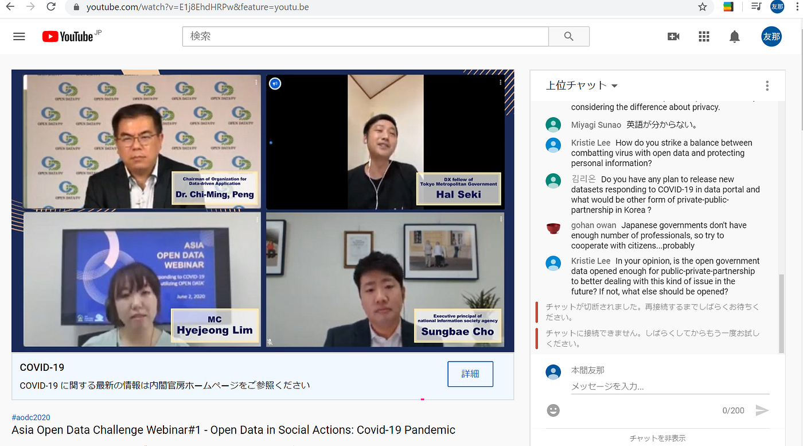
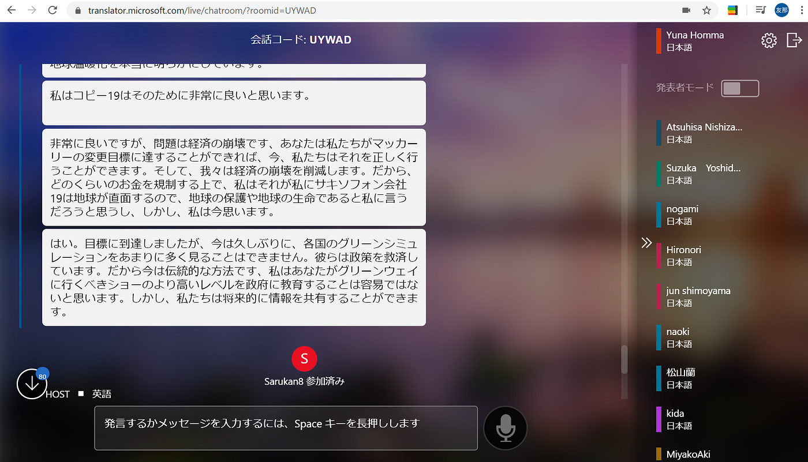

### 台湾・韓国・日本のコロナ禍における政府のオープンデータ活用の最新事例とこれから

2020年6月2日に『台湾・韓国・日本のコロナ禍における政府のオープンデータ活用の最新事例とこれから』について国際会議がオンラインで開催され、参加させて頂きました。そこでは、台湾のオードリー・タン氏、日本の関治之氏、韓国のイ・フンジュン氏、台湾のチーミン・ペン氏のスピーチを聞かせて頂きました。

まず1人目のスピーカーは台湾のオードリー・タン氏でした。fast、fare、funの観点からスピーチされていました。
まずfastの観点では、他の国よりも早く、台湾ではコロナの存在に気づき、年明けから空港で中国の武漢からの検疫を始めていました。日本では２月半ばごろからコロナの対策が強化され始めたので、台湾政府の対応の早さには驚かされました。台湾ではこのような早い対応をするので、市民と政府が信頼関係で結ばれています。
fairの観点から、新型コロナウイルスの際、全ての人にマスクが行き渡るように政府が市民のアイディアから政策を作っているそうです。ボランティアの市民からマスク情報を集めリアルタイムでマスクの在庫が分かるマップシステム、さらにマスクの需要と供給を視覚化するダッシュボードも作っています。また、薬局が空いてない時間に仕事をしている人のために、予約注文をしてコンビニエンスストアで24時間受け取れる体制もあります。
最後にfunの観点では、台湾政府はユーモアのある絵でパンデミックに影響された噂が人々の中で広まらないようにする、humorとrumorの関係についてお話しされていました。例としては、マスクの生産が１日200万だったのが2000万になるので、同じく原材料から出来ているティッシュペーパーの在庫が切れる噂が出回りました。そこで、政府はティッシュペーパーの産地や原料が書かれた、目に入る面白い絵を市民に提供し、ティッシュペーパーの在庫切れを解消に成功しました。また、犬を並べてソーシャルディスタンスを表す絵もあります。噂よりも早く、正しい情報が流れるように試みているそうです。現在噂はSNSであっという間に拡散されてしまうので、それに対抗した印象に残りやすくした絵で、政府の公式の正しい情報を流すことは市民の混乱を抑えることができるので素晴らしい手段だと思いました。

2人目は関治之氏新型コロナウイルスのオープンデータとオープンソースによる次世代政府サイトの構築についてスピーチされていました。
東京都庁が使うギットハブは、市民だけでなく海外の人でも自由に修正でき、誰でも許可なく情報を使用できます。学生団体が作ったコロナ関係の政府の公式ウェブサイトもあるのは驚きでした。ウェブサイトでは若い世代にアピールするためにイラストを用いているそうです。
オープンデータの作成の際、スタンダードフォーマットに統一し、PDF形式などの違う形式で手作業変換する手間を省きました。
また、市民と地方政府がそれぞれ提供しあい、巨大なオープンソースコミュニティができ、市民によってオープンデータの作り方の解説など技術的な教科書的記事もあります。

3人目は韓国のイ・フンジュン氏です。
ドライブスルー検疫や社会的距離などによりコロナの患者の数は下がってきている韓国では政府のウェブページのオープンデータでコロナに関する、プレスリリースを様々なカテゴライズに分けて、毎日市民に提供し、英語と中国語でも発信しているそうです。
さらにPublic Private Partnershipを重要視し、APIで、ITインフラを整え市民が簡単に使えるものを提供しています。マスク価格沸騰を抑えるため在庫状況を色で識別した地図アプリ、不必要なテストを減らすために基本的な情報や症状や医療の歴史に基づいた自己診断アプリ、スクリーニングセンターの情報を地図にしたしたものなど、PPPからコロナウイルスに対抗するものが沢山作られているそうです。

最後のスピーカーは台湾のチーミン・ペン氏です。まずが各国が新薬や医療方法などの科学情報、偽りのない情報を共有することが重視だそうです。
台湾はソーシャルメディアで中国を監視し早めに対策すること、毎日報道記者会見をすること、オープデータを開示すること、携帯追跡、マスクの習慣をすることで、コロナウイルスに現在勝つことができています。
また経済を回すために政府はモバイルペイで補助金を出しています。
そして、経済が世界全体で止まっているため、今年はパリ協定に届くくらい気候変動が改善していますが、これからも継続する行動が必要だそうです。
経済再開後の健康と経済のバランスの取り方やメタデータや透明性も大事で、携帯の追跡データは政府のプライバシーの侵害ならないように、データは残らないようにするべきだとおっしゃっていました。

今回の国際会議は英語で難しく、内容が合っているか不安なのですが、海外のコロナ対策について詳しく知る機会が今までなかったので、勉強になり、有意義な時間でした。オープンデータの重要性を知り、また官民連携で様々なことをデジタルでサービスを提供していたり、ユーモアのある絵で噂を抑えたり、各国それぞれ工夫をしていて感心させられました。これからは世界で有益な情報を交換し合うことでコロナが収束に向かうといいと思いました。

グラレコ

参加記録

