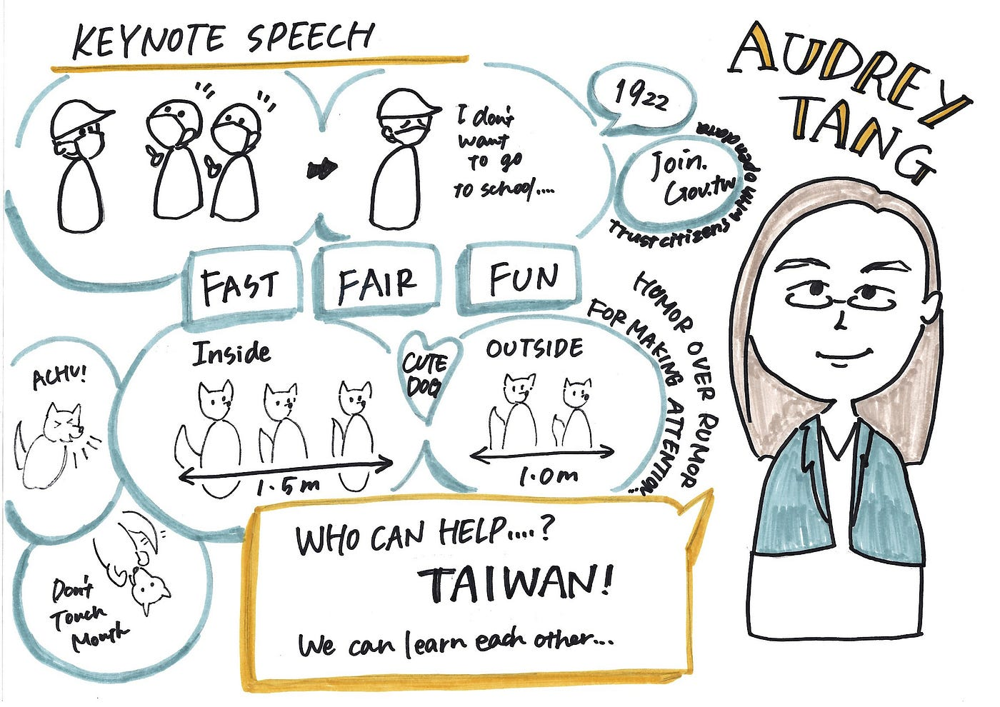
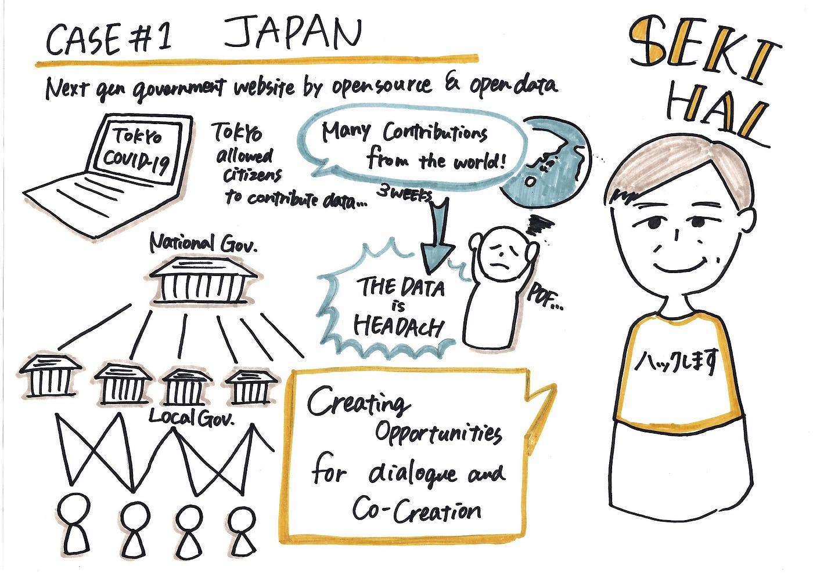
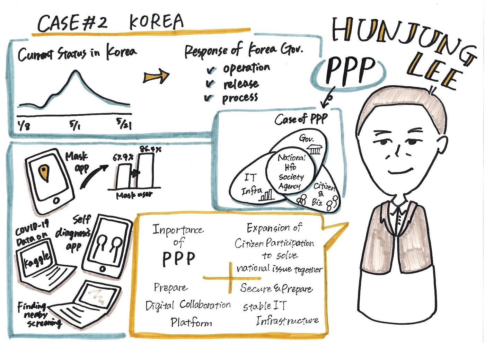
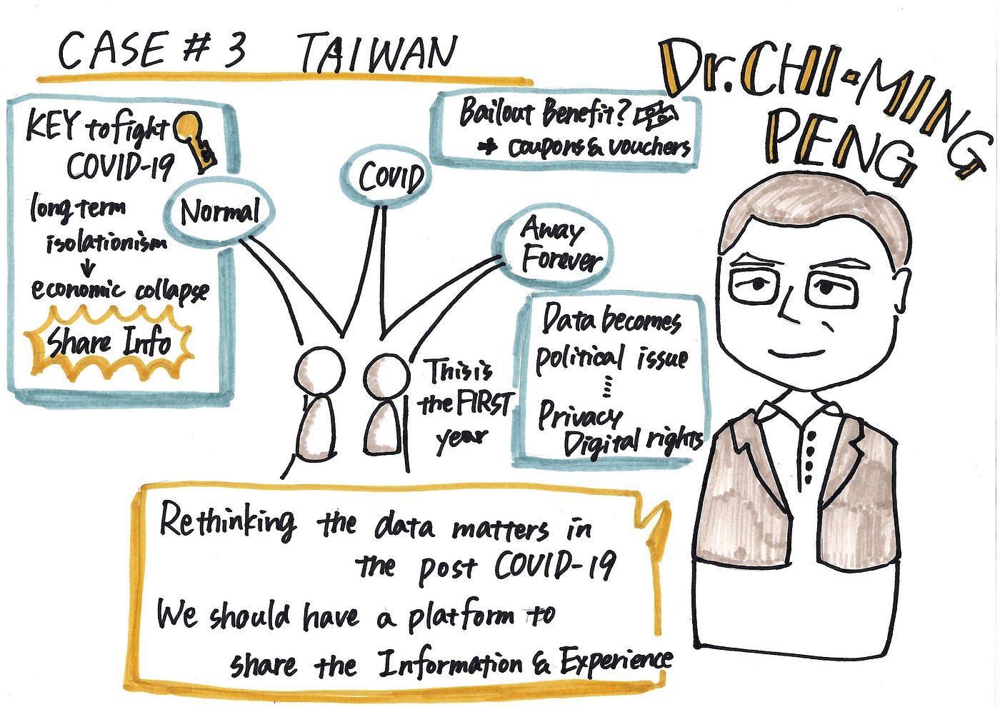
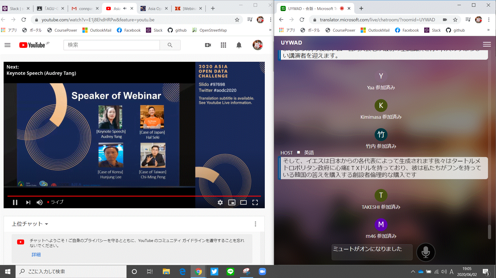

### **「台湾・韓国・日本のコロナ禍における政府のオープンデータ活用の最新事例とこれから」**

Responding to COVID-19 utilizing open data in Taiwan, Japan, Korea with Audrey Tang

6月2日に行われた、2020 Asia Open Data Challengeのオンラインイベント、「**台湾・韓国・日本のコロナ禍における政府のオープンデータ活用の最新事例とこれから」**に参加してきました。
今回はそのレポートをお送りします！

#### 「Keynote Speech」 Audrey Tangさん

オードリー・タンさんのお話では「Fast」「Fair」「Fun」という3つのキーワードが出てきました。台湾モデルで面白いなと思ったのは、「Humor Over Rumor」という言葉で、面白い広告で人々の関心を集めたり、犬を使ってみたりと、ただ注意するだけではなくそこに面白みを加えることで人々の注目を集める工夫がいいなと思いました。どんな困難の中でも、自分たちを鼓舞する姿勢や、お互いから学ぶことの大切さなど、本当に大切なことだと思いました。

#### 「Case #1」 Hal Sekiさん

関さんのお話は日本のことということもあり、とても興味深かったです。政府がオープンデータを取り入れて、一般人や世界中の人がデータを書き込めるようにしたというのは、日本人の私だからこそ、この取り組みがすごく大きな一歩だったのではないかと感じました。人それぞれ得意分野は違うのだから、その道のプロの力を借りるということは大事なことであるし、そうして協力できる環境や機会を作ることも同時に重要であることだと思いました。

#### 「Case #2」Hunjung Leeさん

イ・フンジュンさんのお話では、「PPP」というワードが出てきました。私は初めて出会った言葉だったのですが、公共サービスの提供に民間が入ることをいう言葉だそうです。今回のコロナの状況では、様々な民間サービスが新たな技術を生み出し、韓国の事例の中でもアプリやネットデータの事例がたくさん出てきました。現代ではテレビよりもネットで情報収集をするという人が多くいると思います。そんな時代の中での情報提供はやはり今までとは違うやり方、新しい手法が必要だったということを感じました。

#### 「Case #3」Dr. Chi-ming Pengさん

チーミン・ペンさんのお話では、「Share Information」が大事だと思いました。台湾、韓国、日本のコロナというのが今回のテーマですが、確かに日本の情報ばかりが先だって他国の情報に目を向けられていなかったかもしれないということに気が付きました。台湾ではコロナへの取り組みとして成功している例がいくつもあり、どうして成功したのか、どのように取り組んだのかということを分析して参考にすることが重要だと思いました。また失敗例であっても、こうすればよかったなどといった情報を共有することで、近隣国同士で協力してコロナと戦っていくことができるのだと思いました。

今回、4名の方のお話を聞いていて総じて感じたことは、**「禍を転じて福と為す」**と**「ここがスタート」**ということです。
このコロナ騒動で新たな技術がたくさん生まれました。日本ではリモート○○というものがあちらこちらで聞かれるようになりましたし、必要に迫られないと実行に移せなかったものたちが、必要に迫られて実現したということもたくさんあったと思います。コロナの状況でできなかったもの、なくなってしまったものはたくさんありますが、そこから生まれた知恵もたくさんあったのだということを感じました。
また、コロナとは年単位の付き合いになるということも耳にします。この頃やっと収まったようにも感じますが、また感染が拡大していく恐れも消えません。いつまた新たなコロナが生まれるかもわかりません。油断せずに長くコロナと付き合っていくつもりで未来を考えていくことが必要だと感じました。

青山学院大学古橋研究室 3年

大岸 裕紀
