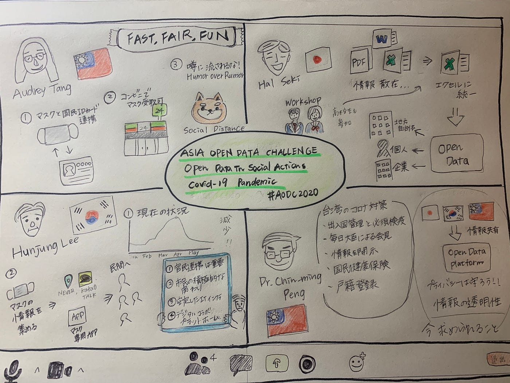

### 国際会議に参加！

「台湾・韓国・日本のコロナ禍における政府のオープンデータ活用の最新事例とこれから」

６月２日に行われたwebiner形式での国際会議に参加しました。今回の会議のスピーカーは４名で、台湾のデジタル担当政務委員オードリータンさん、関治之さん、イ・フンジュンさん、チンミンペンさんでした。今回のコロナ禍における台湾、日本、韓国のオープンデータの活用例、そして新型コロナウイルスにどのように各国が立ち向かったのか貴重な話を聞くことができました。

**台湾デジタル担当政務委員 オードリー・タンさん**

台湾では行政がマスクの情報を自国の健康保険証と結びつけることで全ての人にマスクを行き渡るシステムがつくられていました。また、マスクの情報を常に最新状態で受けることのできるアプリを作り、薬局での受け取りを可能にしたそうです。そして仕事終わりの人は薬局では受け取ることができないことがあり、その後コンビニでの受け取りを可能にしたそうです！join.g0v.tw という行政のｏを0になっているシビックテックの活躍により接続のしやすさを可能にしたことも台湾の情報の速さの鍵の一つだそうです。そしてそれらの政府側の情報をCSVファイルで公開したことによってg0vが活動しやすくなり、スピード感につながったそうです。また危機的な状況下でも「Humor over Rumor」を大事にしており、フェイクニュースや噂をあえて利用して政府から情報を流すことでより人に注目してもらえるようにしていたそうです。

いまだにマスクが売ってなかったり、買い占め故に本当に必要な人に届いてないのは確実にもらえるという安心感のなさからくることを考えるとこのシステムを是非とも日本に導入して欲しいです、、、

**Code for Japan の関 治之さん**

東京都の公式covid-19の感染症対策サイトの開発を行いました。このサイトの作成に当たり多くの地域、高校生や大学生も協力し作り上げたそうです。その中で国や自治体が公表している情報が機械判読性のひくいデータであったり、データの形式が揃っていないといった問題がありました。特にPDFは編集がしにくく、データに対して基準を設け、データを集めやすくすることに尽力したそうです。こデータを正しく公開することそして協力しあい、オープンデータの価値を高めていくことが重要であることが言えます。

**韓国 イ・フンジュンさん**

韓国では現在コロナの感染者数は減少しており、それがなぜ可能であったかを韓国のコロナ対策を通して説明していました。韓国ではマスクの情報をカカオトークやNEVERを通じて情報を得られるようにしており、さらにマスク専用アプリなどを用いて全ての人に情報が届くようにしていたそうです！今回のコロナ禍を通して官民の連携の重要性、また安定したITインフラ、デジタルコラボプラットフォームが重要であるといっていました。

**台湾 チーミン・ペンさん**

オープンデータの重要性そしてその課題について話していました。今回のコロナウイルスの中でも情報共有が国内のみで行われているためこれをもっとオープンにし、日本韓国台湾や世界全体レベルでのオープンデータプラットフォームを作成し情報を共有しやすくすることが大事であるといっていました。またその一方で共有の際に生じるプライバシー問題の確保が問題であるとおっしゃっていました。また経済の崩壊を恐れて情報を不透明にすることはダメであり、情報の透明性はオープンデータにおいて今後も重要である言っていました。

聴き慣れない単語が多く、難しかったです。しかし自分の知らないところでこのような活動が行われていたことを知り興味深かったです。またOpendataの重要性をより確認できました。

**単語まとめ**

PPP：Public Private Partnershipの略称。「官民連携」と訳されることが多い。

API：APIは自己のソフトウェアを一部公開して、他のソフトウェアと機能を共有できるようにしたもののことであり、**ソフトウェアの一部をWEB上に公開する**ことによって、誰でも外部から利用することができるようになります。それによって、自分のソフトウェアに他のソフトウェアの機能を埋め込むことができるようになるので、**アプリケーション同士で連携することが可能**になること。

（参考サイト→[https://www.sejuku.net/blog/7087](https://www.sejuku.net/blog/7087)）

シビックテック：地域の住民自身がテクノロジーを活用して、地域の課題を解決すること。

（参考サイト→[https://www.sbbit.jp/article/cont1/32211](https://www.sbbit.jp/article/cont1/32211)）

CSVファイル→Excelファイルと似ているテキストファイルのこと。CSVファイルは互換性が高い一方でExcelはCSVに互換性は劣るが、装飾・機能の自由度がCSVファイルよりはるかに高い。

**今回のグラレコ**

**スクショ**

