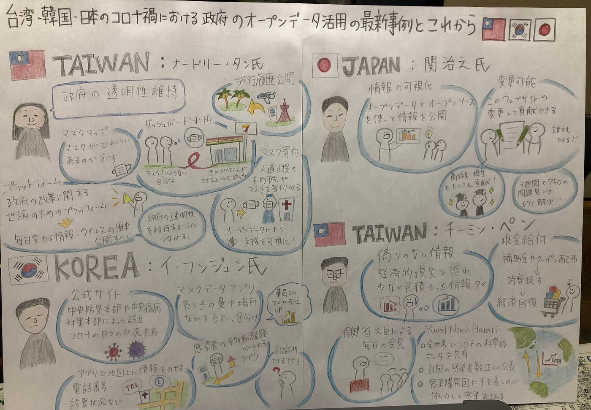
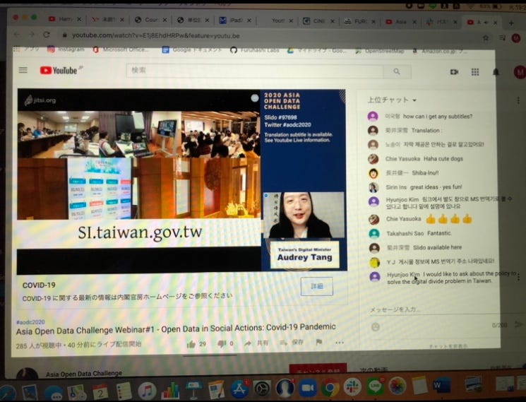

[https://youtu.be/E1j8EhdHRPw](https://youtu.be/E1j8EhdHRPw)

### **国際会議「台湾・韓国・日本のコロナ渦における政府のオープンデータ活用の最新事例とこれから」**

6月2日午後７時から開催された国際会議にオンラインで参加しました。今回お話ししてくださったのはオードリー・タン氏（台湾）、関治之氏（日本）、イ・フンジュン氏（韓国）、チーミン・ペン氏（台湾）の４名でした。

オードリー・タン氏はマスクマップの活用や国民健康保険のオープンデータ化、ダッシュボードの活用について話されていました。マスクマップによってマスクの在庫を把握することができます。またダッシュボードを利用することでコンビニエンスストアと協力し、マスクの行き渡らない自治体への対応も行っています。しかし中には嘘の情報が出回ることもあり、これらの情報に惑わされてパニック買いをしないよう注意を呼びかけています。オードリー・タン氏はコロナに関する情報は鮮明に公開し、政府の透明性を維持することが重要であると話されていました。

関治之氏は「オープンソースとオープンデータにおける次世代政府サイト」ついて話していました。オープンデータとオープンソースによってウェブサイトを作り情報を公開しています。またこれは誰でも変更が可能であり、これらを改善することに貢献ができます。これにより３週間で750件の問題が見つかり、671件が解決されました。高校生、大学生も活発に貢献しているとのことでした。これらによって情報が入りやすくなるだけでなく、自ら貢献することができることで国民の意識も高まるのではないかと感じました。

イ・フンジュン氏は情報を共有していくことが重要であるとし、中央防災本部や中央疫病対策本部によって公式サイトが作られ、コロナに関する情報を共有しています。また韓国では自己診断アプリ、マスクデータアプリ、感染者の移動経路が分かるアプリなどができ、感染を予防することができます。

チーミン・ペン氏は偽りのない情報を公開していくことが重要だと話されていました。経済的損失を恐れて感染者を低く見積もってはいけないとのことでした。また保健省大臣によって毎日会見が行われ情報の積極的な共有が行われています。全世界でもコロナの科学的データの共有や、感染者数の公表をしっかり行い、感染爆発国には手を差し伸べ協力していくことが重要であると話されていました。そこで世界中でデータの共有ができるプラットホームを作ることで世界的感染を防げるのではないかと考え、またプライバシーに関する問題も考えていかなければならないと仰っていました。

グラレコ

スクリーンショット

