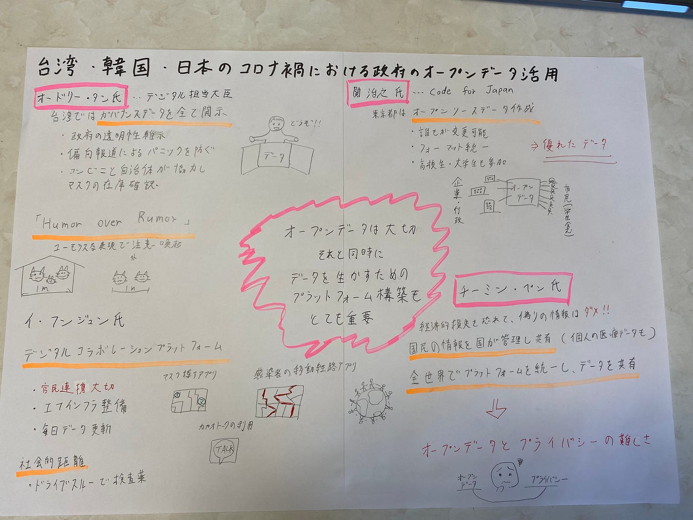
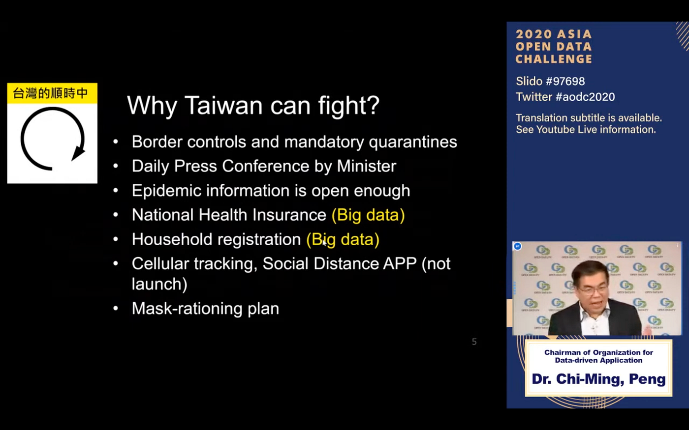

### 国際会議「台湾・韓国・日本のコロナ禍における政府のオープンデータ活用の最新事例とこれから」に参加

６月２日に１９時より開催された「台湾・韓国・日本のコロナ禍における政府のオープンデータ活用の最新事例とこれから」に参加しました。初めての国際会議で、各スピーカーの主張を拾う事は大変でしたが、自分なりにまとめてみました。

今回の国際会議ではコロナ 禍におけるオープンデータをテーマに、台湾・韓国・日本の専門家が各国におけるオープンデータの活用事例などをスピーチしました。

まず一人目のスピーカーは、台湾のデジタル担当大臣であるオードリー・タン氏でした。台湾ではガバナンスデータを全て開示しており、それが偏光報道によるパニックを防いでおり、政府の透明性維持にも繋がっているという事でした。また、コンビニと自治体が協力してマスクの在庫確認を行いデータにする事で、民間がマスクを作り始めるというオープンデータの活用が出来たと言われていました。

二人目のスピーカーは、東京都のCovid-19のサイトを作成したCode for Japanの関治之氏でした。東京都では誰もが変更可能なオープンソースデータを作成し、優れたデータ作りを目指しました。しかし、誰もが参加できる分送られてくるフォーマットが統一されていないなどの問題が起き、フォーマットの統一化をしました。その結果、高校生や大学生もデータ作成に貢献した事を受け、オープンデータの重要性を理解してほしいと仰っていました。

三人目のスピーカーは韓国のイ・フンジュン氏で、デジタルコラボレーションプラットフォームの重要性を言われていました。韓国ではPPP（官民連携）や ITインフラ整備を活用し、今回のCovid-19に対応しました。情報の開示と共有を大切にし、マスクを探すアプリ・感染者の移動経路がわかるアプリ・カカオトークを使った自己診断といったアプリケーションの利用も行っていると仰っていました。また、感染者はドライブスルー形式で検査薬を入手するといった社会的距離の確保なども、Covid-19収束に貢献したそうです。

最後のスピーカーは台湾のチーミン・ペン氏で、オープンデータとプライバシーについて話されました。国民の個人データを国が管理し、共有する事で最適な医療を迅速に提供することができるが、オープンにするとプライバシーが侵害されるなど、オープンデータとプライバシーの両立の難しさを言われてました。また、経済的損失を恐れて、偽りの情報を公開する事はダメだとも仰っていました。また、全世界でCovid-19のデータを共有する事で、Covid-19を抑えられるのではないかと主張されていました。

今回のグラレコ

スクリーンショット

