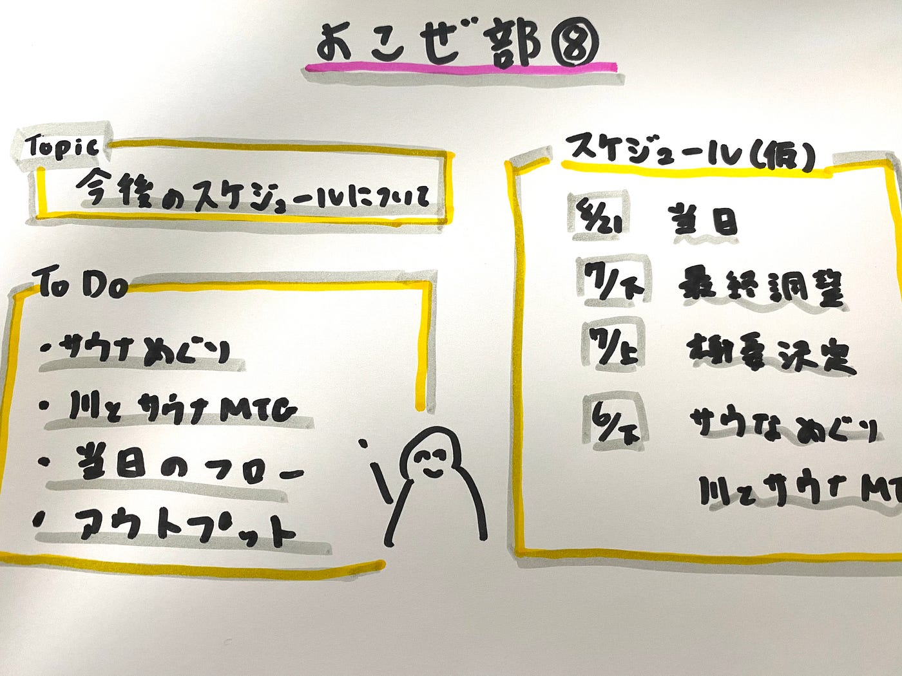

### 横瀬部週報

こんにちは。古橋研究室4年生の大庭です。

今年度は、横瀬の夏合宿でサウナを自作することを目標に活動しています。

今週は、今後のスケジュールについて話し合いましたので、共有させていただきます。

#### ＃トピック

今後のスケジュールについて（サウナ＠古橋ゼミ夏合宿に向けて）

#### ＃今後のスケジュール

**8月21日〜23日
**古橋研究室夏合宿IN横瀬。サウナ設置。

**7月下旬**
最終調整。（必要機材等）

**7月下旬**
概要決定（詳細等決めていく）

**6月下旬**
サウナ知識INPUT（サウナ廻り＠都内近郊）
横瀬の川でサウナの方々と打ち合わせ

#### ＃TO DO

1. サウナ廻り（3箇所程度はいきたい）
→コロナの状況により左右される
→今のところ少し難しそう

2.川でサウナの方々と打ち合わせ
→当日の機材や設置について

3.当日の設置フロー決定
→細かいスケジュールを決める必要がある

4.アウトプットをどうするか
→合宿でサウナをやったことを写真や動画で公開したい

#### ＃SAUNA FES JAPAN 2019 Official After Movie

[https://www.youtube.com/watch?v=zSu0t30BJ14](https://www.youtube.com/watch?v=zSu0t30BJ14)

→ドローン部と連携できるか！？

