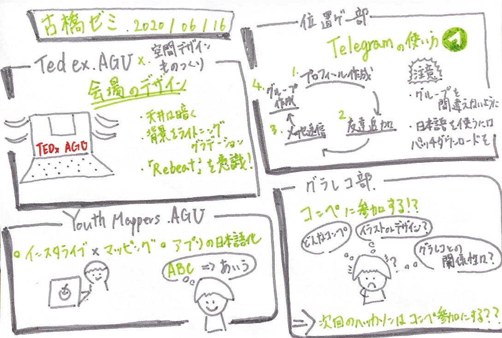

### グラレコ部週報

↑ゼミ活動記録のグラレコ

グラレコ部 平澤彰悟ですー！
今回の週報では、グラレコ部コンペでてみない？？という趣旨のもと記事を書いていきたいと思います！

#### ##なんでコンペでるの？？

**“端的に言うと、せっかくなら自分たちの作品を評価してほしくね？？”
ってことです！**

いままで、グラレコ部では主に、TEDやゼミ活動の内容をグラレコしてきました！ しかし、書いてMediumに載せるor Slackで共有する。ということしか行っていませんでした。ここで、コンペにでることで外の世界を覗くきっかけを作ると同時に、今のグラレコ部がコンペに通用するレベルなのかということがわかると思います。

以上の旨を部員にも共有したところ、みんな乗り気で、自分たちの実力がどの程度のものなのかを測りたいという意見でまとまりました！

#### ##何のコンペにでるの？？

このコンペにでればいいんじゃね？と考えています！
[https://www.vanfu.co.jp/design/tote/](https://www.vanfu.co.jp/design/tote/)

> このコンペを端的に説明すると、
**”「TRIP-旅-」をテーマにトートバックのデザイン考える”
**という旨で募集が行われています

あくまで、以上のコンペは一例であり、まだまだ、デザインやイラストのコンペはあるので、部としての方針や、個々人のやりやすさ等を部員で話し合い、参加するコンペを決めようと思っています！

#### ##グラレコとこのコンペって関係あんの？？

今回のこのコンペは、あくまでデザインのコンペとなっています。
ただ、デザインのコンペに参加するのであれば、古橋ゼミのグラレコ部として参加する意味は無いと思っています。

> ・このコンペとグラレコの関係性は？
・グラレコ部としてこのコンペにでることによって得られるものは？
・グラレコらしさが発揮できるコンペなの

という理由付けの部分をしっかりと決めていきたいです。

#### ##どんなコンペなの？詳しく聞かせて！

今回[このコンペ](https://www.vanfu.co.jp/design/tote/)は第二回ということで、もちろん以前第一回がありました！ 
第一回では**”Let’s go out！～出かけたくなるデザイン～”**というテーマで募集が行われていました！ このコンテストの結果も載せておきます！
[https://compe.japandesign.ne.jp/result/vanfu-totebag-2019/](https://compe.japandesign.ne.jp/result/vanfu-totebag-2019/)
