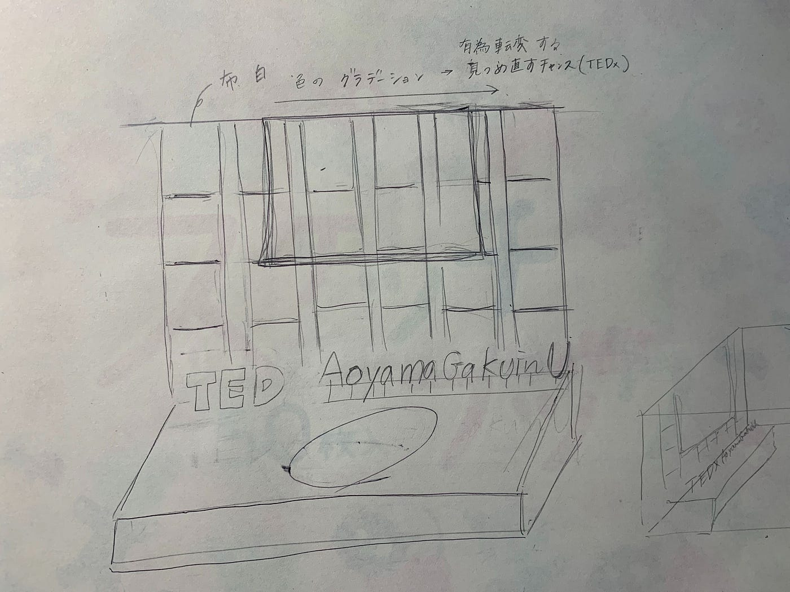
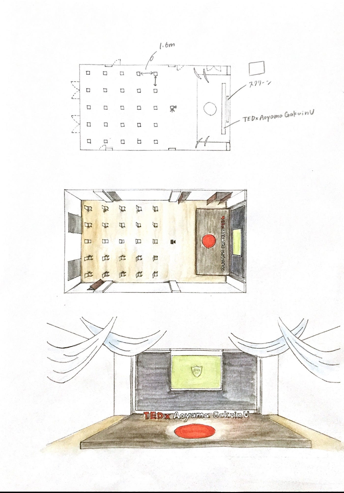
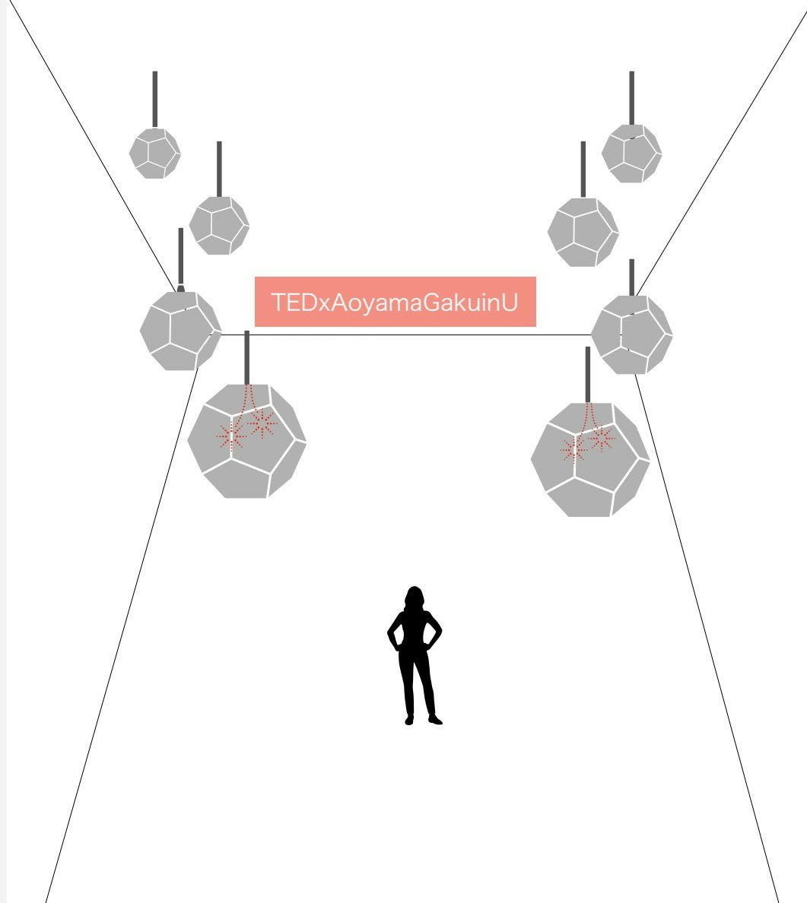
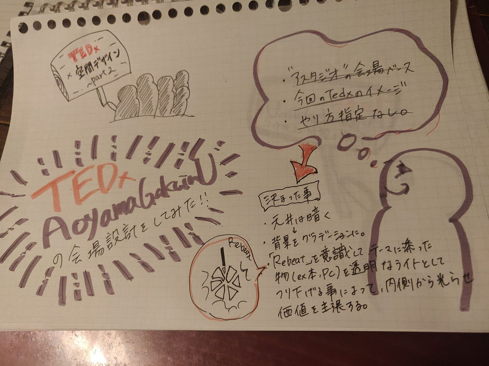

### TEDｘ会場制作

今回私たちは今回のTEDｘAoyamaGakuinUのテーマ「Rebeat」をテーマに会場設計を考えてきました！そして次のハッカソンでは「ものづくり部」と共同でオンラインイベント空間を作ることに決定し今回はそのデモ会場を作成していこうという話になりました。

といっても製図経験なぞ０の私たち、、、初心者ながらいろいろな案を出していきました。

> 決まったこと

> ・天井は暗くする（空間を広く見せる効果も）

> ・背景をライトニンググラデーションに

> ・「Rebeat」を意識しテーマに沿ったものを透明なライト（３Dプリンターで作成）として吊り下げることにより内側から光らせ価値を主張する

> 次回

> 今回出し合った案をものづくり部に引き渡せるような完成版にまとめ個人でまとめてくる。

