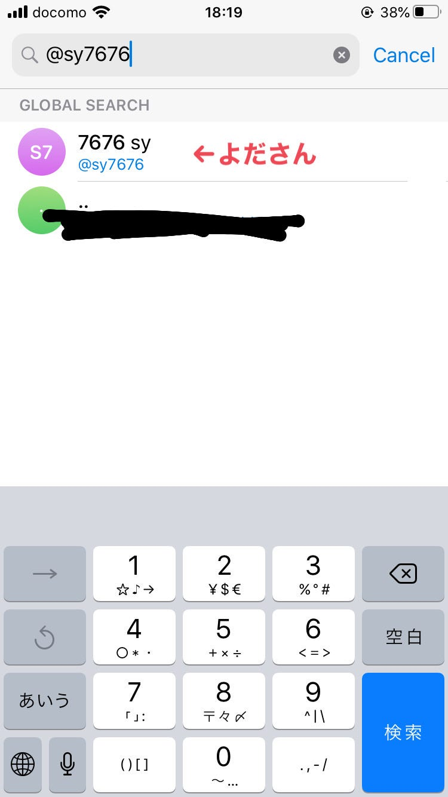
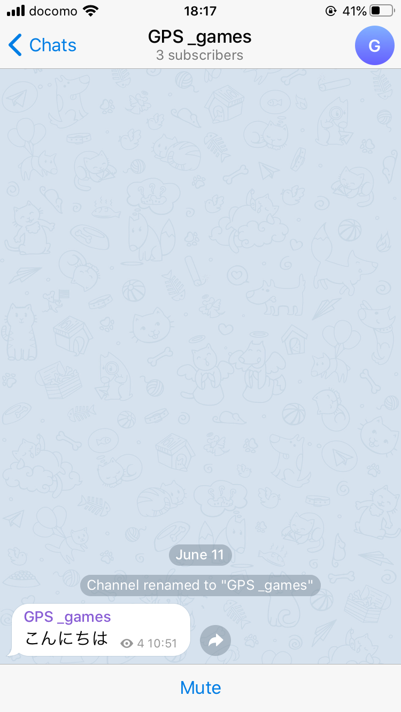
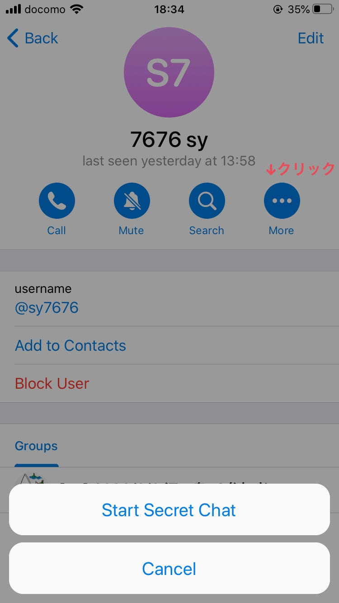
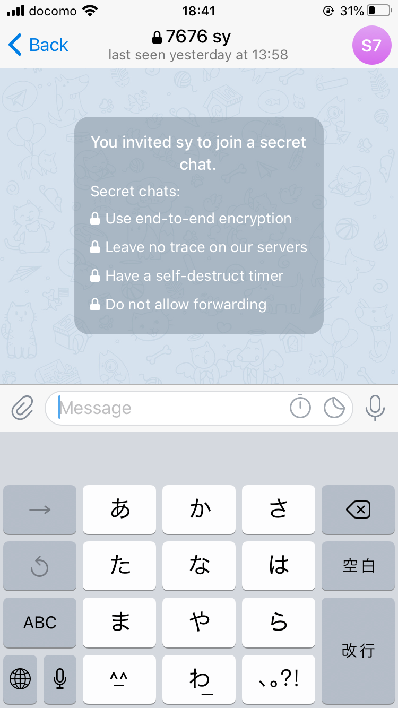
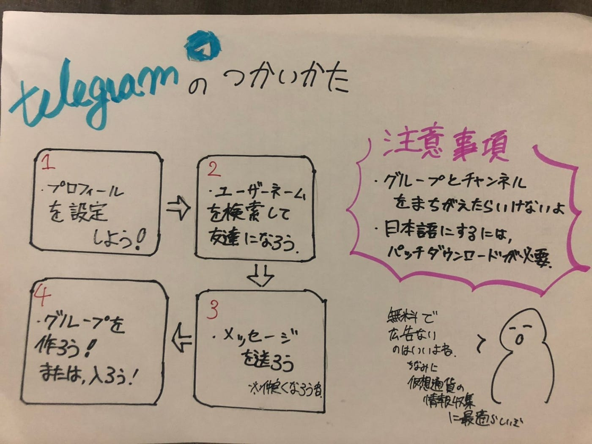

### 位置ゲー：テレグレムの使い方

今月のfsで使用されたチャットアプリ、テレグラムの使い方をまとめました。

基本的にはアプリをインストールして、電話番号、ニックネーム、ユーザーネームを設定すれば、誰とでもチャットできます。

例えば、依田さんのユーザー名（＠sy 7676）で検索すると直接チャットできます。

また、テレグラムで集団でのチャットをするとき、グループとチャンネルの二つに分けられます。グループでは、メンバー全員がチャットすることができます。チャンネルでは、作成者及び管理者のみ投稿を送信することができます。他のメンバーは閲覧のみです

チャンネル閲覧者の視点

先週での週報にて、fsグループ内で重要なメッセージ（各イベントのリンク、パスワード）が他のコメントで埋もれてしまうという問題点がありました。しかし、チャンネルとグループを使い分ければもっとうまい進行ができたのかなと思います！

**テレグラムにてメッセージを暗号化できるようなので試してみました！**

チャットから相手プロフィールで右上のmoreをクリック！すると、start secret chatとでてきます。

できます。

まだまだ隠れた機能ありそうですね、、、今週は以上です。

グラレコ

