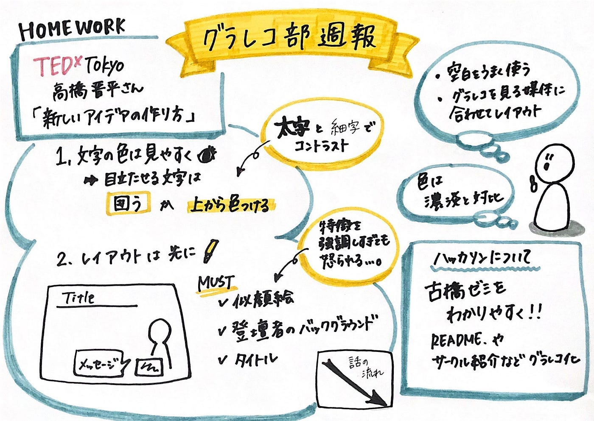
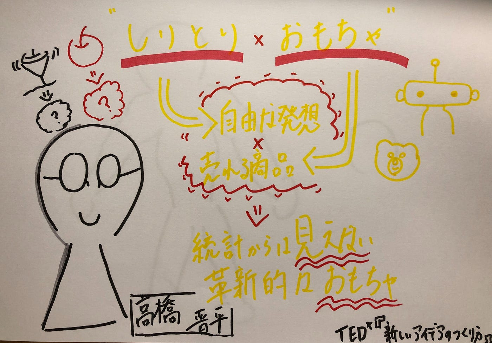
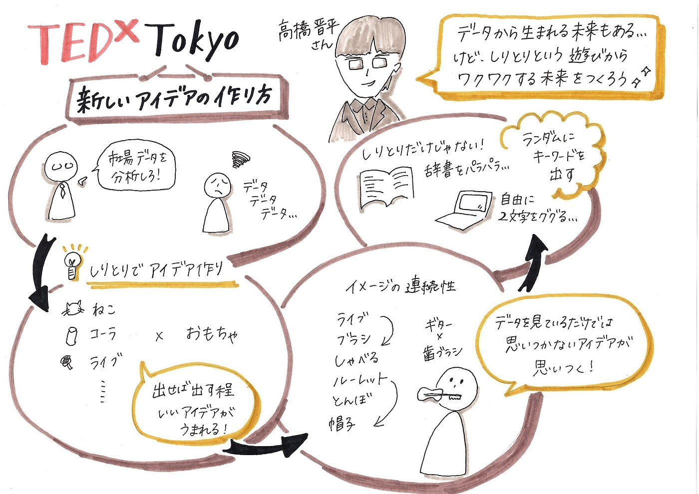
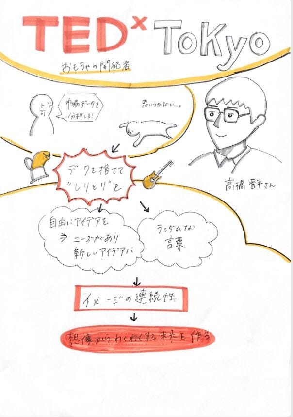
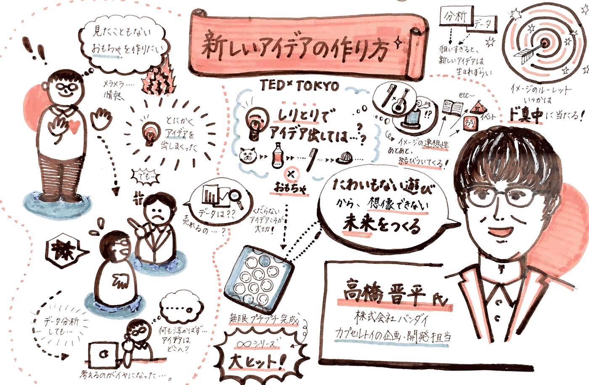

### 新しいアイデア、ピクトグラム。

今週のグラレコ部週報は、宿題だったTEDのグラレコとピクトグラムについて取り上げていきたいと思います！

#### ##今週のグラレコ

まずは、今週のグラレコです！

今回は川嶋さんが教えてくれた、iPhoneに入っているアプリ「メモ」のスキャン機能を使ってみました。どうでしょうか…？
お手軽かつなかなかきれいに読み取ってくれます！
（参考までに、私は最初スキャン機能が表示されなかったのですが、設定をいじくっていたらできるようになりました！）

そのほかスキャンアプリの比較は川嶋さんの記事にわかりやすくまとめられてます！

[いろんなグラレコ
今回のグラレコ部では「グラレコがどのような現場で使われているのか」調べ共有しました。medium.com](https://medium.com/furuhashilab/%E3%81%84%E3%82%8D%E3%82%93%E3%81%AA%E3%82%B0%E3%83%A9%E3%83%AC%E3%82%B3-2e4d35e131d3)

#### ##TEDxTokyo「新しいアイデアの作り方」

今回はTEDx Tokyoで高橋晋平さんが講演された「新しいアイデアの作り方」をそれぞれグラレコしました。

新しいアイデアのつくり方 | 高橋 晋平 | TEDxTokyo

グラレコを比べてみて気づいた点は大きく2つです。

> 文字の色は見やすく、太さを変えてコントラストを付ける

> タイトル、似顔絵、登壇者のバックグラウンドは先に書いておく

グラレコするときのレイアウトについては、安田さんの解説がとてもわかりやすいのでぜひ参考にどうぞ。

[グラレコのレイアウトどうなってるの？｜安田遥｜note
こんにちは！グラフィッカーの安田遥です。大学一年生の時に授業で寝ないようにとグラレコを始め、ゼミではプロセスを研究しています。 さて今回は巷で噂のグラフィックレコーディングを分析して解説してみる 「グラレコ解説」 をしていきます。…note.com](https://note.com/apo_volleyball/n/nf85d8be32416?magazine_key=m3172a4d22056)

このほかにも、「空白をうまく使う」「グラレコを見る媒体（スマホだったら縦書き、Twitterに載せるなら横書き…）に合わせてレイアウト」などなど新たな課題も見つかりました。

今後もTEDなどを使って、練習していく予定です！

#### ##ピクトグラム

ピクトグラム、ご存じでしょうか。
いわゆるトイレマークや案内表示で見るアイコンたちです。

今や世界中で見られるピクトグラムですが、その広がりのきっかけとなったのが1964年東京オリンピックでした。
当時、英語が話せない日本人も多い中、日本伝統の家紋にインスパイアを受けて考案されたスポーツピクトグラム。
その後の各国のデザインを見ていくと、それぞれの特徴とこだわりが表れていてとても面白いです。

[光る各国の個性！オリンピック歴代ピクトグラムを一気見せ | SPORTS STORY | NHK
1964年の東京オリンピックで初めてお目見えした スポーツピクトグラム…www.nhk.or.jp](https://www.nhk.or.jp/sports-story/detail/20190731_3943.html)

これだけたくさんのバリエーションが作られてきたわけですが、すべてのピクトグラムは、シンプルかつ分かりやすさのもとに作られています。
きっとどのデザイナーさんたちも苦労しながら作られたことでしょう…。
2020年東京オリンピックでスポーツピクトグラムのデザインを担当した、廣村正彰さんのインタビューで、その大変さがうかがえるのでぜひ読んでみてください！

[制作に2年！2020東京五輪ピクトグラム デザイン秘話 | SPORTS STORY | NHK
2020年7月24日の東京オリンピック開幕まであと1年！今回は、オリンピック各大会の「顔」とも言える、競技をイラストで表した スポーツピクトグラム…www.nhk.or.jp](https://www.nhk.or.jp/sports-story/detail/20190731_3939.html)

私がピクトグラムに注目したきっかけは、タイに留学中、フィールドワークのテーマをピクトグラムにしたことなのですが、実はグラレコにも通じることがあるなぁと思っています。

ピクトグラムの3要素、可読性、統一性、明解性はグラレコする上でも大切だと思います。
誰が見ても理解でき、統一してわかりやすいこと、そしてシンプルな美しさ。
だれが見てもイメージがわくようなアイコンとそれを限られた枠の中で表現する難しさ。
こうしたプロのデザイナーさんたちが時間をかけて考案したアイコンを見ていると、シンプルなデザインで特徴をつかんでいるので、とても参考になります。

そして前回古橋先生に教えていただいた動くピクトグラム！

[https://tokyo2020.org/ja/news/news-20200226-04-ja](https://tokyo2020.org/ja/news/news-20200226-04-ja)

永遠に見ていられます…笑
今までのピクトグラムがさらに進化して、動きが加わったことにより空間が可視化されたように思います。
個人的には馬場馬術の馬の耳の動きと、新体操のリボンの美しさが絶品です！

このピクトグラムたちが、東京オリンピックで活躍してくれるのが楽しみです！

今後どこかでタイのピクトグラム研究も紹介できたらなと思います！
それではお読みいただきありがとうございました。

青山学院大学 古橋研究室 3年

大岸 裕紀
