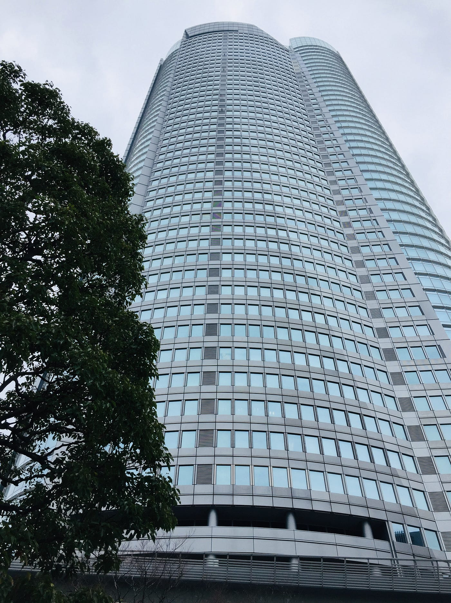
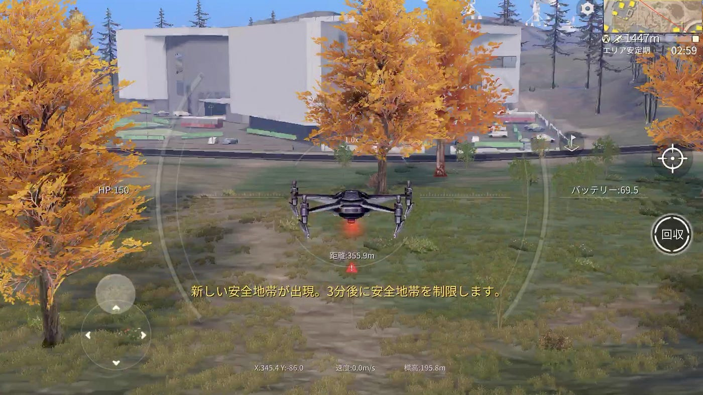
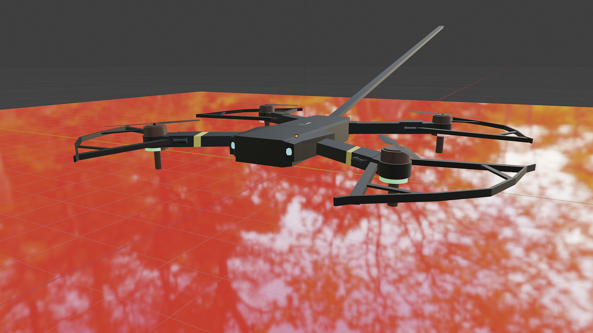
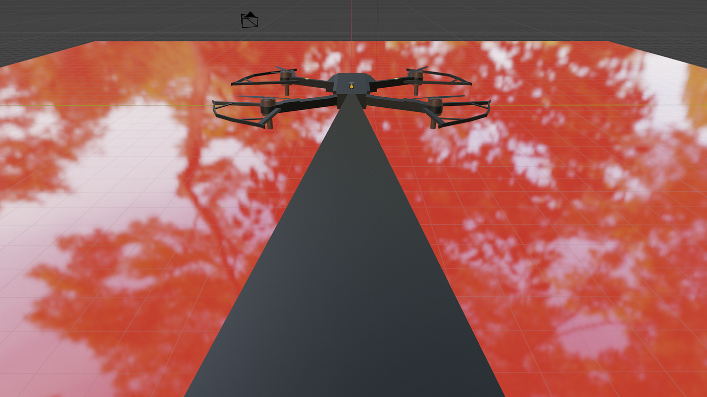
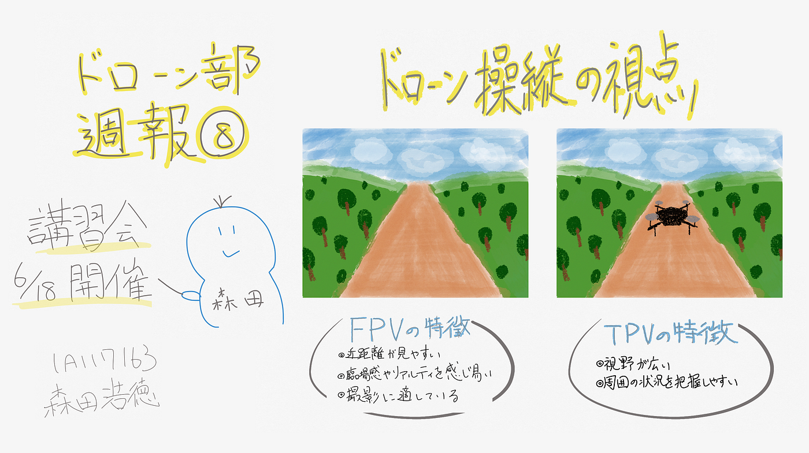
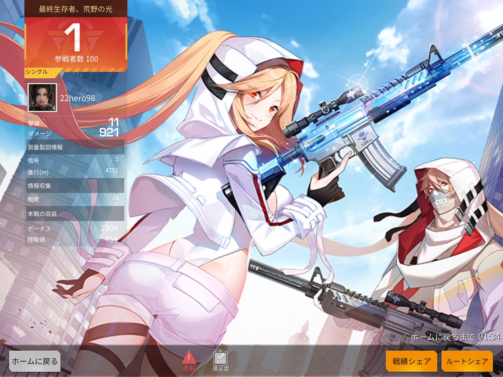

### 荒野行動から学ぶドローンの安全飛行

#### ドローン部週報⑧ 森田浩徳

都心には様々な高層ビルがありますよね。その中でも際立っているビル

… そう、



**六本木ヒルズ**なのら。超大手企業が多数入居しているのですが、僕の中では相変わらずGoogleのイメージが強かったですね。しかし今回ばかりはGoogleではなく、あっ「世界の◯部」さんと思ってしまいました。
みんなも本件を教訓として、律儀な行動をしましょう。
まあそんなとこで絶賛就活真っ只中の森田がブログを担当します！

突然ですが皆さんは荒野行動をしたことがありますか？

> 『**荒野行動**』は、中国企業の[NetEase Games](http://www.neteasegames.com/jp/)が開発、運営するTPSバトルロイヤルゲームで、約100人のプレイヤーが無人島に降り立ち、最後の1人になるまで戦闘を繰り広げる。（[Wikipedia](https://ja.wikipedia.org/wiki/%E8%8D%92%E9%87%8E%E8%A1%8C%E5%8B%95)より引用）

皆様のイメージ通り、人と戦うゲームとなっております。
なぜ私が荒野行動で遊んでいるかと言うと、



なんとドローンの操縦ができるからです！

ということで、今回は荒野行動から学ぶドローンの安全飛行について書いていこうと思います！

その前に、先週のドローン部のミーティングでは、**「ハッカソンに向けてのブラッシュアップ＆懇親会の日程調整」**について話し合いました。

## 決定事項

- ハッカソンの日程：6月23日

- 懇親会日程：6月18日 20:00~

## 議論内容

- ハッカソンに向けた最終調整

- 懇親会日程

- ドローン時事

- 荒野行動

## todo

1. **ドローン図鑑作成**

- 最終成果物のまとめ方
┗シェアしやすいようにGoogleスライド
┗字体等のフォーマットを統一させる

**2. チートシート**

- 担当分野を決定させる

- 各々イラストを描写

- Git-Hubレポジトリに投稿

## 懸案事項

- ハッカソンでの役割分担
┗medium、スライド、発表者

6月のハッカソンも近づいてきましたので、最後のブラッシュアップに力を入れていきます。

さて本題に入ります。

実際に荒野行動でドローンを飛ばしてみると、意外にも飛ばしやすいことに気づきました。その点を私なりに解析していこうと思います。

実際のドローンの操縦と荒野行動でのドローンの操縦で圧倒的に異なるのは、**視点の位置**になります。

通常は**FPV(First Person View)ドローン**とも呼ばれており、**一人称視点**からの映像になります。そのためドローンそのものの映像が画面越しに見えることになります。


対して荒野行動でのドローン操縦の視点は、**三人称視点**からの映像となっているため、ドローンを中心にその周辺から撮影された映像になります。調べてみたのですが、**TPV(Third Person View)ドローン**は存在しなさそうなので、上手に申請すれば特許の取得ができそうですね。


私の主観ではTPVの方が操縦がしやすいように感じました。そこでドローン部内でアンケートをとってみたのですが、やはりTPVの方が操縦しやすいと感じた方が多かったです。

#### ## FPVの利点

- 近距離が見やすい

- 臨場感やリアリティを感じやすい

- 撮影に適している

#### ## TPVの利点

- 視野が広い

- 周囲の状況を把握しやすい

ドローンの性能が向上しつつある現在でも、ドローンの墜落のニュースは絶えることはありません。最近では航空局に申請せずに豊島区の小学校に墜落させ、航空法違反で逮捕される[事件](https://news.tbs.co.jp/newseye/tbs_newseye4000341.html)もありました。恐らくこちらの方は電波トラブルによる墜落だと思いますが、、、

またドローンを飛ばしていると、周りの状況が把握しにくいと体感することが多々あります。何もない広場で飛ばすのであれば、周りの状況を注意深く観察して操縦することは滅多にないと思います（それでも細心の注意を払って操縦してください！！）。しかしFPVドローンの視野の狭さによって、樹木の枝などに気づかないで墜落させてしまった[前例](https://www.youtube.com/watch?time_continue=4&v=Yri3D79NYlg&feature=emb_logo)もあります。

死角への衝突による墜落を防ぐために、ドローン飛行ルールとして**目視範囲内**での飛行があります。確かに目で見ることは大切なのですが、この目視範囲は大変グレーゾーンであります。例え管理者が目視できないとしても、目視できているかどうかを決めるのは操縦者当人であるためです。科学的な証明がない限り、視力8.0と言ってもバレないかもしれませんしね。

もしFPVドローンにTPV要素が追加されたら、走行中に全体の状況が把握しやすくなって、衝突による墜落も減少するかもしれません。

そこでBlenderを使ってTPVドローンを制作してみました。
ドローンを最初から作れる気がしなかったので、以下のフリー3Dモデルのデータから改良を加えてみました。ダウンロード時はRARファイルであるので、Blenderで開きたい場合は[The Unarchiver](https://apps.apple.com/jp/app/the-unarchiver/id425424353?mt=12)をインストールして解凍してあげる必要があります。

```
ドローンのフリー3Dモデル
```

[Drone E58 3D Model
Free Download, 3d Drone E58 model available in blend format.free3d.com](https://free3d.com/3d-model/drone-e58-777923.html)

そして作成した世界初のTPVドローンがこちら…





クオリティが低くて申し訳ございません、素人には限界がありました…
これでも2時間かけて編集＆レンダリングしたんです…

実際に作成してみてわかったことは、物理的に操縦が困難になるのではないかという点についてです。

問題点をあげるとすると、

1. **空気抵抗**が大きくなり操縦が不安定に

1. 曲がるときに**内輪・外輪差**が発生（タイヤはないですが）

1. 鳥の羽休めになってしまう可能性がある

といったところでしょうか。

2つ目の内輪・外輪差については、カメラの伸縮が可能であれば、解決できるのではないかと思われます。

総合的にみて操縦は不安定になってしまうかもしれませんが、実験してみる価値はあると思います。地上から目視で操縦するよりも、ドローンの周辺で観察できる方が、より安全かもしれませんしね。

以上、今回は荒野行動から学ぶドローンの安全飛行について記載してきました。メーカーのみなさま、ドローンの安全性を求めているのであれば、三人称視点のドローンも考慮してみてはいかがでしょうか？



あっ、ちなみに、



勝ちました。
