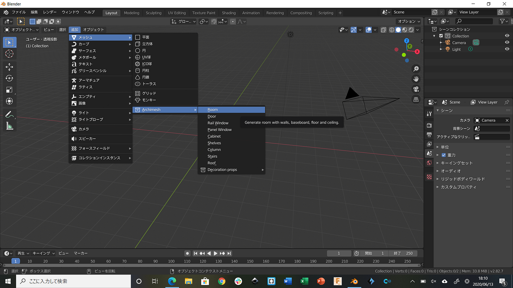
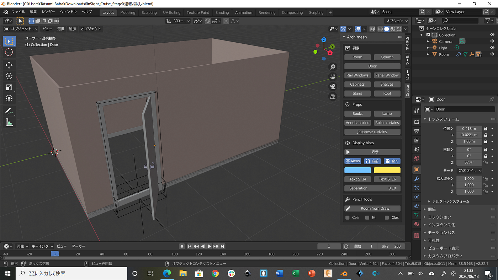
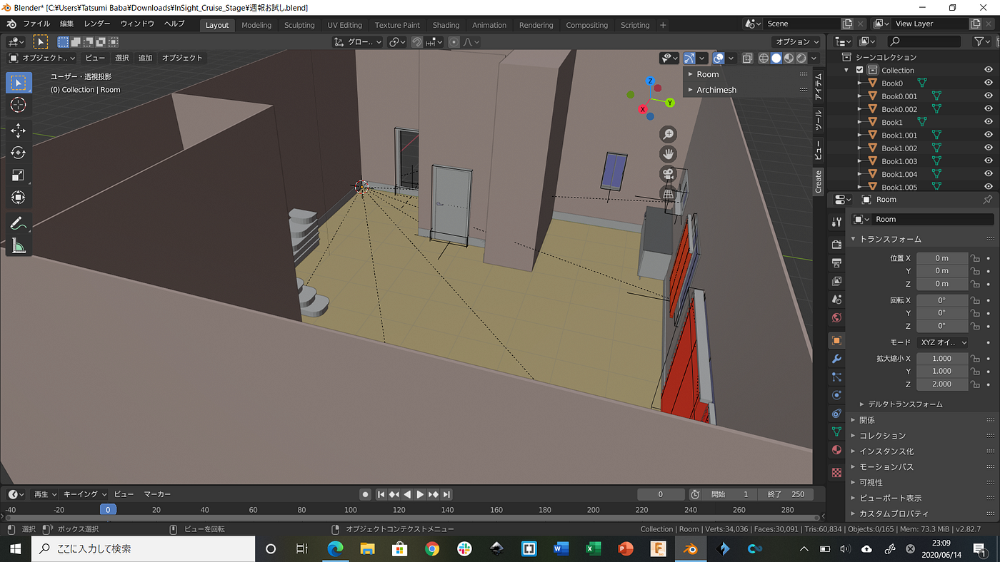
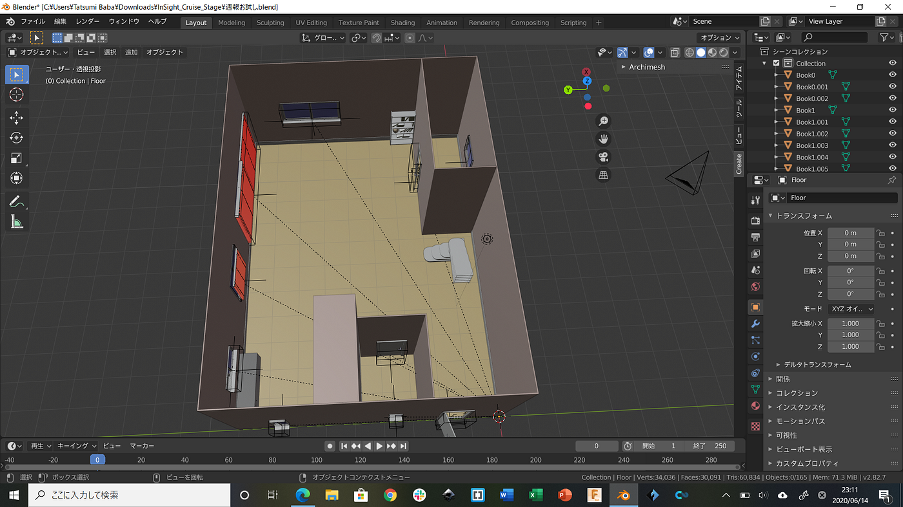
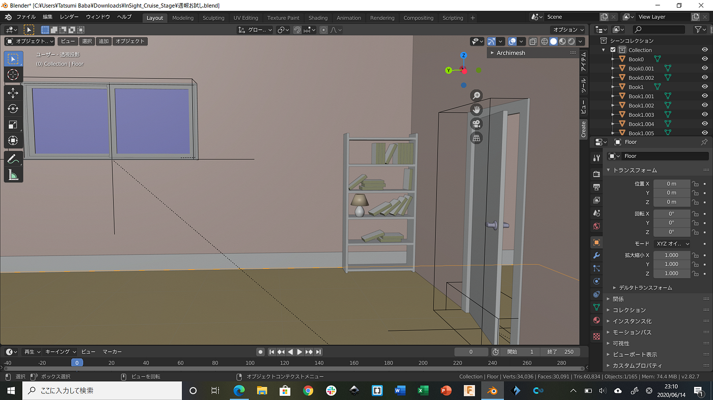
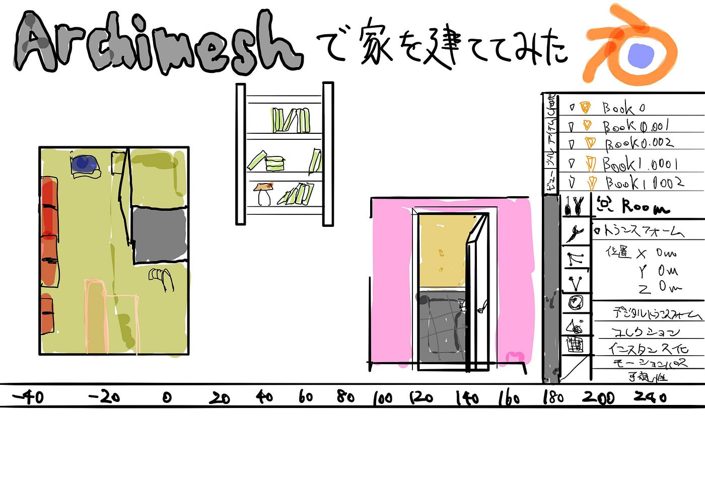

### Blenderで簡易的な家を造ってみた

前回で調べたBlenderのアドオン「Archimesh」を追加し、実際に使用してみた。ArchimeshはBlender2.8では標準アドオンとして入っているので、設定から簡単に追加する事が出来た。

アドオンを追加するとこのように表示され、デフォルトで入っているものが使用可能になる。

壁にドアや窓を埋め込み、”オートホール”を選択するとその分の穴が壁に空き、このように通り抜け出来るようになる。

これを用いてデフォルトにあるものだけで簡易的に家を作成していった。

このように棚を作り、そこに本、ランプを入れる事も出来た。

このように、初めてArchimeshを使用してもある程度は作成することが出来たので、今後のハッカソンでも使っていけるのではないかと感じた。

#### **＜グラレコ＞**

