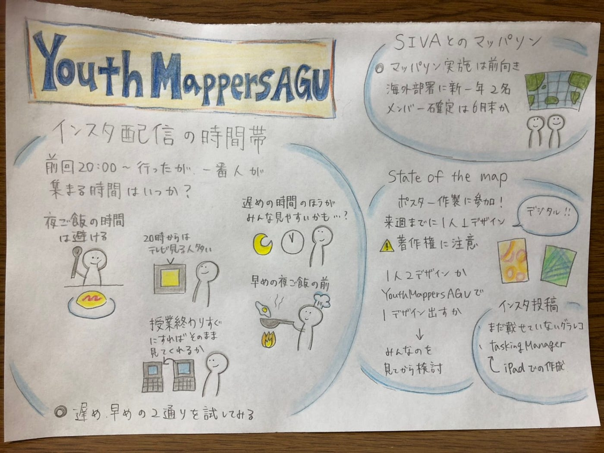

### ついにMapSwipe日本語版が完成

こんにちは、3年の日向野邦春です。

まずはじめに先月私たちが作ったMapSwipe日本語版ページが本家からpublishの許可が出て公開されました。

YouthMappersAGUとして１つ大きな成果が出たかなと実感しています。

[MapSwipe | Every swipe helps put families on the map
Humanitarian organisations can't help people if they can't find them. MapSwipe is a mobile app that lets you search…mapswipe.org](https://mapswipe.org/jp/get-involved.html)

#### 先週の振り返り

**・インスタライブ配信の実施**

インスタライブを利用したマッピング方法の配信を試してみました。その中で、いくつか問題点が上がりました。

**・携帯で配信すると画面の写り込みがひどい**

インスタライブは基本的に携帯を利用して配信を行うのでPCの画面を映し出すには画面を携帯で撮影しなければいけません。そのため写り込みなどで画質が下がってしまいました。次回は啓太さんに紹介してもらったOBSを使ってPCで配信したいと思います。

**・時間帯の問題**

２０時から配信をしてみたのですが皆さん夕食の時間らしく視聴者数があまり伸びませんでした。しかし２１時２２時にしてしまうとドラマの時間になってしまうためそれでも伸びないと思い深夜に行って見ると最大で10人ほどが見てくれました。

#### SIVAとのマッパソン

私が所属しているボランティアサークルSIVAがコロナの影響でほとんど活動できていないため、マッピングを教えてマッパソンを開催しようと考えています。ですが、SIVA側の新入生がまだSIVAに入って慣れていないという事や人数の問題で一度このイベントは保留することとなりました。

#### State of The Mapポスター作成

SIVAとのマッパソンが延期となりましたが新たな目標が決まりました。８月にオンラインで開催されるState of the Map2020のPRポスターの提出をすることとなりました。期限は今月の末までで意外と時間がないので急ピッチで作っています。

[State of the Map 2020 - Cape Town
Building on previous State of the Map culture, we love to hear what has been done with OpenStreetMap data, but we also…2020.stateofthemap.org](https://2020.stateofthemap.org/calls/posters/)

