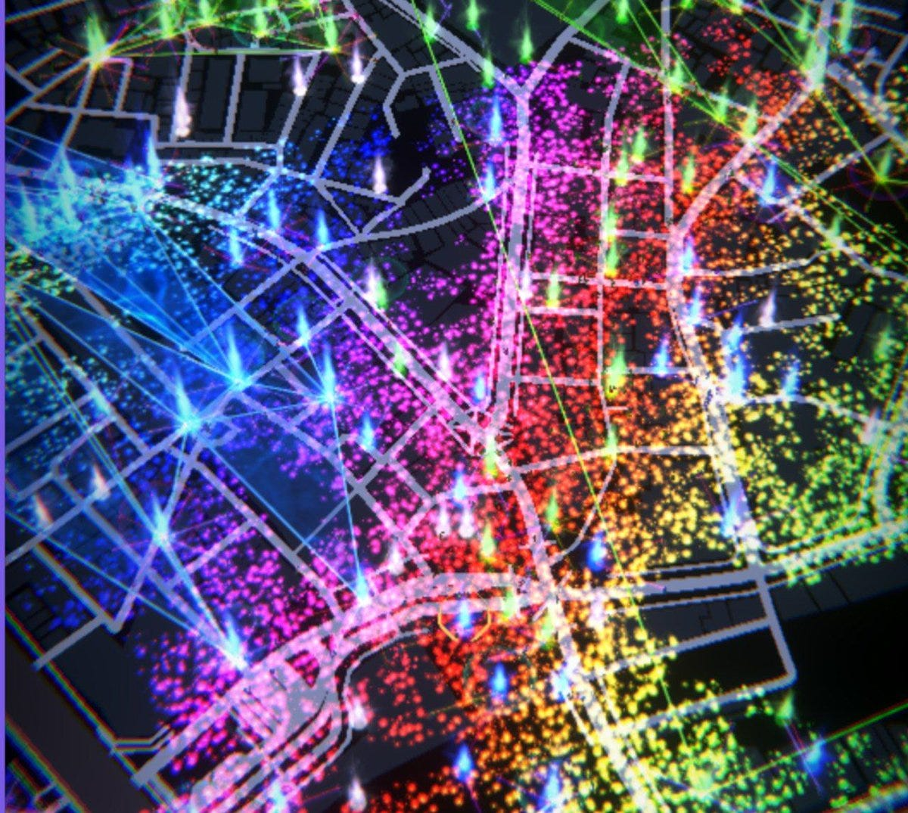
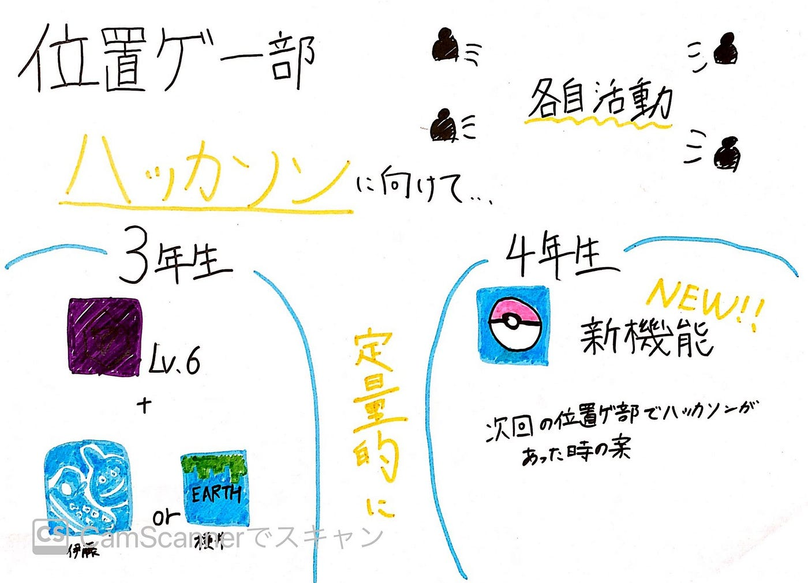

### 位置ゲー部週報：ハッカソンに向けての活動

今回位置ゲー部のミーティングではハッカソンに向けて各自活動をしていいくことにしました。

まず三年生は基準のIngressと新しく加わる位置情報ゲームの基準を決めることに専念していきます。その際に重要となることは主観的に決めるといのではなく相応する時間で基準を決めていく定量的に判断することが大事だと思うのでそこに注意をしていきます。

そして４年生の先輩方はまずPokémon GOに関しては新しい機能がどんどん増えているので以前と比べてどのくらい経験値の効率があがるのかというのをまず調査していくことになりました。そしてIngressは新しい機能もあまりなくほとんど経験値の効率の差が依然とないために、依田さんは次回以降位置ゲー部でハッカソンをした際にすることのアイデアを考えていただくことになりました。

X,Y軸の基準はまだ協議中です。

では今回、私がIngressのレベル上げをしていた際にLGBTの権利とコミュニティーの支持を示すためにXMの色がレインボーになっていることについて書いていきたいと思います。

詳細は[こちらのサイト](https://community.ingress.com/en/discussion/11200/rainbow-xm-for-lgbtq-pride-month) です。

このように６月末まではレインボーになります。実際に渋谷に経験値を稼ぎに行った際のXMの画像はこちらです。

一見、華やかで美しいと思いますが、ポータルや自分の現在位置がどこにあるのかわからなくなり、やりずらかったのが正直な感想です。またTwitterでこのことを知るまではいきなり色が変わったので驚きました。プレイヤーの選択で変えられるとより良いと思いました。

今回のグラレコはこちらです。

