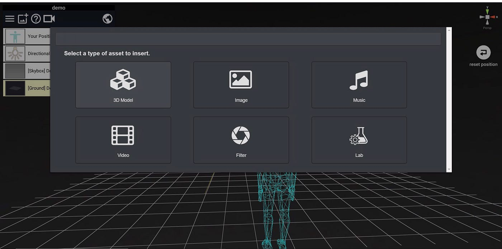
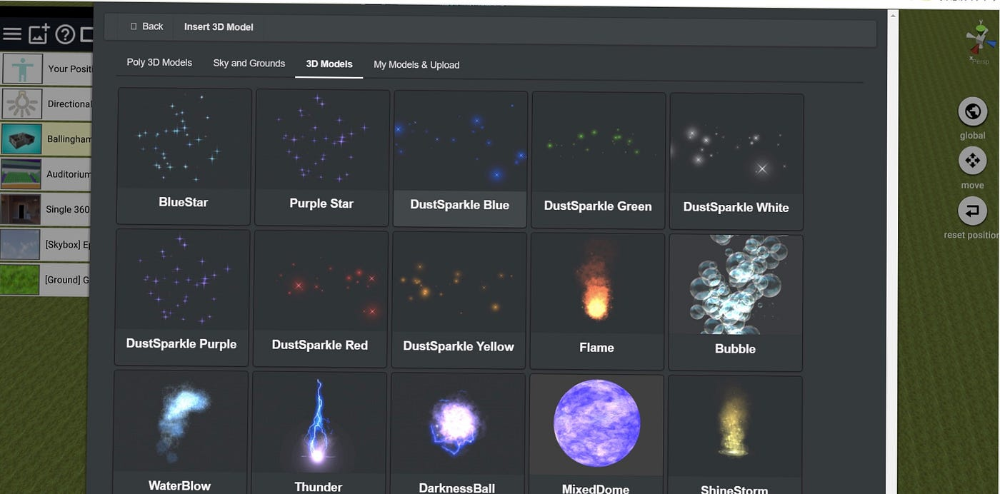
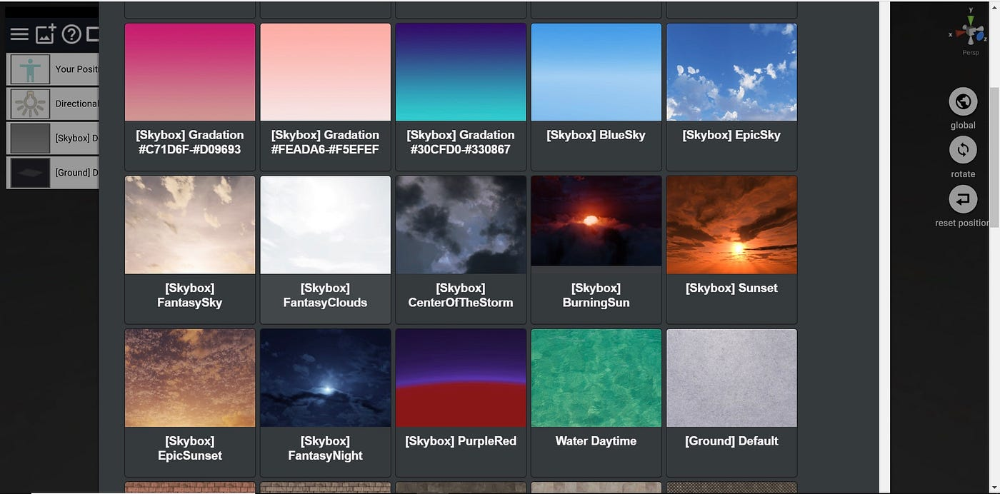
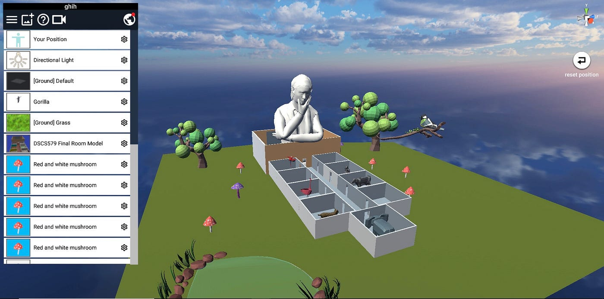
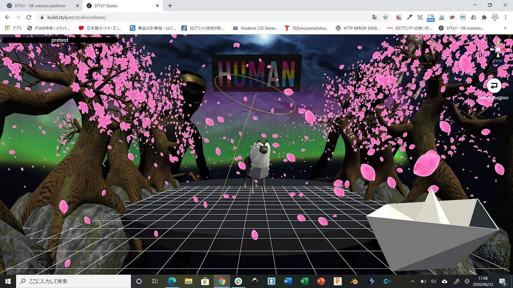
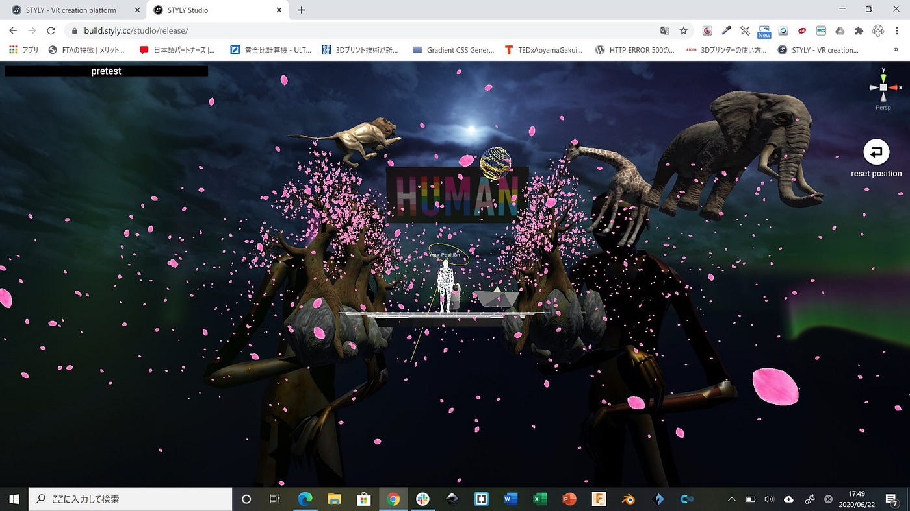
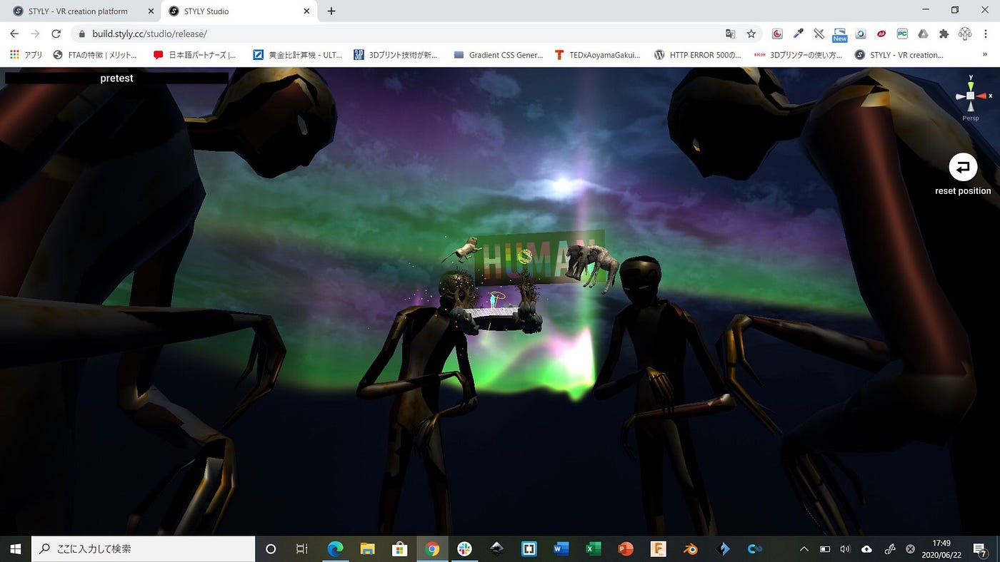
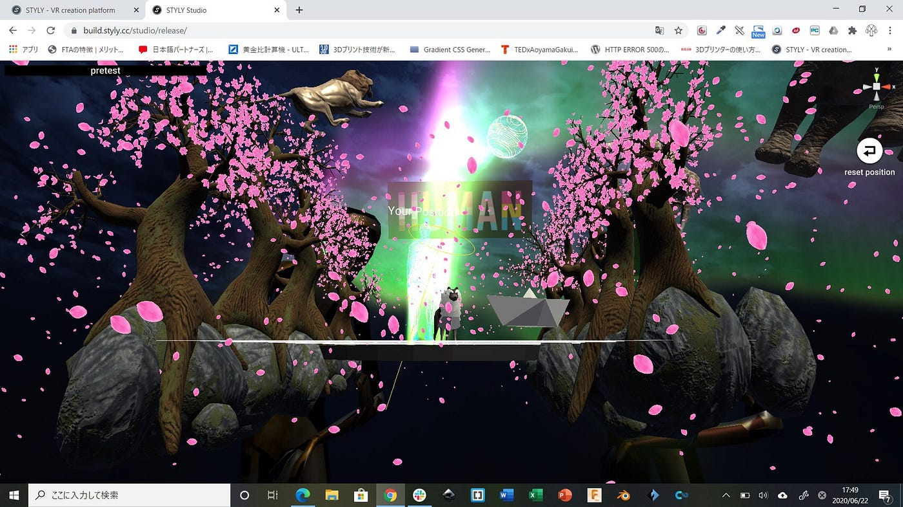
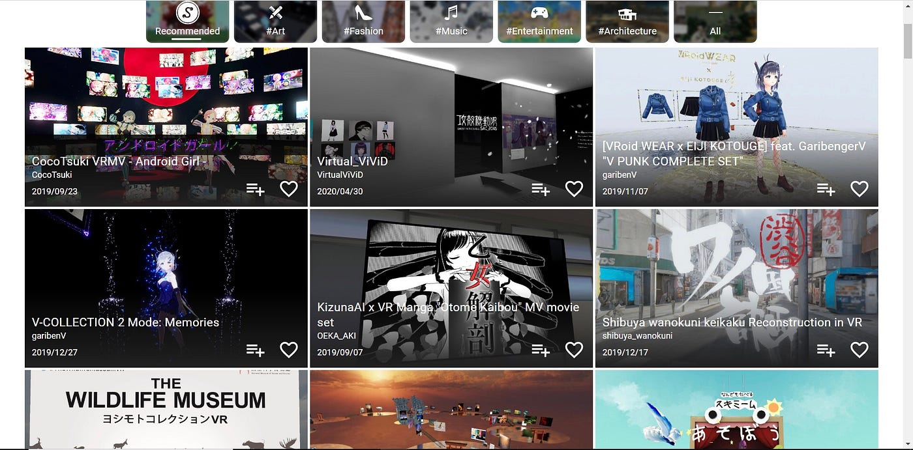
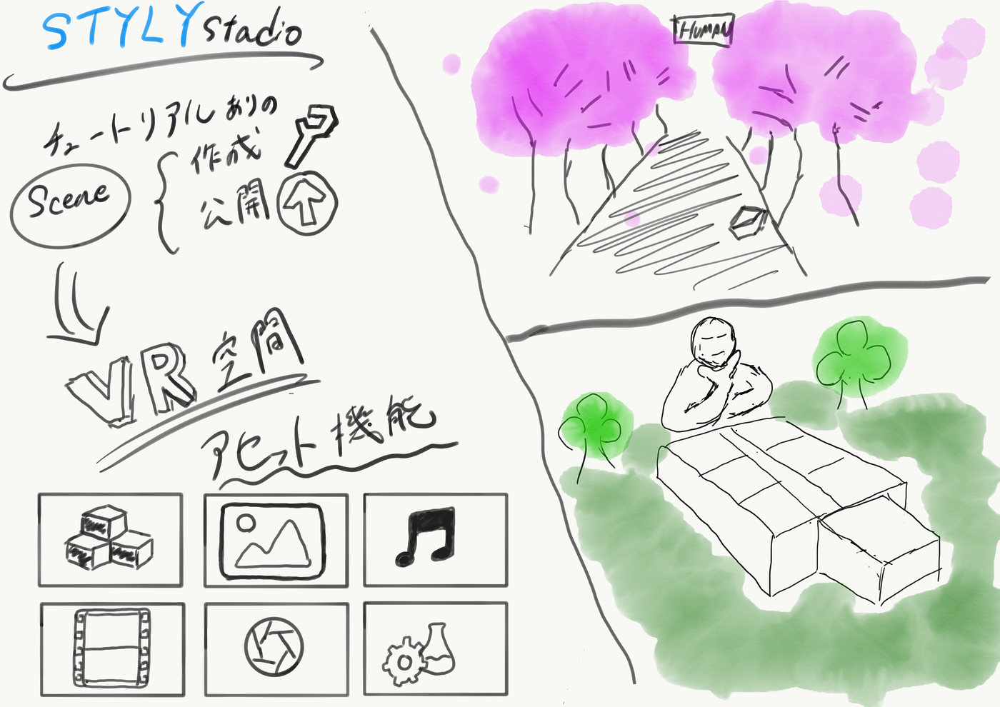

### STYLY Studioでのモデリング

今回はSTYLY StudioでのVR空間モデリングに取り組みました。

STYLY StudioとはSTYLYが公式に出している”[Scene作成・公開方法を学べるチュートリアル](https://styly.cc/ja/manual/scene-create-tutorial/)”というものがあり助かりました。

最初にScene (VR空間）を新規作成してアセットを挿入していきます。

### アセットの主な機能

> **3Dモデル**（Google Polyの3Dオブジェクト、光源、天球、エフェクト、フィルター、自分でアップロードした3Dオブジェクト）

> **画像**（360度画像、PNG、JPEG対応）

> **音楽**（MP3、Soundcloud対応）

> **動画**（YouTube対応）

> **Instagram **（アカウント連携すると、連携したアカウントから写真を取得し、画像にアニメーションが付き表示される）

今回は主にデフォルトの３Dモデルを使用しました。３Dモデルには、Poly３D models、Sky ＆Grounds、3D models、My models & Updateがあります。

ここから空や地面のエフェクトや３Dオブジェクトを選択して配置していきます。blenderに比べるとかなり多くの素材が用意されていました。もちろんblenderやその他の3DCGソフトでモデリングしたオブジェクトの読み込みも可能です。

#### ＜今回の作品＞

神田 （[Forest of animals](https://gallery.styly.cc/scene/51dda4eb-11cd-4003-a0d1-22c180db7ba3)）

馬場 （[pretest](https://gallery.styly.cc/scene/18832d52-49b6-485a-b383-c262276a2c6e)）

また作成したSceneはPublishボタンで[STYLY GALLERY](https://gallery.styly.cc/)というサイトに公開できます。このサイトから他の作成者の作品をVR（HMDを持っている方のみ）かWeb Playerで体験することができます。

#### 今回のグラレコ

