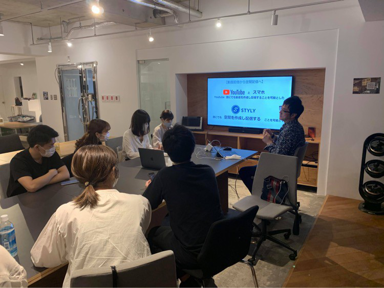
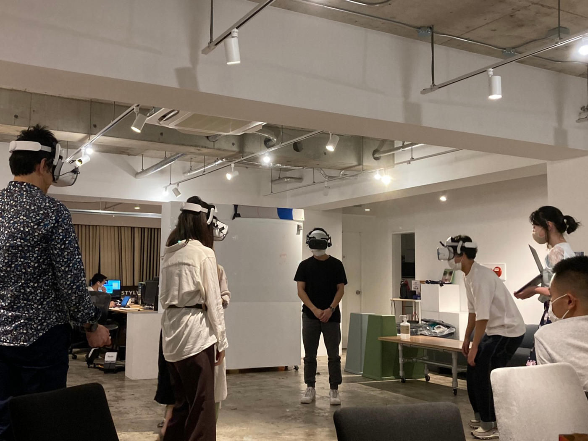
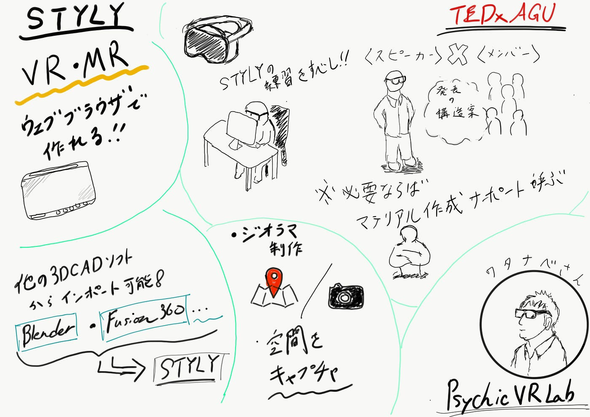

### STYLYのVR・MRを体験！

6月16日にPsychic VR Lab様のオフィスにお邪魔させて頂き、取締役COOの渡邊さんからStylyについて詳しく説明をして頂きました。

ここでは、説明を受け、TEDxで利用出来そうな情報だけをピックアップし、記しておきます。

#### ＜説明を受け、分かった事＞

・**ウェブブラウザ**のみで空間を作成し配信することを可能にする

・**VR、MR**空間を作成する事が出来る。

・空間に配置出来るデフォルトの**テンプレ**が多様。

・他の**3DCADソフト（Blender,Fusion360 等）**もスタイリーにインポート可能

・**無料アカウント**では、スタイリーのロゴが自動表示されるが、充分に使用可能。

・バーチャル空間に表示されるものを操作可能。

・空間をキャプチャ（**地図と大量の写真**でジオラマを制作）

・空間（**ゲーム・音楽**）を無料で作れる。

・クラウド上で**プログラムレス**でコンテンツ制作・配布が可能。

#### **＜TEDxAoyamaGakuinUでの利用方法案＞**

_**スピーチ_**：

事前にTEDxメンバーがSTYLY空間でのスライドやマテリアルの配置/演出方法・アクションの設定方法を把握し、スピーカーと共にスピーチを作る。

TEDxの何人かのメンバーはSTYLYの練習する必要あり。0から作る必要のあるマテリアルは依頼できる人を見つけサポートして頂く可能性も視野に入れておく。

このようにヘッドセットを着用して実際に体験もさせてもらいました。

#### ＜グラレコ＞

