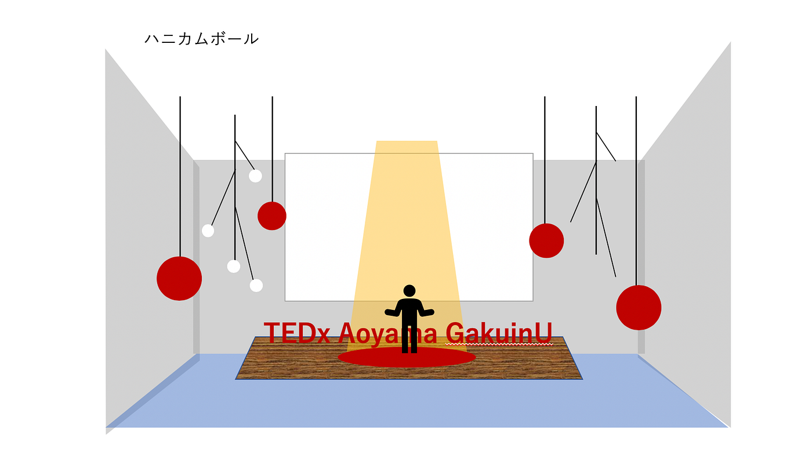
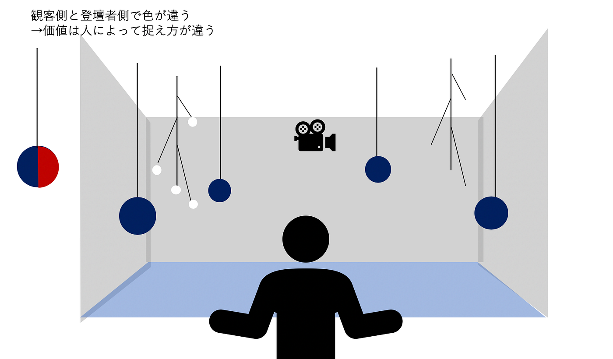
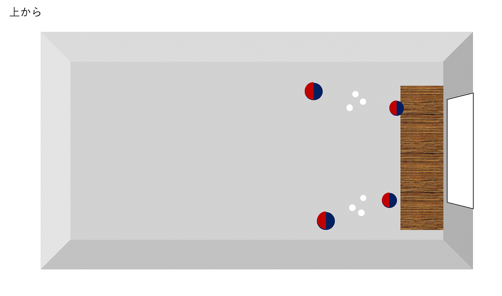
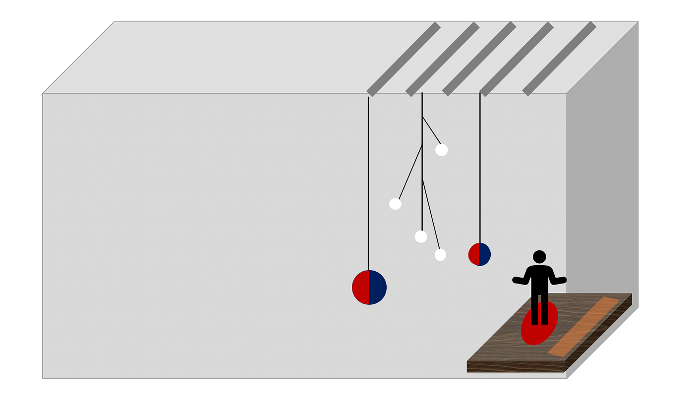
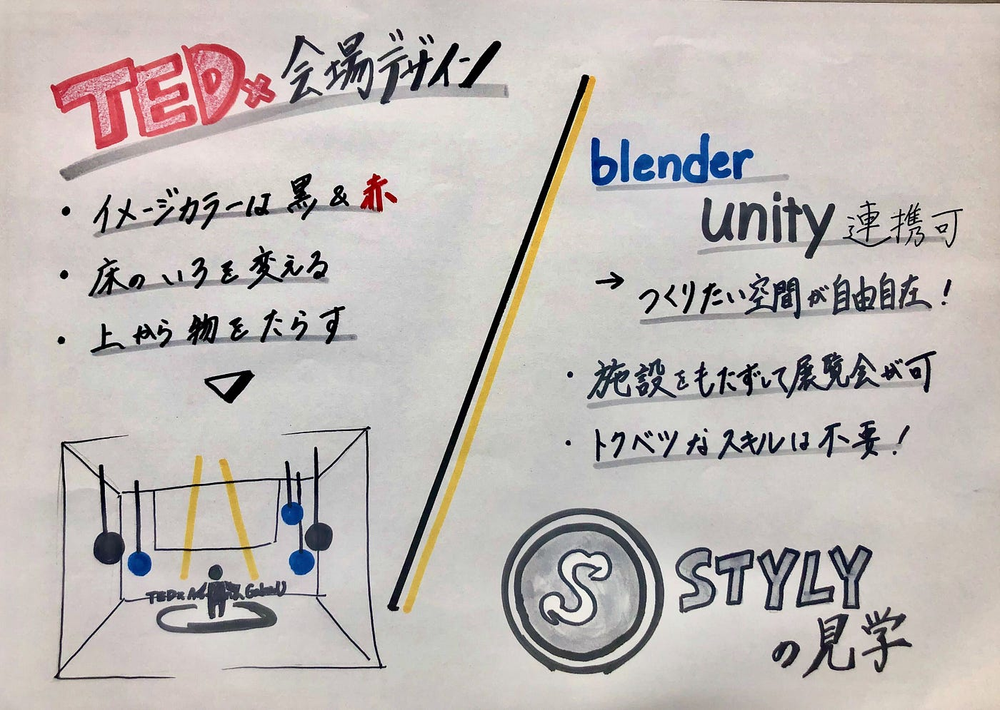

### TEDx 会場設計について

先週のMTGでは各自会場設計の案を考えました！

今週はその考えたものをブラッシュアップし、全体的な会場イメージをメンバーで共有しました！

> _全体は暗くすること_

> _イメージカラーは黒と赤_

> _床の部分を一色に変える（色は未定）_

> _上から物を垂らす→ライトアップする_

> _物：価値を再認識すべき物（PC、家族、本、時間など）_

> _人による価値の違いを表現→見え方を角度によって変わるように工夫する_

**STYLY 体験会に参加してみて**

6/16（火）styly体験会に空間デザイン部で参加しました。

[styly](https://styly.cc/ja/)では空間をVRとMR空間を作成することができます！

Blender（3DCG制作ソフト）やUnityなどとも連携していて動画の取り込みも可能で自分の作りたい空間を特別な知識がなくてもその空間に置くことによって簡単に作れるそうです！

施設を持たずして展覧会が可能になり、移動の必要もなく、人によってコンテンツを変化させることもできるそうです！！MRグラスさえ付ければ、空間にものを表示させることできます！

バーチャルでアバターを作って、というわけではなく、空間自体を作り上げてその中に飛び込んでいくことで現実のように体験できるリアルさによって観客を魅了し、オンラインでもその場にいる感覚を味わってもらえると思います。

参加してみて自分たちが考えていたことはstyly上では簡単に実現可能だということがわかりました！！（床の色を変更する、上からものを垂らすなど）なのでstylyでしかできないことをもっと考えて会場設計のなかに組み込んでいく必要があり、それを今後考えていきたいと思います。

ハッカソンの課題はclusterにしようとなっていましたが、それをまずstylyに変更し、その中で今回考えていた会場設計案をものづくり部と一緒に作成していきたいと思います！

＜ハッカソン課題（仮）＞

・styly上で今回イメージしているTEDxの会場設計

・stylyでしかできない会場づくりを具体的にイメージしていく

→ゲストスピーカーに合わせてプレゼン資料を提示できるようにする

＜今週のグラレコ＞

