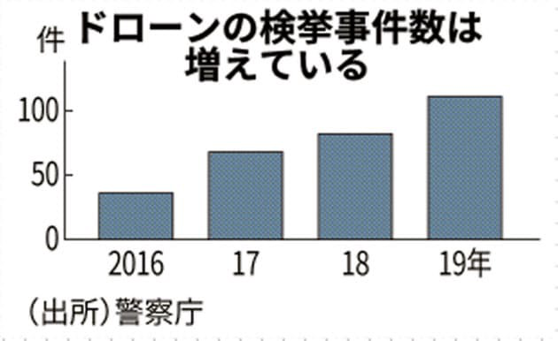
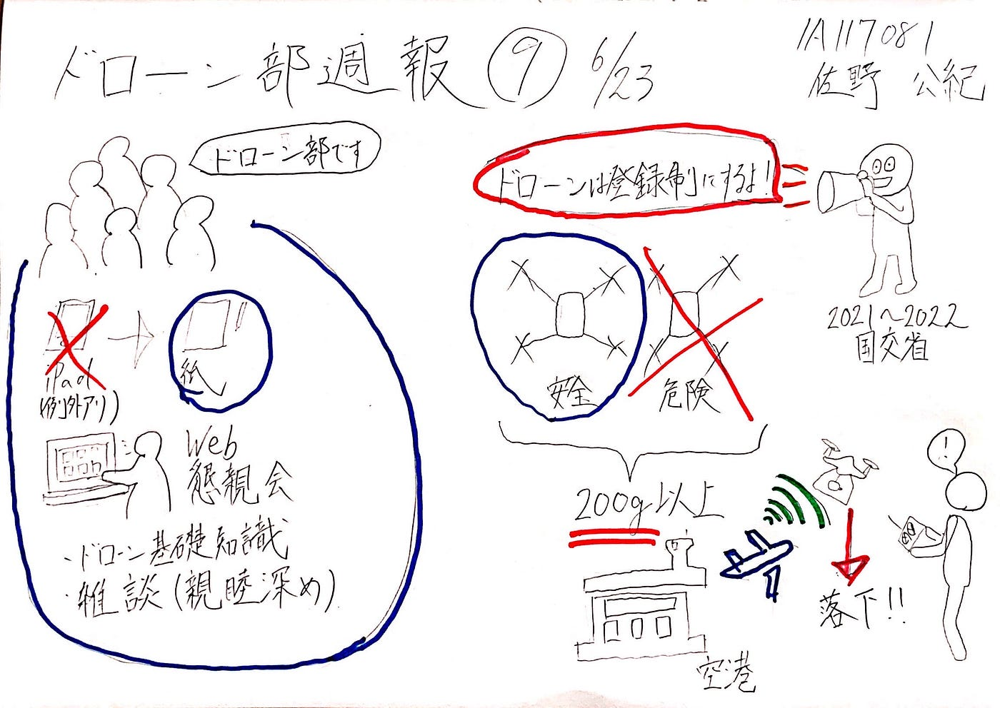

### ドローン部週報⑨

こんにちは。古橋研究室ドローン部の佐野です。今週は3年生にドローンの基礎的な知識を身につけてもらうべく（4年生もかな？）部長森田が主催した懇親会が執り行われました。

### 〜懇親会：6月18日20時〜

#### 内容

・ドローンとラジコンヘリの本質的相違点の共有

・ドローンに関する基礎的な知識の全体共有

・質疑応答

・雑談

以上の4点を見る限り一見浅い内容に見えるかもしれませんが、実際は大変有意義なものでした。実際3年生自身が声を上げてわからないところを質問するという行動そのものが原点となってこれから成長していくしていくと思われます。また、キャンパス授業がいまだに開始されていない状況で、zoomを使って今の段階から部員と親睦を深めることは非常に価値があるなと感じます。おそらく実際に顔をあわせるのは夏合宿になると思うのでその時が非常に楽しみです。

また前回のゼミ後のミーティングですが、ハッカソンに向けたドローン図鑑作成にあたり少し変更点があったのでお知らせします。

〜以前〜

・**iPadにて**各自ドローンのスケッチを行う

・一人あたり**3企業担当**

〜変更後〜

・各自**紙にスケッチ**して（iPadでも可）絵を完成させる

・一人あたり**2企業担当**

変更の理由はapple pencilのようなツールがないとipadにスケッチを行うことは現実的に考えて厳しい（絵のクオリティが最悪となる）と判断したためです。盲点でした。また担当企業数に関しては各々取り組むべきものと並行してハッカソンを行うには2企業が現実的に最適であるという議論の結果です。

他は大きな変更点なく、各自来週のハッカソンに向けて準備を進めるという形でミーティングは終了しました。

さて、今週は気になるドローンニュースがあったので紹介します。ドローン所有者に登録義務が課せられました。

この理由としては、近年ドローンユーザーが増えてきたために事故件数も多くなってきたため、機体の情報を管理し、安全確保のルールを整備するためです。

これを受けて国交省は、2021年末～22年始めに登録制度を導入することとしており、200g以上のドローンの所有者は、氏名や機種などを申請し、個別の登録記号の通知を受けることとなります。同時に、安全性に問題がある機種の登録はそもそも認められなくなります。

また、同時に成立したドローンの飛行禁止法改正案により、空港の管理者などはドローンの退去を命令したり、妨害電波で飛行を阻止することが可能となるようです。

政府は今後、ドローンの免許制度を作る方針。ある程度の危険を伴う運用をする場合は免許取得を必須とする方針であり、学科や実技試験を課して操縦者の技能も審査し、事故防止へと繋げるようです。

これを受け、これからもドローンのスキル磨いていく人々は操縦と知識の両面を向上させていく必要がありますね。ドローン部全体で取り組まなければw

今回のグラレコです。

4年 佐野公紀
