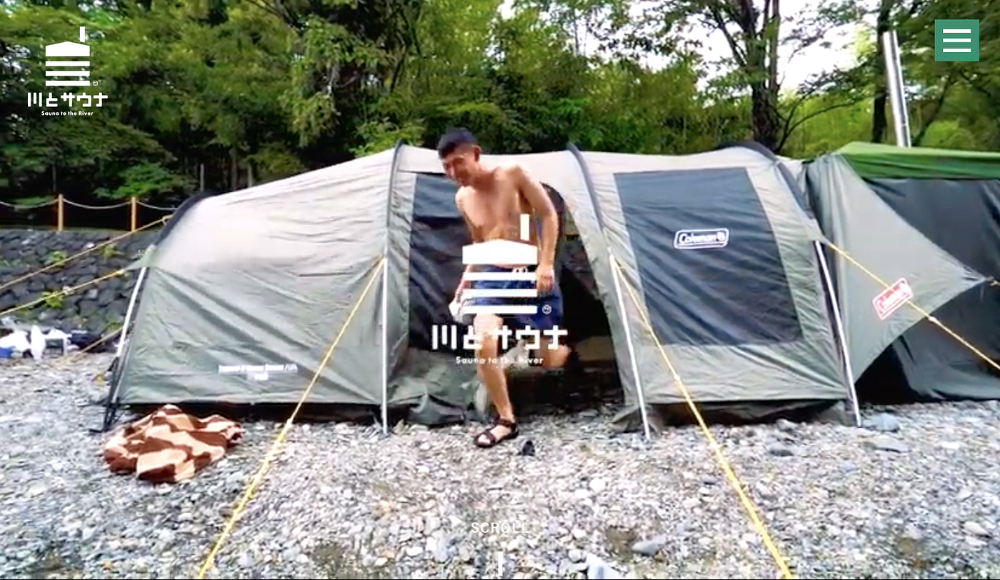

### 横瀬部週報 川とサウナ事前学習

こんにちわ、古橋研究室横瀬部の安保です。今回の横瀬部の週報では夏合宿げコラボを予定している「川とサウナ」さんについて学ぼうということで、横瀬部メンバーで[川とサウナさんの公式HP](http://kawatosauna.love)を参考に下調べを行いました。

#### **コンセプト**

> 木々の木漏れ日 清流のせせらぎ 小鳥のさえずり

> この、圧倒的大自然が広がるのは埼玉県横瀬町。
僕たちはここにサウナを作りました。

> サウナの中でヒリヒリと上がる肌の温度。
滴り落ちる汗。

> サウナから出ると、目の前には横瀬の山々が恵んでくれた清流があります。

> カラダを…投じる。

> カラダが不思議な衣に包まれ、多幸感に満たされます。
川から上がると、自分の五感が研ぎ澄まされていることに気づくでしょう。

> 全身に自然を注入するディープリラックス体験、
それが「川とサウナ」です。

↑ これが「川とサウナ」のコンセプトです。

もう既に横瀬合宿を経験している4年生はわかると思いますが、あの大自然の中で行われる合宿にサウナが加わったら倍楽しいでしょう。この様に僕たちも横瀬部として何かしら合宿でのコンセプトを設けて、他の生徒により楽しい合宿を経験していただけたらなと思います。

### サ飯とサ酒

「川とサウナ」さんの活動において欠かせないのが、サ飯とサ酒ですね。サウナに入り、汗を流すことで、カラダの中の塩分やミネラルが失われます。それにより塩分濃いめの食事や、ミネラルたっぷりの飲み物が、普通では体験できないほど、深い味わいになります。これを横瀬町の自然の中で味わえるのは楽しみです。

①バーベキュー

②どぶろく

③シュラスコ

「川とサウナ」さんはこの３つを主にオススメしていました。横瀬ホルモンやどぶろく「花咲山」など、横瀬でしか口にすることができない食品を食べることで、より横瀬の魅力を感じることができると思います。実際に夏合宿でも昨年と同様であれば夜にお酒を飲みながらバーベキューを堪能できるかと思います。横瀬部として名産品などをピックアップしてみるのも今後考えてみたいです。

また、[ソトレシピ](https://sotorecipe.com)というキャンプ料理専門のレシピメディアともコラボをしている「川とサウナ」さん。キャンプならではのレシピも載ってるので是非見てみてください。

### 今後

先週先生からもあった様に近日中に「川とサウナ」とオンラインでミーティングをする予定になっているので、そのスケジューリングを行いたいと考えています。それが終わり次第、横瀬部三人で横瀬に下見に行きたいと考えています。行きたい人がいれば是非、、、、！！！
