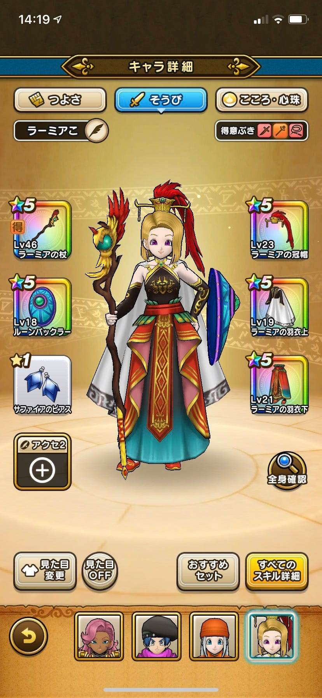
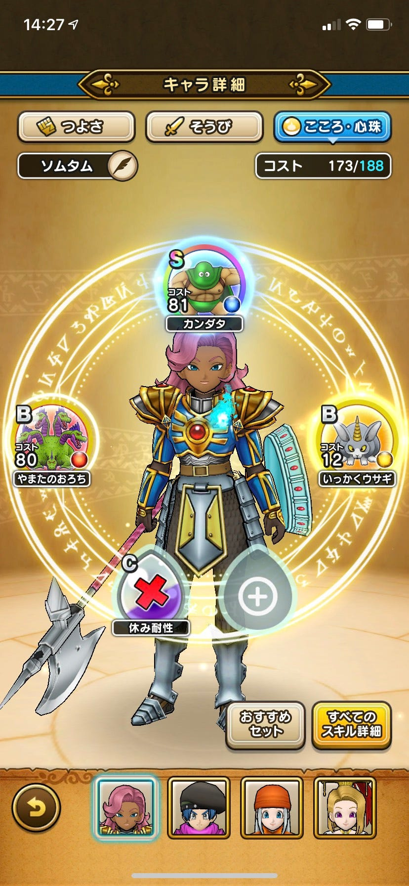
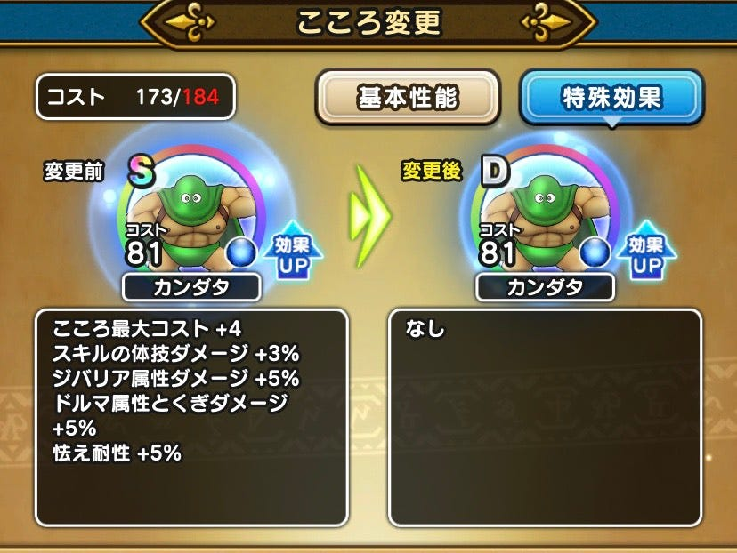
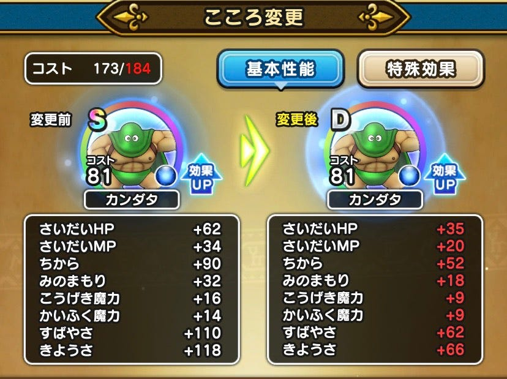

### 位置ゲー部ハッカソン：ドラクエウォークの基準決定

今回、Ingressとドラクエウォークを両方レベル上げをし、Ingressがレベル６になった時点でドラゴンクエストウォークがどのようなレベルになったのかまず発表します。結果としてはレベル38でした。かかった日数は約25日間かかりました。

### ではドラクエウォークの基準を発表します。

#### 基準はパーティ平均**レベル40**とします。なぜ40レベルに設定をしたか説明していきます。

1つ目はレベル38になった時点でほぼレベルが40に近かったということです。またドラゴンクエストウォークのストーリー4章の10話（1ストーリ10話）クリアの推薦レベルが40ということもあり、現在ストーリーは2020年6月28日の時点では7章まであるのでちょうどいいと思いました。

2つ目にIngressとの時間を比較してみて同等の時間であるからです。ドラゴンクエストウォークは確かに外に出なくてもレベル上げをすることができますが、ストーリー攻略やレベル上げのイベントをクリアするために外に出ることが必須になります。しかしIngressのように経験値の効率を求めてポータルが多く設置されている都会に出なくてもプレイすることが可能なので難易度を少し上げました。

3つ目に章を基準にしてしまうと武器やこころ（プレイヤーのステータスを上げるもの）によって攻略の難易度が変わっていってしまうからです。実際にドラクエウォークに課金をしてみて強い武器を使ってみたところ、ボス攻略はこれまで以上に簡単になりました。このように武器によって難易度が変わらないように、基準をレベル上げにしました。

### 効率のいいレベルの上げ方

次に効率のいいレベルの上げ方について説明します。

まずドラゴンクエストウォークを始めるうえでプレイヤーのステータスを上げることができるものは主に2種類あります。それは武器や防具といった装飾品とモンスターのこころです。

#### 武器について

ドラゴンクエストウォークでは武器はジェム（課金要素）で引くことができます。一番レアリティの高い☆5の武器や防具は他のレアリティの武器よりも強いです。そのためゲームを始める前に☆5の武器が出るまで厳選するも手段の1つとしてあります（課金も可能）。

この武器や防具は「工房」で強化ができることができ、☆４以下の武器や防具も強化をすることで経験値の効率を上げることができます。

#### 強い武器について

特にレベル上げの経験値の上げ方で強い武器は敵に全体攻撃を与えることができる武器が第一優先です。その次に単体にダメージを与える武器で、最後に強敵と戦う際に全体的な回復をする武器がとても重要になります。

全体攻撃の武器を優先する理由は敵を一撃で倒す可能性があり一番早いからです。これは全体攻撃の武器の例です。

#### モンスターのこころについて

モンスターを倒すとこころを入手することができます。強いモンスターになればなるほどコストが高くなっていくのでレベル上げが必須になります。このモンスターのこころは課金要素ではなくやりこみ要素でレアリティが分けられており、Sが一番強いようになっています。

では実際にレアリティでどのようなステータスがあるのかというと、

このようにステータスもことなり、特殊な効果も異なるようになります。

強いモンスターのこころの入手方法は、

1. メガモンスターに勝利する。（レイドバトル。協力可能なマルチバトル）

1. イベントクエストを攻略し入手する（強襲クエスト）

1. 一般的なモンスターからの入手する

主にこの3パターンからです。おススメとしては2のイベントクエストに強襲クエストで入手することです。なぜならソロ専用でモンスターの強さも徐々に強くなっていくために努力次第では強いモンスターのこころを入手することができるからです。

#### メタル系のモンスターを倒す

土日にはメタル系のモンスターが発生するクエストがイベントクエストからでき、経験値を大量に稼ぐことができます。また不定期開催でメタル系モンスターが大量発生するものもあるのでメタル系がきたら倒す意識が大事です。その際に会心の一撃を与える武器か連続攻撃の武器が特に有効です。

#### パーティの編成

初期で設定されている、戦士、武闘家、僧侶、魔法使いがおススメです。
