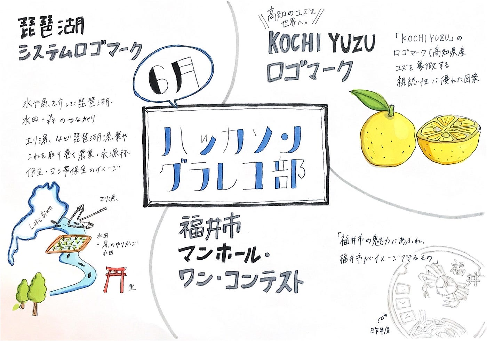

### 6月 ハッカソン グラレコ部

グラレコとピクトグラム、そしてロゴは情報を凝縮して表すという点で関連しているのではないか？ということで今回のハッカソンではロゴのデザインコンペに参加しました。

登竜門という情報サイトから見つけた地方自治体から出されている地域活性化系の３つのコンペ
・琵琶湖システムロゴマーク
・KOCHI YUZUロゴマーク
・福井市マンホール・ワン・コンテスト
のうち1人1個以上の参加をノルマにしました。

[イラスト・マンガ | コンテスト 公募 コンペ の[登竜門]
◆お知らせ◆掲載コンテスト等の実施予定について（参加時は必ず公式ホームページをご確認ください） いつも「登竜門」をご利用いただきありがとうございます。…compe.japandesign.ne.jp](https://compe.japandesign.ne.jp/category/comic/)

#### 琵琶湖システムロゴマーク

> 「_**琵琶湖システム」のロゴマークを公募します！_**

> 次の要素を極力盛り込むことなど（詳細は募集要項に記載）

> ・水や魚を介した琵琶湖・水田・森のつながり

> ・エリ漁などの琵琶湖漁業や、これを取り巻く農業、水源林保全、ヨシ帯保全のイメージ

募集期間：6/30まで

[「琵琶湖システム」のロゴマークを公募します！｜農業遺産
ご使用のブラウザでJavaScriptが無効なため、一部の機能をご利用できません。JavaScriptの設定方法は、お使いのブラウザのヘルプページをご覧ください。 ...www.pref.shiga.lg.jp](https://www.pref.shiga.lg.jp/biwako-system/news/311127.html)

#### KOUCHI YUZU ロゴマーク

> **「KOCHI YUZU」のロゴマーク(高知県産ユズを象徴する視認性に優れた図案<イラスト含む>)を募集します。**

> 海外向けのユズ商品のパッケージや海外でのプロモーション用
海外の人に「ユズといえば高知」と思ってもらえるようなロゴ

募集期間：7/10まで

#### マンホール・ワン・コンテスト

> **マンホールふたのデザインを募集します！**

> 普段は目に見えない下水道について関心や愛着を持ってもらうと共に、福井市の魅力を再発見してもらうこと

> ・デザインテーマは、「福井市の魅力にあふれ、福井市がイメージできるもの」
 ・図柄はフルカラーＯＫ。

募集期間：7/15まで

[マンホールふたのデザインを募集します！
令和2年7月26日にハピテラスで開催する「福井市上下水道展」に合わせ、マンホールふたのデザインを募集します。www.city.fukui.lg.jp](https://www.city.fukui.lg.jp/kurasi/gesui/gesuiproject/p019625.html)

発表用スライド

グラレコ

