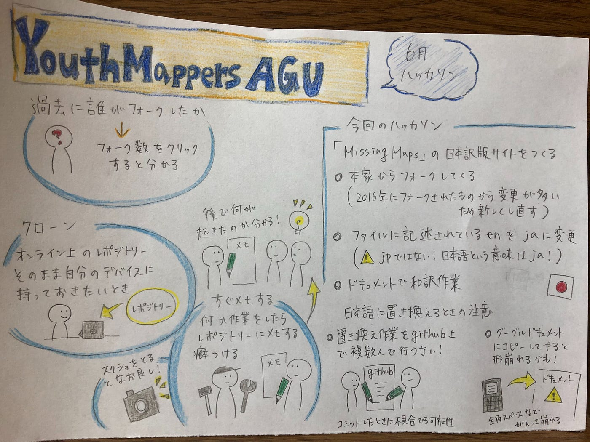

### Missing Maps のウェブサイトを日本語化

今回の報告書は2年髙橋が担当します。

YouthMappersAUGは、「Missing Mapsのウェブサイト日本語化」を目標としてハッカソンを行いました。

Missing Mapsのウェブサイトは、MapSwipeのウェブサイトとはつくりが異なり、ブランチがたくさんあったり、多言語化対応されていたりしてMapSwipeのウェブサイト日本語化の時のやり方は通用しませんでした。

まず、どの部分をフォークすべきなのか。そして、どこを書き換えるべきなのかわからず、結局古橋先生の力を借りてしまいました。先生、ありがとうございます。

Missing Mapsのウェブサイトの編集はCI deployによって行われている部分がある事などから、今回私たちはjaファイルの日本語への置換と、enテンプレートをjaに書き換えることを完了させることにしました。

日本語化作業については、まずドキュメント上で英語の下に日本語訳を追記していき、書き換えを担当する一人が一気にGitHub上のファイルを書き直すという方法で行いました。

また、今回の作業の中で学んだことをいかに箇条書きします

・GitHub上では、フォークボタンに書いてあるフォーク数を押すと今までフォークした人の一覧を見ることができる

・あとから作業内容を振り返ったり間違いを発見したりするため、少しでも作業をしたらGitHubのissueにメモする癖をつけるべき

・i18nはinternationalizationの略

・GitHubでどんな修正をしたかは、commitsから確認できる

・オンライン上のレポジトリーをそっくりそのまま自分のPCで持っていおきたいときや、一気に広範囲を変更したいとき、クローン機能を使う

・pushはローカルからオンライン、pullはオンラインからローカル の意

・日本語に置き換える作業をGitHub上で同時に複数人が行うと、良からぬことが起きる場合がある

以上のことを踏まえて、今後も活動を続けていきます。

特に、GitHubは全員が使いこなせるようになると連携がとりやすく作業効率も上がるので、まずはGitHubの使い方をメンバーで確認しようと思います。

