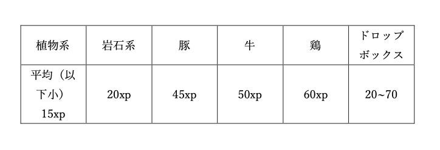
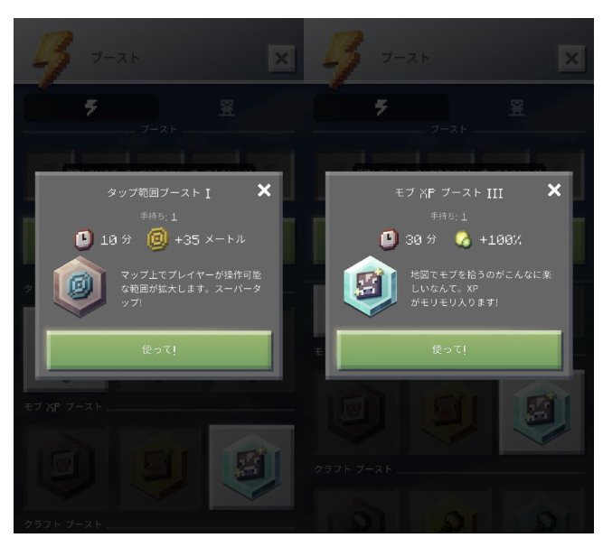
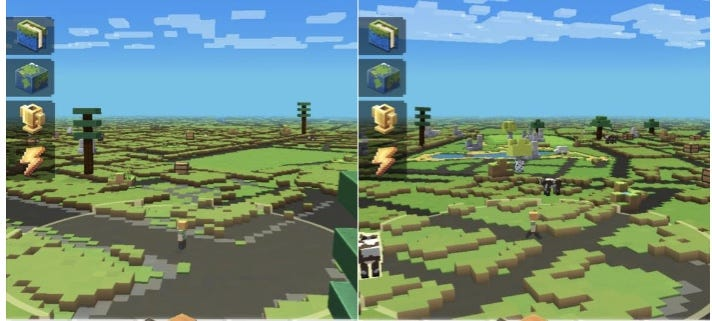

### マイクラアース：レベル設定

この記事は新しい位置情報ゲームのマイクラアースのレベル設定と効率的なレベルの上げ方を紹介します！

### #レベル設定

ingressとマイクラアースを並行して活動して行った結果

今までのingressのレベル設定であるLv.6に達するときにマイクラアースは**Lv.10**に達していました！

きりもよく、妥当なレベルだと思うので**Lv.10を推奨します！**

また、Lv10に達するうちに、素材やキャラクターの着せ替えも増えていくため、やり込み要素も増えていく。大きなビルドプレートを建設できるのもLv.10からです。

### #推奨するレベルの上げ方

マイクラアースには様々な経験値の上げ方があります。

- 道にドロップされている、アイテムの採取

- デイリーチャレンジやタッパブルといった、指定された採取を行うこと

- 毎シーズンある、チャレンジをクリアすること

- アドベンチャーを開始して、モブ退治やレアアイテムゲット

この中で、僕が思う**最強レベル上げ**方法は、、、

> **道にドロップされている、アイテムの採取です！**

というのも、ドロップアイテムを採取しないとデイリーチャレンジやアドベンチャーに必要な道具をクラフトできないからなんですよね。シーズンのチャレンジは初心者はまずクリア不可能ですし、、、

**＃＃ではどのように工夫してアイテムを採取すればいいか**

僕がお勧めするのは、モブを採取することです！

やったことがない人に説明しますと、道に落ちているアイテムは大きく4つに分類することができます。

植物系、岩石系、モブ系、ドロップボックス。

モブというのは、牛や豚、鳥などの動物系です。ドロップボックスは、種類バラバラなアイテムが入っていて、レア度も高いです。

**##ではなぜモブの採取を推奨するのか**

それは、単純にもらえる経験値が多いからです。

この表は、分類ごとにもらえる経験値をまとめた表です。これを見ると、モブ（牛、豚、鶏）がいかに平均多くの経験値をもらえるかわかります。

### **##次に工夫です**

マイクラアースには、ブーストという機能があります！これをうまく使いましょう！お勧めするブーストは、**モブxpブースト**と**タップ範囲ブースト**です。

この二つを同時に発動して、一気に経験値を上げることができます！実際にやってみて、1時間で3000xpもらえました。

**##最後に場所です**

まずこの二つのスクショを見比べて欲しいです。

この画像、左が渋谷駅前、右が淵野辺（鹿沼公園）前です。（撮影した時間は違います。）

明らかに、モブの数や木の量が違います！。ingressと違い、都会より田舎などの緑がある方が採取が捗るのではないのでしょうか。

### #まとめ

マイクラアースのレベル上げは、

> **モブxpブーストとタップ範囲ブーストを行いながら、モブを集中的に狙うべし！田舎で！**
