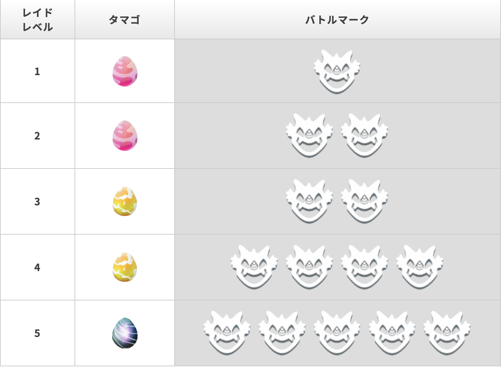
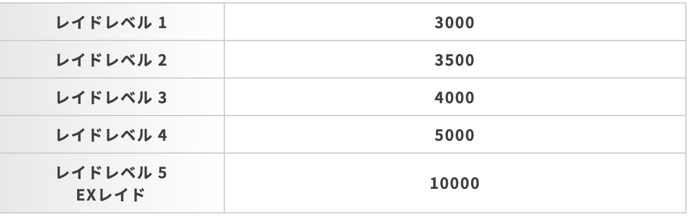
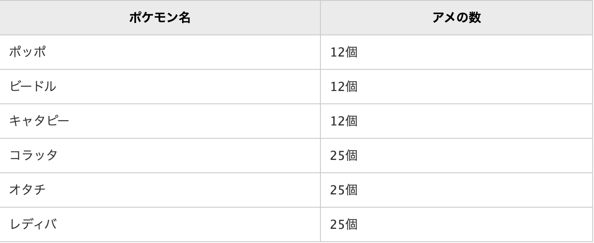
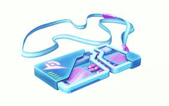

### 位置ゲー部 Pokémon GO レベル設定

今回の記事では、古橋ゼミにおけるPokémon GOのノルマレベルの設定と
どのようにしたら、効率良くレベルを上げることができるのかを記していきたいと思います！

### **##Pokémon GOのノルマレベルは？？**

結論から申しますと、今年度はLv.25が妥当であると考えます！
理由は以下の通りです！

> ・昨年度自身がやってみて、2–3ヶ月でノルマ達成できて、これが妥当な期間であると考えたから

> ・コロナの影響でレベル上げが難しいと思われるかもしれないが、新機能が実装され、リモートでもレベルアップが可能であると考えたから

> ・Lv.25までいくと、ある程度ポケモンを強く育てることができ、ノルマ達成後もゲームとして継続して楽しめるものであるから。

### ##どうやってレベル上げすればいいの？？

まずは僕自身がやっていることをご紹介したいと思います！

> 1.レイドバトル

レイドバトルにはレベル設定というものがされており、レベルは卵の色を見ればわかります！

このレベルが高い程、もらえる経験値が高くなります！

これに加えて、しあわせタマゴというアイテムを使うともらえる経験値が倍になるので、もし、使い余しているのであればレイドバトル前に使うのがおすすめです！

> 2.進化マラソン

進化マラソンって何？？という方もいると思います。
進化マラソンとは、進化までに必要な飴が少ないポケモンを進化させ続けるというものです！

野生で出やすくかつ、進化させやすいポケモンの一覧はこちらです！

### ## その他にコツとかあるの？？

コロナで外に出づらいのに、どうすれば・・・・。
という方は必見ですー！最近リリースされたリモートレイドパス
というものを使うことをおすすめします！

> リモートレイドパスって？？

端的に言えば、現地に行かなくてもレイドバトルに参加できるアイテムのことです！

ただし、使う際にはいくつか条件があるので注意してください！

> ・現在いる場所から、見ることのできるレイドバトルのみ使用可
・リモートで参加できるのは1つのレイドバトルにつき10人まで

#### ＊注意したほうがいいこと＊

これは私の実体験なのですが。。。
電波が悪いと、途中でバトルが終了してしますことがあります！
貴重なリモートレイドパスがそこで無駄遣いになってしまわないように、使うときは電波と相談してからにしましょう！

### ##最後に

ここで紹介できなかった、経験値効率方法はまだまだたくさんあります！
みなさんも、最短でノルマクリア& Pokémon GOをより楽しむめにも色々調べてみてください！

私がよく参考にしているサイトをおいておくので、よかったら覗いてみてください！
[https://pokemongo.gamewith.jp/](https://pokemongo.gamewith.jp/)
