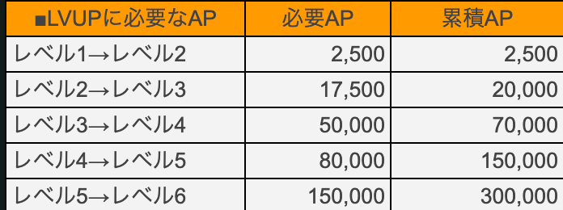
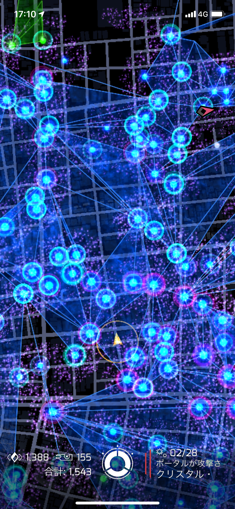

### 位置ゲー部 ハッカソン

〜古橋研究室位置情報ゲーム部部長が伝授する最速レベルアップ方法〜

古橋研究室に所属する学生必須の項目ingressレベル６という条件が難しいという声が多数あったため、自分がこれまでのプレイから得た経験を伝授します。

### はじめに僕がingressレベル６までにかかった時間を先に紹介すると約９時間ほどです。

本気でやれば1日でクリアできる課題なので今年の3年生はぜひ締め切りまでに全員レベル６に到達して欲しいです。（現四年生は当時３人くらいしかクリアできてなかった気がする）

### ＊あくまでこれはおれがレベル６までに意識してやっていたことです！ちなみに全部ソロでやりました！

では早速紹介していきます！！

まずこれが各レベルごとに必要な経験値です。

レベル６になるには累計で300,000APが必要になります。

この300,000APを最速で稼ぐために僕が意識したことを「アクション」「場所」「時間」の三つのセクションに分けて紹介していきます。

まずは「アクション」についてですが、レベル６に到達する上で最も大切な作業は

### 「CFの作成」

です。逆にこれ以外は正直どうでもいいです！（言い過ぎ）

CFを一つ作成した際に得られる経験値は1563APと序盤においてはかなりのAPを稼ぐことができます。なのでレベル６まではCFの作成を最重要目的として取り組むことがいいと思います！

反対に一番不要なアクションは

### 「攻撃」です

もちろん敵陣営のハブとなっているポータル を破壊すればかなりの経験値を得ることができますが、序盤では高レベルのポータル は基本的に破壊できないため諦めましょう。また、攻撃はかなりの時間とXM、アイテムを消費するため序盤特にレベル６まではかなり非効率で、旨味がありません。低レベルの敵陣営のポータルを中立かするときだけ行うといいと思います。

hackとdeployはやることを前提にしてます！グリフハックなど様々な技術はありますが、レベル６までは特に意識しないでとにかく数をこなす方がいいと思います！

次に「場所」について紹介します。

### 実はこの場所選びこそ、最速でレベル６に到達するために最も大切な要素になります！！

具体的にどのような場所が望ましいかというと

条件１→ポータル の母数が多い

条件２→リンクがあまり貼られていないこと

条件３→中立ポータル 、自陣営のポータル が多いこと

条件４→激戦区でないこと

以上の４点を意識して場所を選びました。この場所選びの細かい理由は後々説明しますが、大前提としてはCFの作りやすさを意識しています。

ここからは各条件の理由を説明します。

条件１に関しては当然ではありますが、全てのアクションを行う際にポータル 間が離れていると作業効率が全く上がりません。できるだけポータル が密集している場所がおすすめです。具体的にはingressの画面にポータル が６０〜７０個ほど見える地域がおすすめです。

条件２に関しては、CFの作成に他の人が貼ったリンクが妨げになることが多いからです。

条件３についてはレベルが低い段階で相手のポータル を破壊する作業は非常に効率が悪いため、できるだけ攻撃をしないでCFの作成を行うためです。（僕はレベル６まで攻撃を一回もしたことない気がする）

最後に条件４の理由はせっかく作ったCFを破壊されることを防ぐためです。

ポータル の母数はこのくらいがおすすめ！（上野駅）だけどこれだとリンクの作成などが難しいのでアイテム集めには適しているけどAP稼ぎには向いてない！

**最後に時間です！！**

これもかなり大事な要素になってきます！

なぜなら、、

### 敵エージェントとの接敵を避けることができるからです！！！

イングレスをプレイしたら実感すると思いますがイングレスを本当の意味でプレイできるのはレベル８からです！

正直レベル６以下はたいした行動もできません！！

なので接敵してしまうと、せっかく自分が頑張って作ったCFは無残にも破壊され、敵陣営のポータルになってからは手も足も出ない。。。なんて事件を未然に防ぐためにもプレイする時間は非常に重要です。

そしてそのおすすめの時間帯とは「深夜」か「早朝」です！本当は陣屋の方がおすすめなのですが、一人でプレイする場合は安全面に十分配慮して行ってください。。

一番やってはいけない時間は週末の２２時頃です！とにかく猛者が出歩いています！

また、週初めは猛者たちが週末に立てた強いポータル が残っていて、何もできなくなる可能性があるので、週半ばの中立ポータル が増えてくる時を狙いましょう！

長くなりましたが、簡単（雑）にまとめると

### 火曜日の深夜or早朝にポータル のめっちゃあるところでCF貼りまくれば９時間もあればレベル６にはなれます！！！

そして最後に！！一番大切なこと言います！！

移動は「自転車」がおすすめ！！！経験値効率まじで５倍は違います！！！

でもながらスマホにならないようにポータル の場所を一回確認して安全に配慮しながら行ってください！

以上！！！
