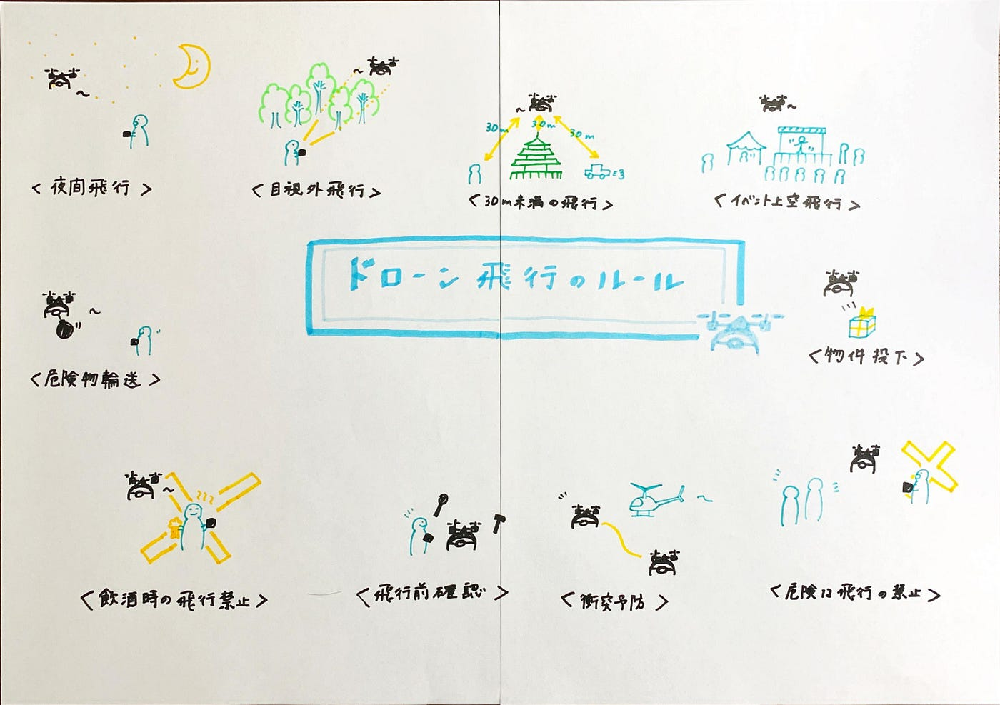
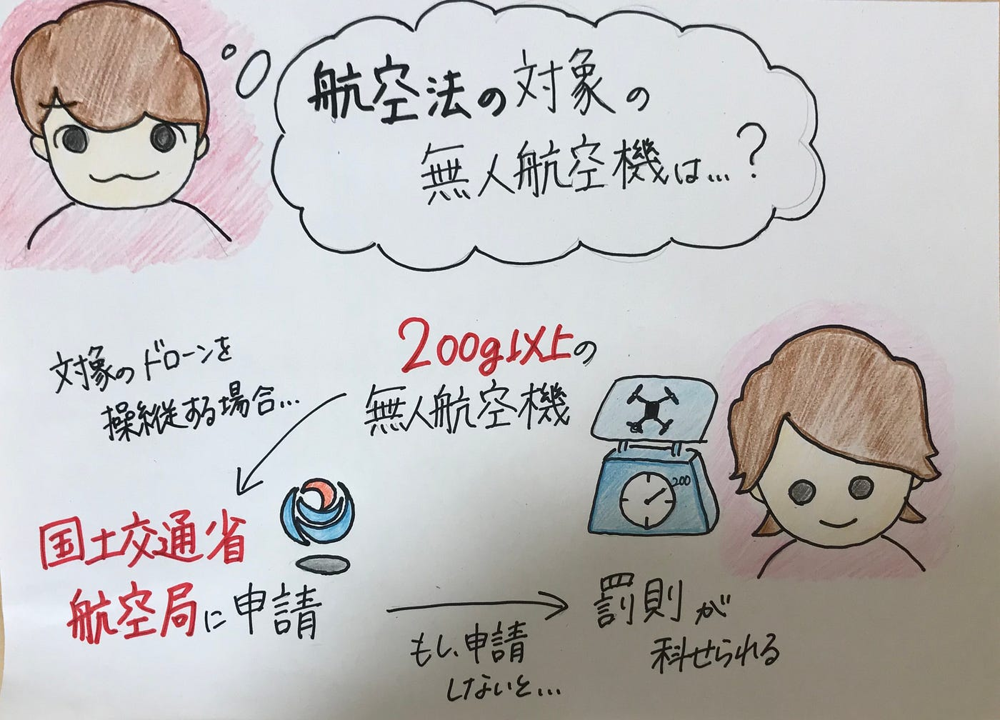
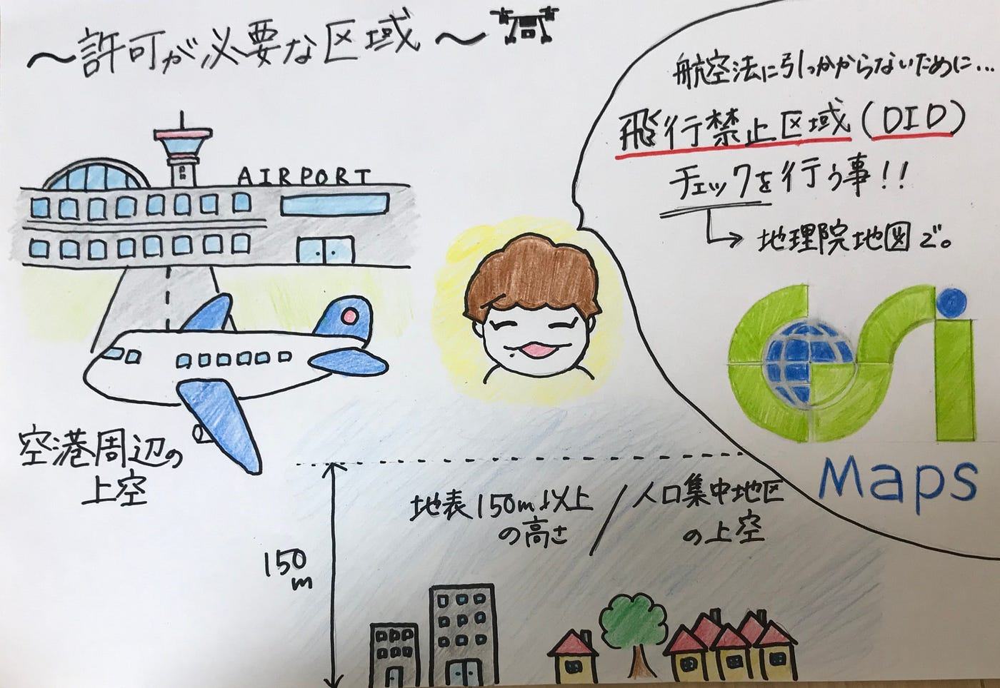
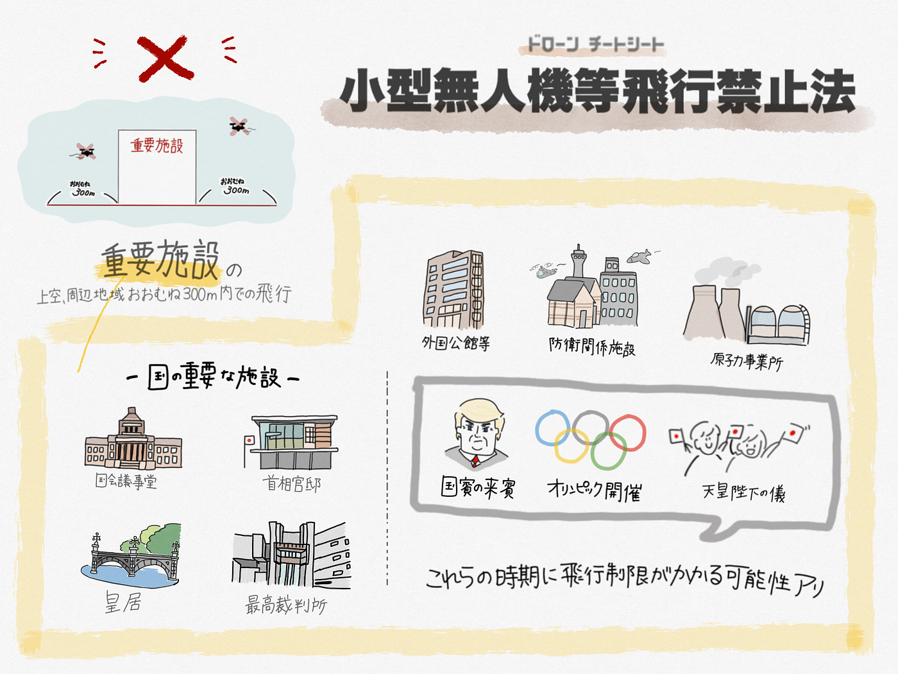
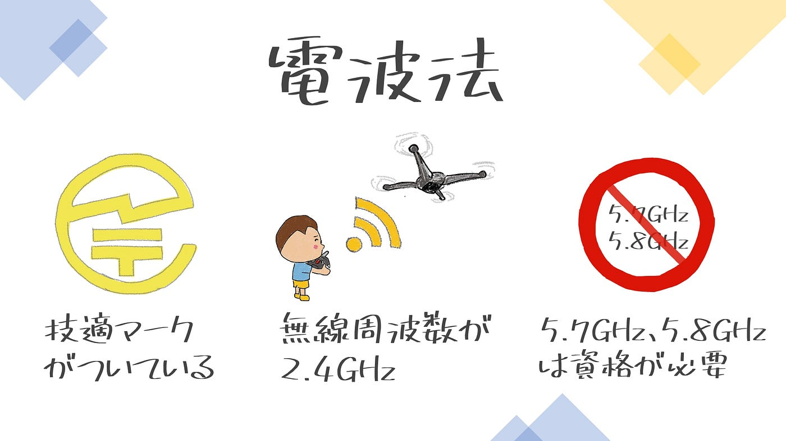
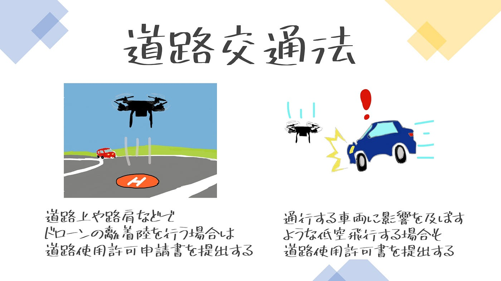
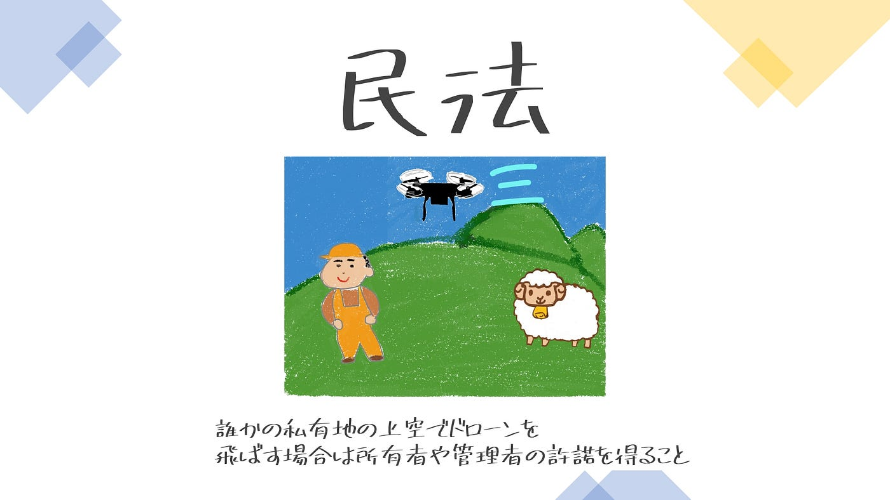
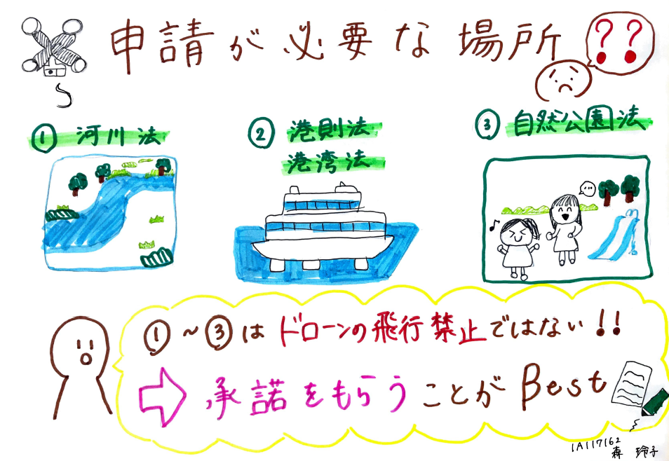

### ドローンにまつわる法律

#### 第3回ハッカソン ドローン部 チートシート

ドローンの需要が拡大し続ける中、ドローンを使用したことによる検挙数も増加しています。警視庁によると、2019年では111件もの航空法違反による摘発（[日本経済新聞](https://www.nikkei.com/article/DGXMZO57242650W0A320C2MM0000/)）がされており、ドローンを飛ばす際の知識がまだまだ認識されていないことが問題であると考えられます。

そこでドローン部では、ドローンの法律にまつわるチートシートの作成を試みました。ドローンにまつわる法律は多岐に渡っているため、今回はその中でもより主要であり身近な法律をまとめることにしました。

#### # 今回まとめた法律一覧

- 航空法

- 小型無人機等飛行禁止法

- 電波法

- 道路交通法

- 民法

- 飛行申請が必要な場所

#### ## ドローン飛行のルール

こちらは法律ではないのですが、最低限守らなければならないルールになります。ドローンによる事故を防ぐための、基本的要素になっておりますので厳守しましょう。

> ［１］ アルコール又は薬物等の影響下で飛行させないこと
［２］ 飛行前確認を行うこと
［３］ 航空機又は他の無人航空機との衝突を予防するよう飛行させること
［４］ 他人に迷惑を及ぼすような方法で飛行させないこと
［５］ 日中（日出から日没まで）に飛行させること
［６］ 目視（直接肉眼による）範囲内で無人航空機とその周囲を常時監視して飛行させること
［７］ 人（第三者）又は物件（第三者の建物、自動車など）との間に３０ｍ以上の距離を保って飛行させること
［８］ 祭礼、縁日など多数の人が集まる催しの上空で飛行させないこと
［９］ 爆発物など危険物を輸送しないこと
［10］ 無人航空機から物を投下しないこと
（[国土交通省](https://www.mlit.go.jp/koku/koku_tk10_000003.html#a)から引用）



#### ## 航空法

[国土交通省](https://www.mlit.go.jp/koku/koku_fr10_000040.html)によると、

> 対象となる無人航空機は、「飛行機、回転翼航空機、滑空機、飛行船であって構造上人が乗ることができないもののうち、遠隔操作又は自動操縦により飛行させることができるもの（ **200g未満**の重量（機体本体の重量とバッテリーの重量の合計）のものを除く）」

と定義されています。つまり**200g以上の機体**には航空法が適用されることになります。適用されるドローンを操縦する場合、国土交通省航空局への申請が必要となります。

また他の航空機に影響を及ぼす可能性のある空域や、落下した際の危害が大きくなる可能性のある空域においては、国土交通大臣の許可を得る必要があります。

#### ### 許可が必要となる空域

- **空港周辺の上空**

- **150m以上の高さ**

- **人口集中地区の上空**

そこで航空法に引っかからないために、**飛行禁止区域（DID）**の確認を行いましょう。有名どころのサイトでは、地理院地図の[人口集中地区（DID） 平成27年](http://maps.gsi.go.jp/#11/35.688871/139.693257/&base=std&ls=std%7Cdid2015&blend=0&disp=11&vs=c1j0h0k0l0u0t0z0r0s0m0f0&d=m)で確認することができます。

他にもDIDを探すことのできるマップがありますが、そちらは古橋教授がまとめた以下のブログを参考にしましょう。

[人口集中地区(DID)を知る方法
ドローンのことをよく知っている人かどうか確認する便利なキーワードがある。medium.com](https://medium.com/furuhashilab/%E4%BA%BA%E5%8F%A3%E9%9B%86%E4%B8%AD%E5%9C%B0%E5%8C%BA-did-%E3%82%92%E7%9F%A5%E3%82%8B%E6%96%B9%E6%B3%95-addf252045d2)





#### ## 小型無人機等飛行禁止法

最近ではDJIの[MAVIC MINI](https://www.dji.com/jp/mavic-mini)のように200g未満でも高性能のドローンが創出されつつあります。前述したように、200g未満のドローンは航空法適用外であります。しかし小型無人機等飛行禁止法は**全ての無人航空機に適用**されるので、注意が必要になります。

小型無人機等飛行禁止法を簡単にまとめると、**重要施設**及び**その周囲おおむね300m**の周辺地域の上空における小型無人機等の飛行が禁止となっております。

#### ### 重要施設

- **国の重要な施設等**

- **外国公館等**

- **原子力事業所**

- **防衛関係施設**

他にも、東京オリンピック開催時、国賓が来賓した時期、天皇陛下の儀が催される際には、特例として飛行制限がかけられる可能性もあります。



#### ## 電波法

普段私たちが生活している社会には、たくさんの周波にありふれています。特に2.4GHz帯は国の許可なく自由に使うことができ、Wi-Fi、家電製品、医療機器、Bluetoothといった身近なものに利用されています。

ドローンも周波で飛んでおり、使用される周波数は主に、2.4GHz帯、5.7GHz帯、5.8GHz帯と分類されます。

一般的なドローンは2.4GHz帯となっており、**資格**や**許可**が必要ありません。また基本的には、適合証明を受けた際にドローンの送信機や機体に**技適マーク**が記載されます。そのため、**2.4GHz帯**で**技適マーク**が付いていれば電波法で摘発されることはありません。

したがって電波法違反は、**特殊な周波数帯**（免許が必要な周波数帯）を**無免許**または**無許可**で利用している際に摘発されます。



#### ## 道路交通法

道路や路肩でドローンを離着陸をさせる際は、道路使用許可申請書を管轄の警察署提出し、許可を得なければなりません。他にも走行している車に影響を及ぼすような低空飛行や操縦をする場合も許可が必要になります。



#### ## 民法

民法では「土地所有権の範囲」として、土地の所有権は、法令の制限内においてその土地の上下に及ぶと定義されています。

つまり誰かの私有地の上空でドローンを飛ばす場合は所有者や管理者の**許諾**を得ることを推奨します。



#### ## 飛行申請が必要な場所

- 河川・河川敷

**河川法**では、河川・河川敷におけるドローンの飛行自体を禁止しているわけではありません。河川によっては、河川管理者の河川管理行為として、ドローン飛行の自粛を求められることがあります。河川・河川敷におけるドローン規制は、河川によって異なります。河川管理者に確認してから飛ばすようにしましょう。

- 港

港では、**港湾法**と**港則法**の二種の法律が存在します。港湾法は港湾施設の管理を目的とするのに対して、港則法は船舶交通の安全を目的としています。少し異なる法律にはなりますが、どちらの法律もドローン飛行を禁止している訳ではありません。しかし港湾区域及び港湾施設におけるドローンの飛行は、港湾管理者の管理行為に服すと定められているため、管理者に承諾を得るようにしましょう。

- 自然公園

自然公園には、自然の保護を目的とした**自然公園法**が存在し、立入禁止区域への立入や迷惑行為が規制されます。自然公園法もまた、ドローン飛行を禁止している訳ではありません。管理団体によってドローンの飛行基準が異なるため、土地所有者の同意・承諾を得る必要があります。

以上のように、河川法も港則法も自然公園法もドローンの飛行を禁止しているわけではありません。しかしグレーゾーンなところが多いため、承諾を頂いてからドローンを飛ばすのが最善と言えるでしょう。



以上、ドローンにまつわる法律シリーズをまとめてみました。違法行為による摘発件数を減らすためにも、ドローンに対する知識を深めていきましょう。

```
発表資料
```
