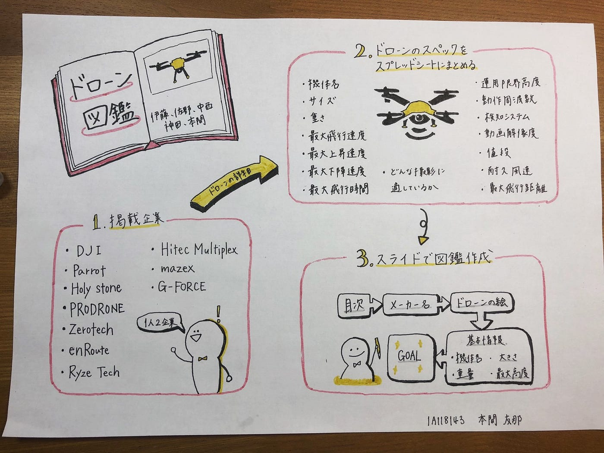

### ドローン部 図鑑組 ハッカソン

こんにちは。ドローン部4年の佐野です。今回のハッカソンを取り組むに当たり、我々ドローン部は2チームに分かれてそれぞれの課題に向き合うこととなりました。その1つであるこちら、ドローン図鑑の作成は伊藤、神田、本間、中西、と私の5人で取り組みました。

我々図鑑組は今回の課題において超絶何かに工夫を凝らしたということはありません。簡単に言ってしまえば各自担当のドローン会社の機体を調べ、そのスペックを調査しスケッチする。ということを行いました。単純作業と言われればそれまでですが。

だからと言って収穫物が0だったことはないです。一体今回のハッカソンでの学びで何が見込まれたかを、作業内容と照らし合わせながらご説明いたします。

今回以下の10社を1人2社体制で図鑑としてまとめました。

・DJI

・G-FORCE

・Ryze Tech

・mazex

・Hitec Multiplex

・PRODRONE

・Parrot

・Holy Stone

・Zerotech

・enRoute

そして、スプレッドシートに記入したドローンスペックは以下の通りです。

・サイズ

・重量

・最大飛行時間

・最大到達高度

・速度

・最大飛行距離

・周波数

・値段

スプレッドシートのパーマリンクがこちらです。

[docs.google.com](https://docs.google.com/spreadsheets/d/1iOXC8I8CoW4DW8c3hB-uV0l8H2fl7w5iBNGA9wIZ-_A/edit?usp=sharing)

続いてイラストについてですが今回ipadと手書き両方可となりました。当初は皆ipadで統一する予定でしたが、指のみでは満足のいく仕上がりが見込まれないという判断で各自どちらか選ぶ形となりました。また、手書きをあえてすることでドローンの構造そのものをスケッチしながら学ぶことができると判断しました。絵の上手い下手に関わらず、画像をポンと載せるだけでは身につかない機体構造の更なる理解を狙いとしました。

ドローン図鑑のリンク

発表スライドのリンク

グラレコです。
