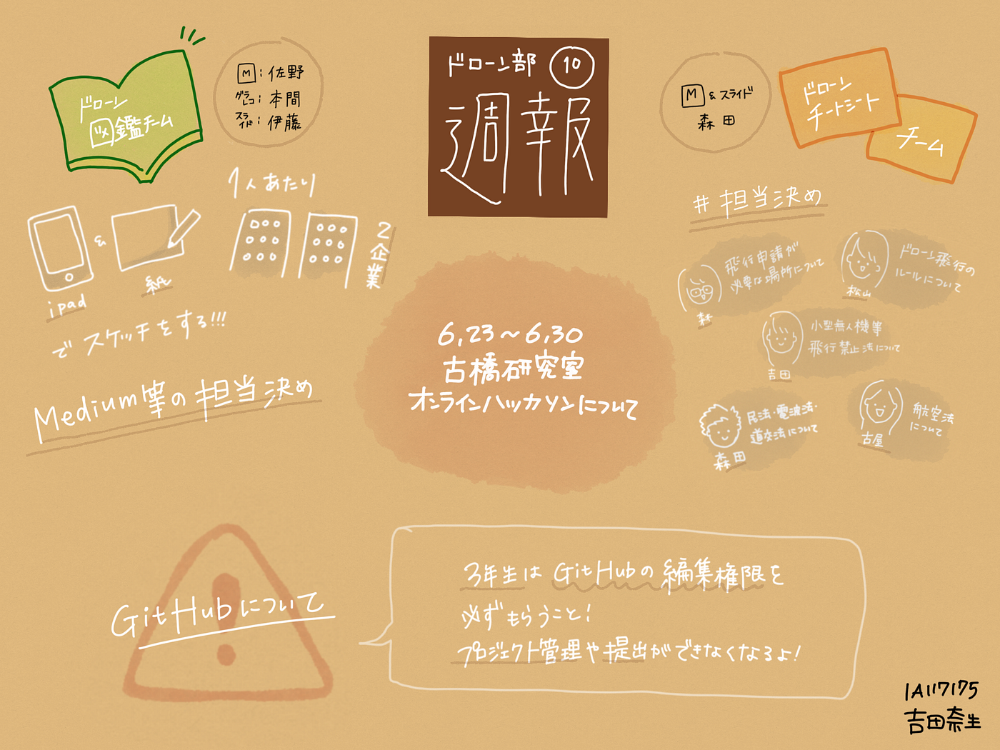

### ドローン部週報 第10週目

こんにちは、古橋研究室４年の吉田です。
ドローン部週報も第10週目になるみたいですね。一周回ってくるの早い。。。ドローンネタが尽きないことを祈ります。。。

#### ＃活動報告

さて、今週は各チームがハッカソンに励んでいる頃だと思います。
私たちドローン部も2チームに分かれてそれぞれ作業とにらめっこしています。

今回のミーティングでは、そのハッカソンに関しての最終確認を行いました。正直確認作業だったため多く語ることはないので以下のグラレコを活動報告とさせてください。

個人的な話になりますが、今回初めてデジタルでグラレコしてみました。

普段の紙とは違う使い勝手に戸惑いながらも描いていくのが楽しかったです。ただ、私自身まとめる力がないので宝の持ち腐れのような気がしたのでこれから練習してみたいと思います。

#### ＃ドローンニュース

今回私が紹介したいのは、真面目なニュースではなくLINEニュースで見かけたちょっと面白い記事です。

_**「空飛ぶ傘『フリーパラソル』」_**

ドラえもんのひみつ道具ではなく、アサヒパワーサービス株式会社という会社が開発しているドローン搭載傘で、_できるだけ簡単に手で持たない傘をさすこと_を目標として開発を進めているそうです。

ドローンにシートを装着することで日を遮り、特定のマークを追尾する自動操縦仕様になっており、両手が空くということで視覚障害を持った方の利用が期待できるようです。

ただ、この動画を見る限り、モーター音の大きさや日差しの角度への対応、コンパクトさなど、まだまだ改善が必要な箇所が目立つように思います。動画のコメント欄にも批判的な内容が多くみられました。

私自身も「頭上にドローン飛ばすなんて危ないなあ、、、髪の毛巻き込まれそうだな、、、うるさそうだな、、、」とこの記事を初めてみたときに感じました。しかし、面白そうだと思ったのも事実です。SF世界のような光景が広がる可能性があるのかなと思うとその完成品が楽しみです。
2020年商用化を目指しているということだったので続報を待ちたいと思います。

#### ＃＃補足

少し調べてみたところ、海外でも「_**ドローンブレラ_**」というものが開発されています。

マジックショーからアイデアを生み出し開発されたとのことですが、特に商用化などの情報はありませんでした。。。残念。。
