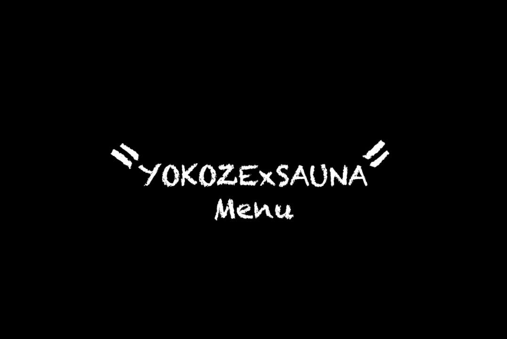
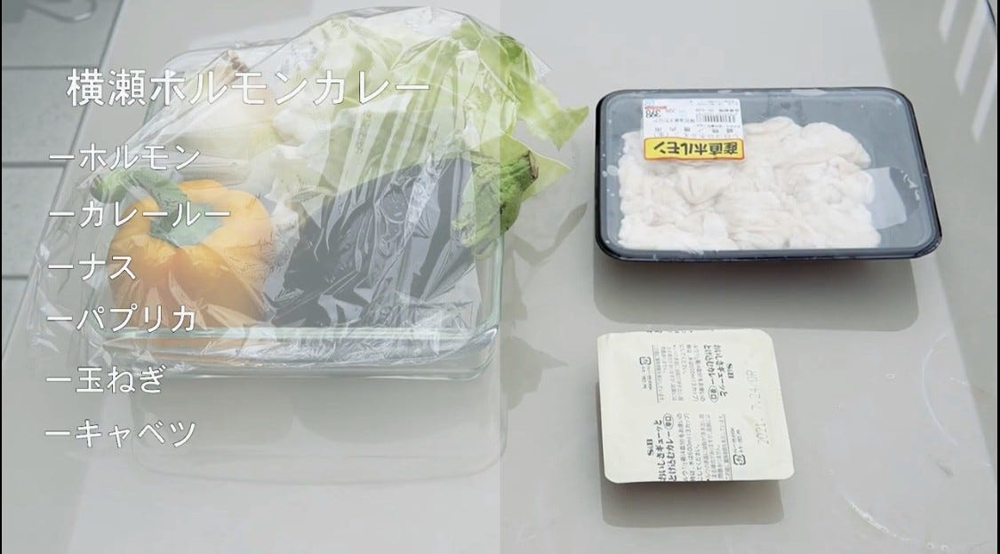
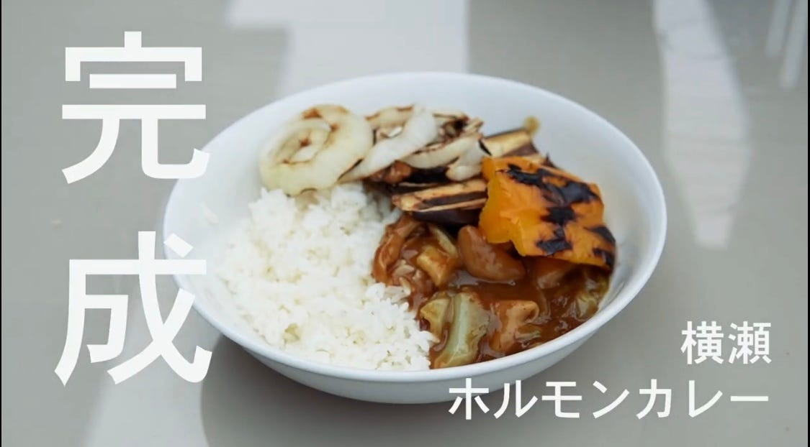
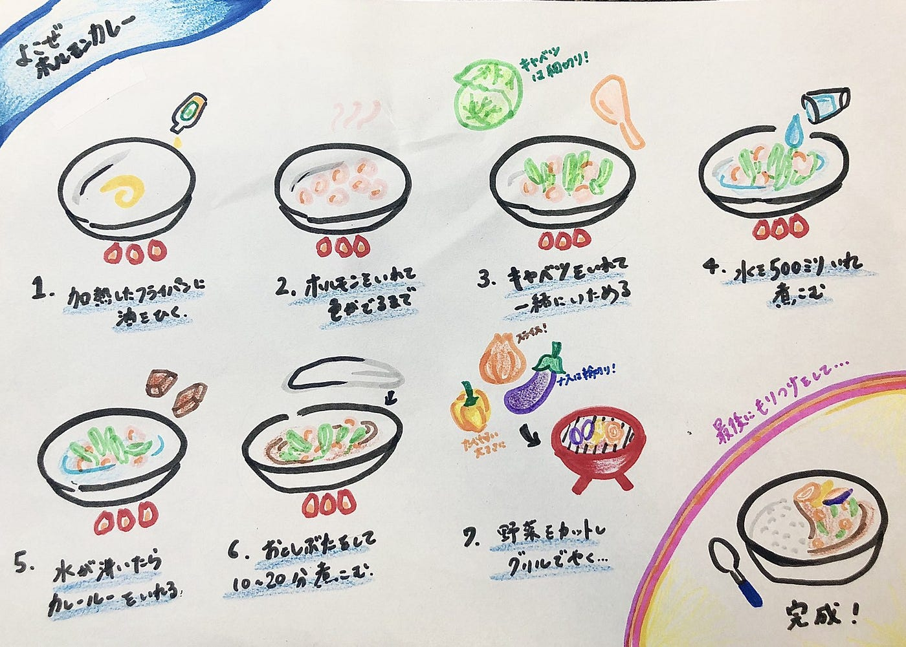

### 横瀬部ハッカソン

こんにちは、古橋研究室横瀬部の安保です。6月のオンラインハッカソンは各ゼミごとでの成果報告ということで、我々横瀬部は8/21〜8/23に横瀬町で開催される夏合宿のレシピ考案を行い、それを動画にすることにしました。合宿では現在我々が勧めている「川とサウナ」さんとのコラボレーションでサウナを設置するのに加えて、横瀬町×サウナをテーマに古橋ゼミならではのBBQレシピを提供する予定になっています。先週の事前学習によって、「川とサウナ」さんで横瀬の特産品を用いたサウナ飯というのがあることがわかりました。なかでも横瀬ホルモンが非常に人気であったため、手始めとして今回はホルモンを使った男ホルモンカレーを作りました。

### ＜横瀬ホルモンカレー＞

**●材料**

> ・横瀬ホルモン

> ・玉ねぎ

> ・ナス

> ・パプリカ

> ・キャベツ

> ・カレールー

**●レシピ**

①まずは、準備したキャベツ以外の野菜をBBQグリルで焼ける大きさに切っていく。キャベツはこの後フライパンでホルモンと炒めるのでそれ用の大きさに切る。

②次に、油を引いたフライパンに横瀬ホルモンを投入。ある程度焦げ目が付くまで炒めていく。焦げ目が付いたら先程のキャベツを投入し、キャベツがしんなりするまで炒める。

③フライパンに適量(500ml)の水を投入して煮込む。水が沸騰したらカレールーを投入してさらに煮込む。(蓋をする。ない場合はアルミホイルなどで落とし蓋をする。)

④カレーを煮込んでいる間に最初に切った野菜をBBQグリルで焼いていく。適度に塩胡椒などで味をつけてお好みの焼き加減まで。野菜に若干の焦げ目が付くのがベスト。

（※キャベツ同様に野菜を炒めてもいいが、BBQ感を出す為と野菜の味を残す為にBBQグリルで焼きます。）

⑤お皿に炊き立てのご飯とホルモンカレーを盛り付ける。最後に、グリルで焼いた野菜を盛り付けて完成。

ホルモン独特の風味がカレーとマッチしてビールとの相性抜群。グリルでじっくり焼いた野菜も甘みがあってとても美味しいです。

### ＜レシピ動画＞

今回のレシピ動画をYouTubeに上げました。

### ＜まとめ＞

今回は横瀬の特産品であるホルモンを使用したカレーを作りました。女子やホルモンが苦手な人でも美味しく食べれるような一品を残りの時間を使って試行錯誤していきます。また、その他の特産品を使った料理の考案も進めていきたいと思います。

### ＜グラレコ＞

