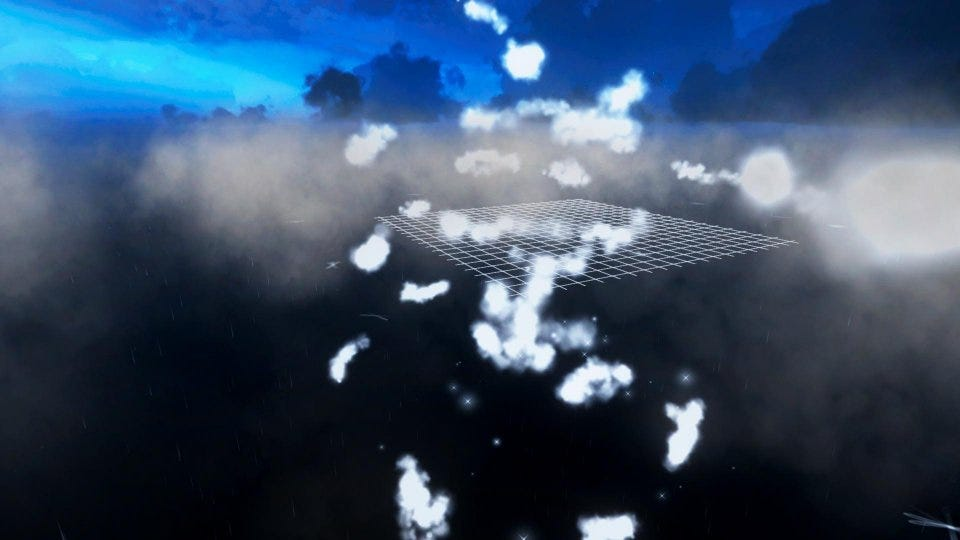
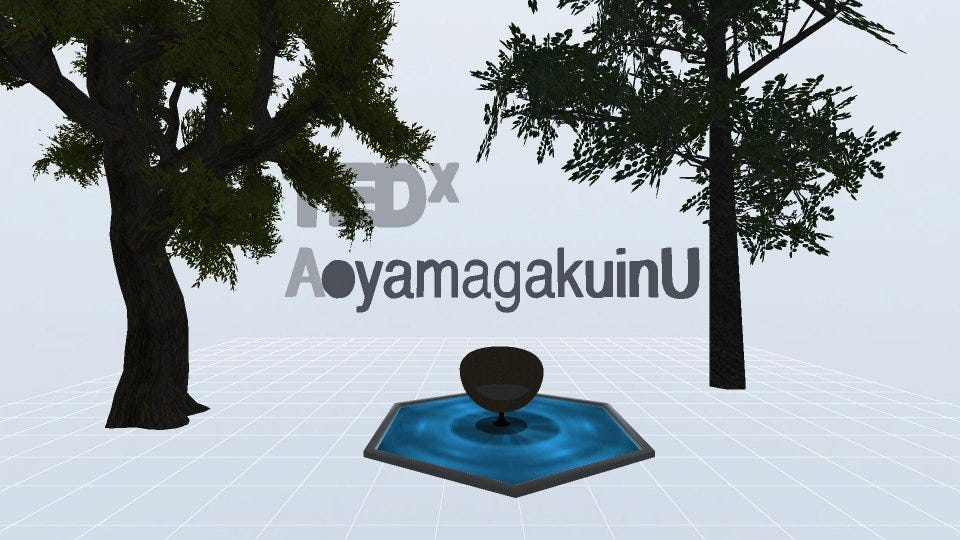
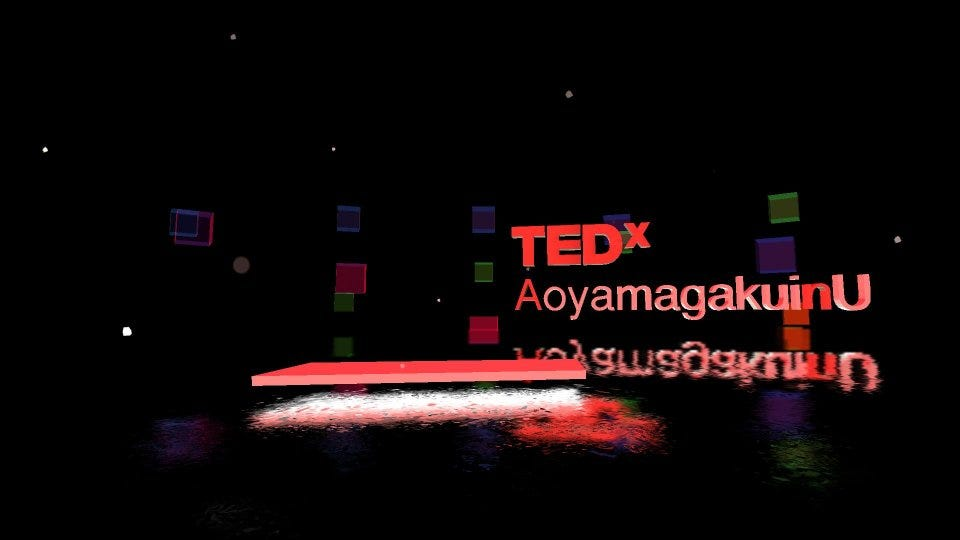
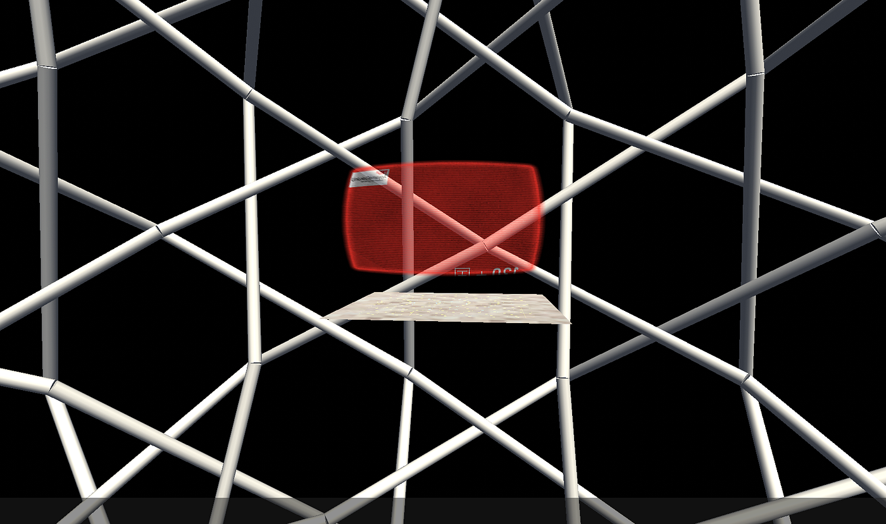
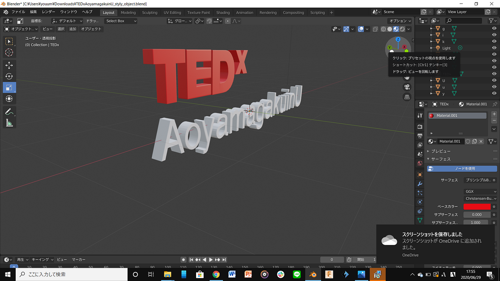
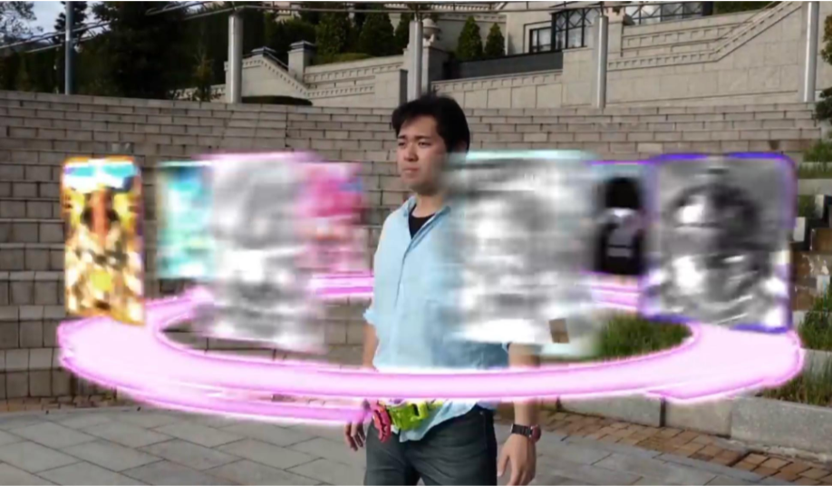
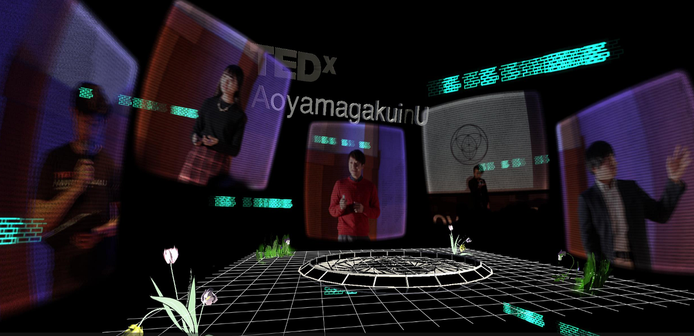
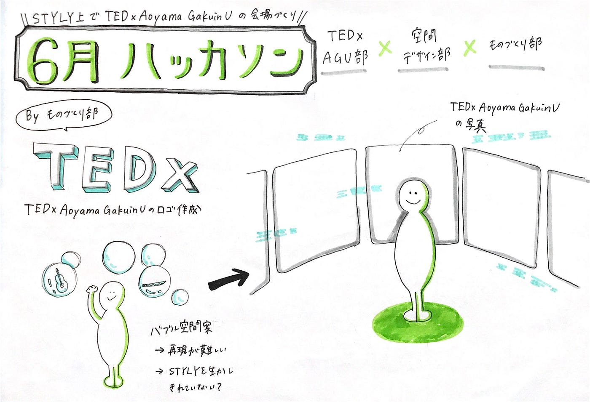

### 空間デザイン×ものづくり STYLYを使って会場をつくるぞ！

6月のハッカソンはTEDx AoyamaGakuinUにむけて、**[STYLY**](https://styly.cc/ja/)を使ってみようということで、空間デザイン部とものづくり部がコラボして、会場作りをしました。

１週間という短い期間でどこまでできるのかわからない中で、作品を紹介すると同時に上手く行った点や困難な点を書いていきます！

### 担当決め

今回は、

ものづくり部が、「TEDx AoyamaGakuinU」の文字をBlenderでつくる。

空間デザイン部が、STYLYで空間をつくる。

という配分でした。
**([Githubレポジトリ](https://github.com/furuhashilab/2020_TEDxdesign/projects/1?add_cards_query=is%3Aopen))**

### 作品集

[https://gallery.styly.cc/scene/2d7854cf-45d9-4d59-a084-58b5f123d805](https://gallery.styly.cc/scene/2d7854cf-45d9-4d59-a084-58b5f123d805)

[https://gallery.styly.cc/scene/b06e2384-6e8a-47ce-8da6-afa904f31af3](https://gallery.styly.cc/scene/b06e2384-6e8a-47ce-8da6-afa904f31af3)

[https://gallery.styly.cc/scene/d0b180b0-4c53-400c-ad36-62933d150862](https://gallery.styly.cc/scene/d0b180b0-4c53-400c-ad36-62933d150862)

[https://gallery.styly.cc/scene/91c5a55b-422a-450e-a6b4-da533fc19765](https://gallery.styly.cc/scene/91c5a55b-422a-450e-a6b4-da533fc19765)

[https://gallery.styly.cc/scene/689de1f3-3769-4994-87b2-596105969567](https://gallery.styly.cc/scene/689de1f3-3769-4994-87b2-596105969567)

TEDx AoyamaGakuinUのロゴ

手順：
ロゴ画像を背景としてセット
↓
長方形を拡大縮小
↓
 押し出し
↓
 面角度調整
↓
押し出し
↓
 ベベル(セグメント: 2、マテリアル: -1)

今回のハッカソンとしてはこんな感じの作品たちが出来上がりました。

TEDxの会場デザインをする上でイメージとして、スピーカーである松永エリック先生にコンセプトである “Rebeat”のイメージを伺いました！

Re=過去
beat=現在
**過去から現在までのストーリーを考えて、新しい未来を作り出すこと。**

過去、現在、未来を意識してどのようなストーリーを作っていくか考えており、このような要素も意識しつつ、今回はまず「作ってみる」を重視しました。

### 作ってみてわかったこと

・初心者でも意外とできてしまう
今回、全員初心者の状態で作りましたが、思ってたよりもクオリティの高い作品ができました。

・デフォルトの素材が多い
簡単にできた理由として大きいのはデフォルトの3Dモデルなどが多いということです。

・自作の3Dモデルをアップロードできるので可能性は無限大
今回もTEDxAoyamaGakuinUのロゴを別で作ったように置きたいオブジェクトを作り簡単にアップロードできる点が使いやすいです。

### 苦労したところ

思っていたよりもできたとは言っても、今回は苦労した点の方が多かったです。

・理想を実現するのが難しい
デフォルトの素材が充実しているのである程度の空間をつくることはできましたが、当初ミーティングで「こんな空間を作りたいね」という話をしていた理想像を実現するのが難しかったです。

当初司会者の周りにスピーカーの映像を配置し、司会者が映像に触れると映像が切り替わるようなことができないか？という案を出しました。

ちょうどわかりやすい映像があり、「[仮面ライダー空間](https://www.youtube.com/watch?v=U2HsJxECJSg)」と呼んでいます。

ですが、実際にやってみると綺麗に映らず、この案は一度止めることになりました。

他にも
・パソコンのスペックによってはオブジェクトをつめすぎると重くなり動かなくなってしまう

・使いたいオブジェクトを探すのが大変

・画像を使って背景にするとズレが生じる

などがありました。

ものづくり部のロゴ作成においての苦労した点は

・文字の角ちょっと丸める。

・Oの真ん中をくり抜く。

・曲線を作る。

また、

・インポート後、STYLYにアップロードした時に、色が変わったり、表示されないなどのバグがありました。

ハッカソンを通して、１週間でここまでできるという驚きの反面、課題が多く、10月のTEDxに向けてより知識をつけていかなければならないです。

STYLYの活用や困った時に相談できるFacebookグループ「[STYLY助け合い所](https://www.facebook.com/groups/stylyusers/?ref=share)」があるのでこちらを活用して勉強していきたいと思います。

### グラレコ

### パワポ
