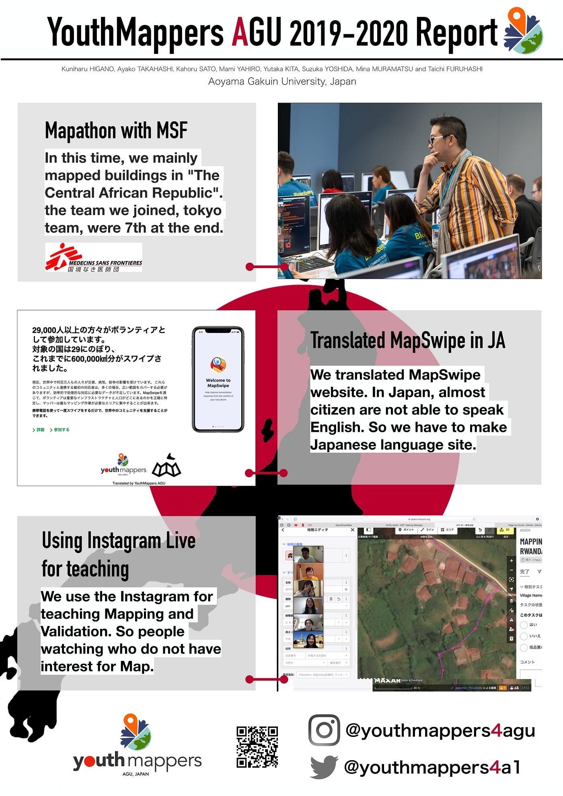
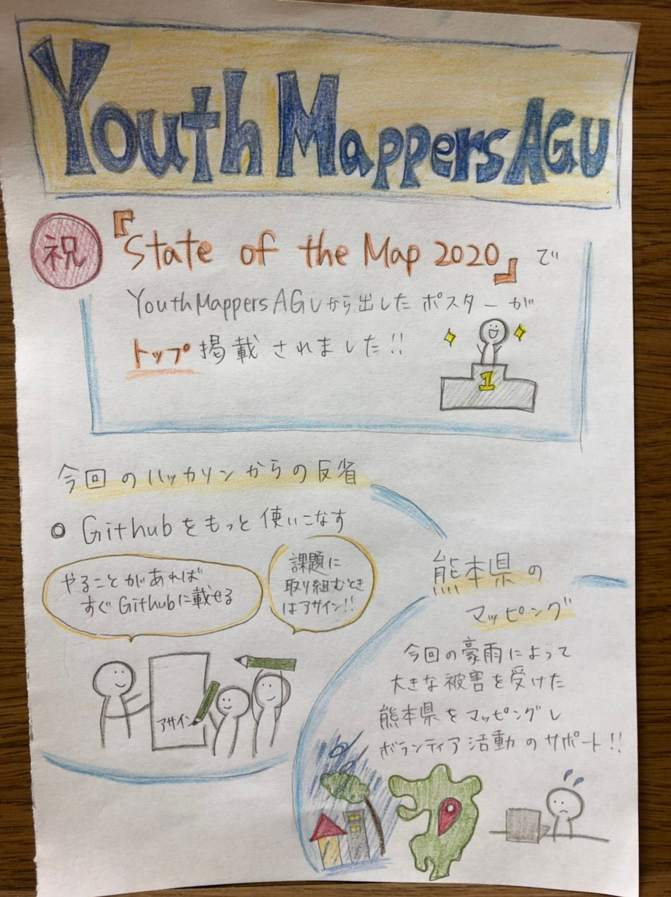

### ポスターセッション トップ掲載！！

先週のハッカソン終了後、YouthMappers部はState of the mapのポスターセッションの締め切りに追われていました。各自がポスターの制作を行いましたが、あまり満足するの物は出来上がらず。最後はリーダーの日向野が頑張りを見せ、なんとかポスターを提出しました。

[State of the Map 2020 - Cape Town
Many followed the call for posters and the results are AMAZING. We thank all participants for the great work. If you…2020.stateofthemap.org](https://2020.stateofthemap.org/posters/)

その結果、なんとState of the mapのポスターセッションでトップ掲載を達成する事ができました！！

### ＃活動報告

今週の活動では、GitHubをもっと有効に活用していくための話し合いを行いました。たとえ小さい事でも積極的にGitHubを活用し、特に、マイルストーンやアサイン、ラベルの機能をもっと使う事で、プロジェクトを円滑に進める事が出来るため、今後はもっとGitHubを理解し、活用していきます。また、コミュニケーションツールはSlackを中心としていく事なども話し合いました。

### ＃今週のグラレコ

