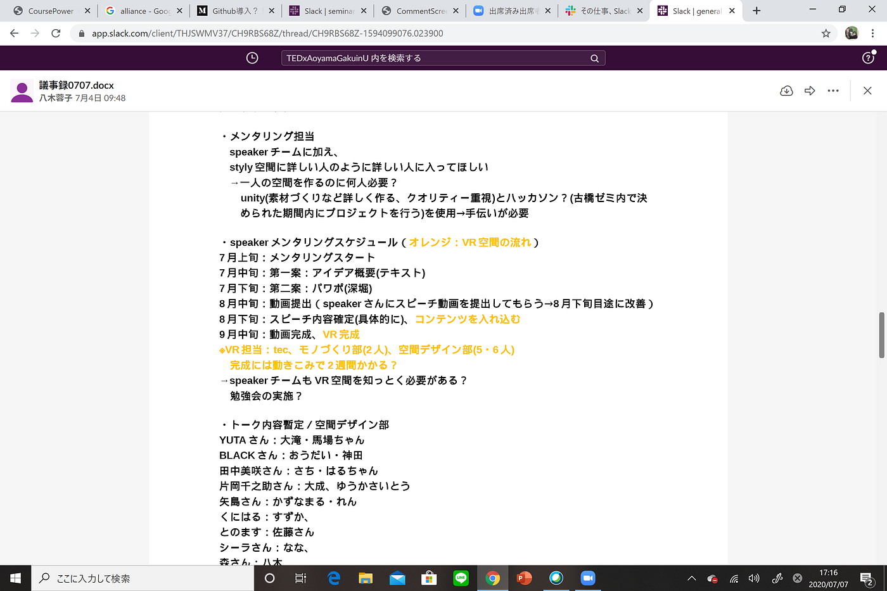
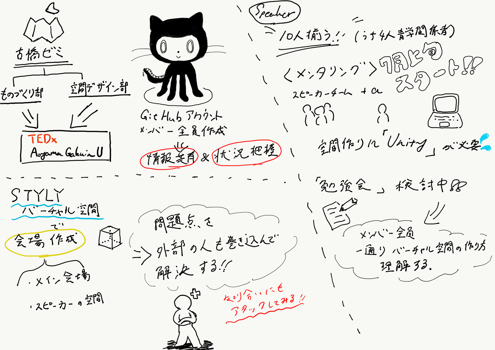

### Github導入？！

先週のハッカソンを終えて、githubのタスク管理機能に魅了されたブル橋研究室メンバー。TEDｘAoyamaGakuinUでもなんとかgithubを用いられないかを含めて話し合いを行いました。

### MTG内容

・空間デザイン部×モノづくり部によるハッカソン成果を発表

・speakerの人数がそろった→今後のメンタリングスケジュールを決める

・github の導入について

### 問題点

・TEDｘAoyamaGakuinUTEDxAoyamaGakuinUメンバーがstyly未経験

→勉強会の実施

・オンライン実施に当たって重さが難点

→経験者やAR,VR技術者などの外部の人も巻き込む

・Githubプルリクエストについて

→古橋先生要相談

> 決定事項

> ・speaker集結にあたってこれからの大まかなスケジュールが決定

> ・メンタリングメンバーの決定

