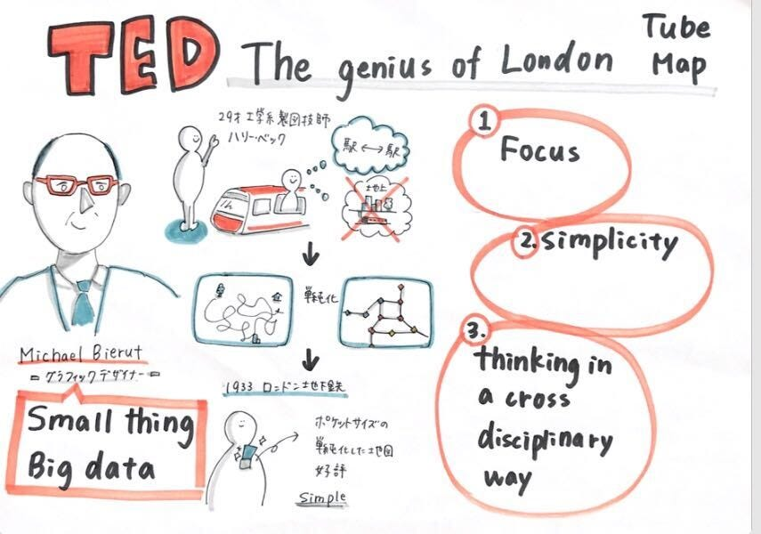
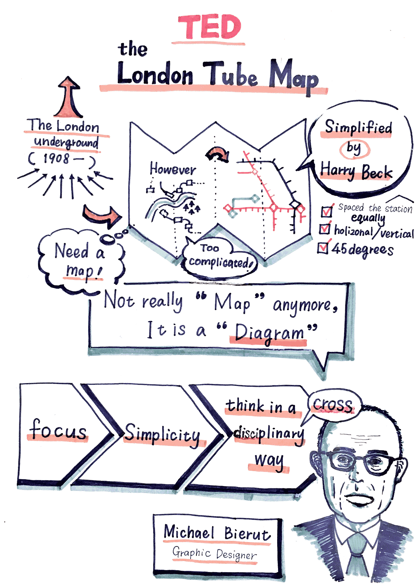
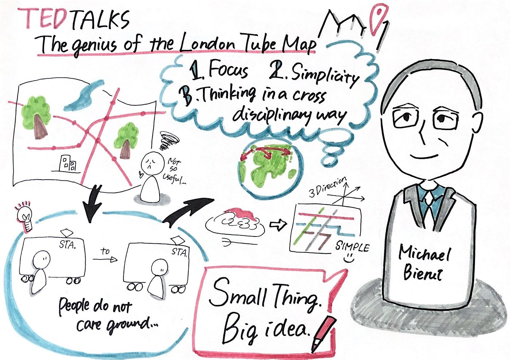
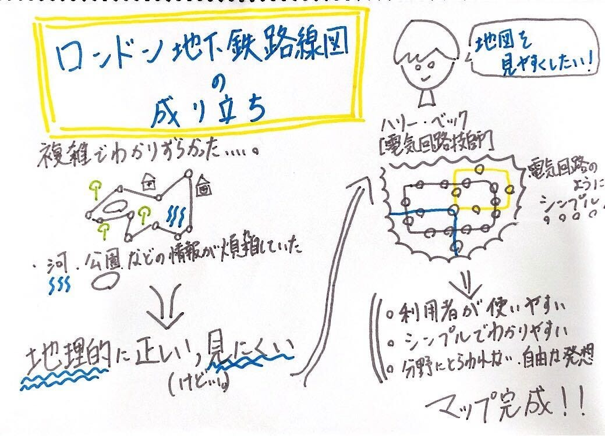
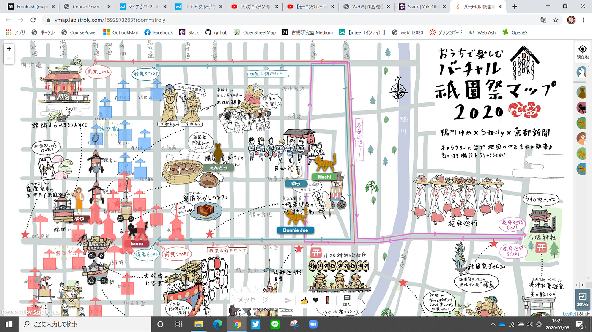
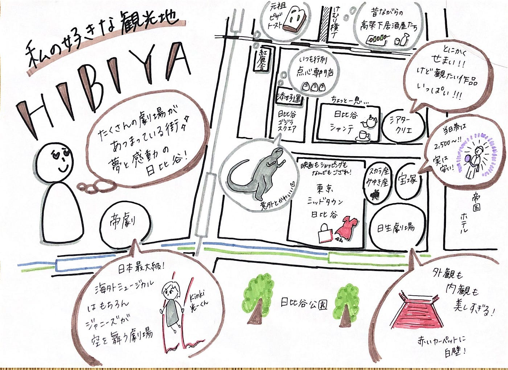

### Map×グラレコ

グラレコ部です！
今週はTEDグラレコとバーチャル祇園祭を紹介します！

#### ## TED 「The Genius of the London Tube Map」

The Genius of the London Tube Map / Michael Bierut

今回のグラレコの題材は、TEDの「The Genius of the London Tube Map」です！
ロンドンの地下鉄マップがどのように生まれたのか、ということをグラフィックデザイナーのMichael Bierutさんが講演しています。

今回のグラレコはそれぞれ前回からの成長がわかりやすい！
矢印を用いて話の流れを見やすくしたり、引き出しでスピーカーのメッセージを強調したり、講演型のグラレコの「これだけは絶対書く」ポイントがそろってきた感じがします。
それぞれのグラレコを比べると、講演のどこをピックアップしているかがそれぞれ違うので、お互いに勉強になります…。

ちなみに、それぞれスピーカーのメッセージや、「地図をシンプルにした」という表現に違いがあって、見比べてみると面白いですね。
私は「複雑な地図」を表現するのにスパゲッティを書きましたが、動画を見るとなぜそれにしたかがわかります…笑

#### ##バーチャル祇園祭

京都新聞が発表した「バーチャル祇園祭」、ご存じですか？
今年の祇園祭がコロナで中止になってしまったので、少しでも祇園祭の雰囲気を味わってもらえたら…と作られたそうです。

[Virtual Kyoto's Gion Festival - Stroly LAB Virtual Map
There is still much to see at the Gion Festival! You will find lots of fun, such as a flower umbrella tour from the…vmap.lab.stroly.com](https://vmap.lab.stroly.com/1592973263?room=stroly)

マップ上に祇園の名所が表示されていて、そこをタップすると紹介文や動画などが見られます。
GPSを使えばその場に自分がいるような感覚、バーチャルマップ機能を使えば自分のアバターを動かすことで疑似祇園祭めぐりができるそうです！

[祇園祭をバーチャル体験 祭の雰囲気を地図上で体感、歴史解説や動画も｜観光｜地域のニュース｜京都新聞
京都新聞は１日、祇園祭に合わせて、山鉾の紹介や写真、動画と地図を組み合わせたスマートフォン向け地図サイトを公開した。新型コロナウイルス感染拡大の影響で、主要行事が中止となった祇園祭の雰囲気を地図上で体感することができる。 ...www.kyoto-np.co.jp](https://www.kyoto-np.co.jp/articles/-/295682)

このバーチャルマップ、イラストは京都在住のイラスト作家鴨川ゆかさんが担当されているのですが、雰囲気があってとてもかわいいですよね。
こういったイラストが入っている地図、時々見かけますが、その街の雰囲気が伝わるというか、味があって素敵だと思います。
調べていたら、こんな記事がありました。

[グラレコの技を使って、地域の魅力を発信する地図を描こう！｜グラグリッド編集部｜note
こんにちは、ナゴヤです。先日新潟で開催された Code for Japan Summit2018にグラレコ隊の一員として参加してきました！ Code for ...note.com](https://note.com/glagrid/n/n1c35dfc641d1)

グラレコ×地図、相性がいいかも…。
そういえば以前、私が書いたマップグラレコがありました。

「私の好きな観光地」というテーマで日比谷を描きました。
劇場メインで描いたので、地図としての機能は果たしていませんが…。

グラレコの議事録以外の活用法、今後も探していきたいです。

青山学院大学 古橋研究室

大岸 裕紀
