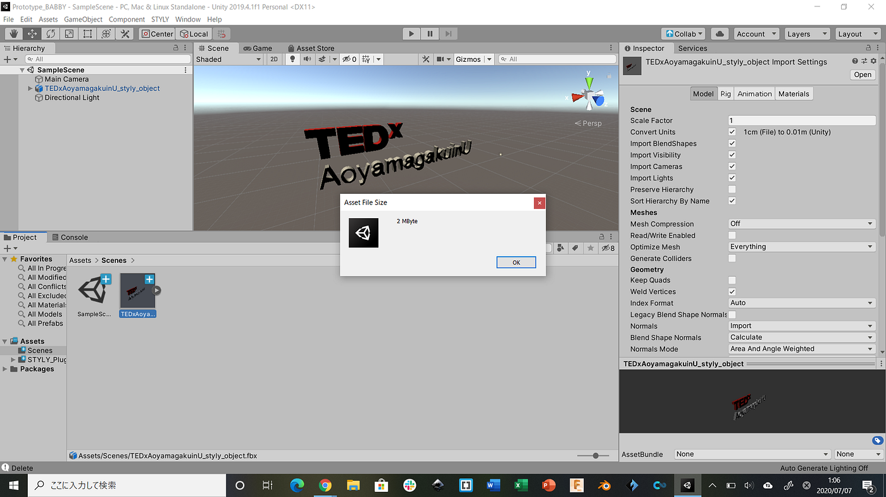
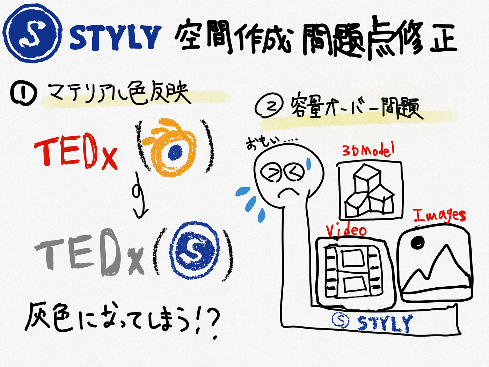

### STYLY会場作成 、問題浮上。

今回は、以前から活動を続けているTEDxAoyamaGakuinUでのSTYLYを使ったバーチャル空間の製作で挙がった問題点の内、ものづくり部が担当している２つを取り上げ、改善方法を探してみた。

#### ＜TEDxAoyamaGakuinUの3Dマテリアルの色が反映されない＞

以前のハッカソンでも問題提示したのだが、Blenderで作成したロゴの3Dマテリアルで色を添付したのだが、これをSTYLYにエクスポートした際に色が抜けてしまうという問題が挙がってしまっている。

[STYLY助け合い所
STYLY助け合い所 has 506 members. STYLYの活用事例や使い方を共有し合うコミュニティです https://styly.cc/ja/ 英語版のコミュニティーはこちら…www.facebook.com](https://www.facebook.com/groups/stylyusers)

Facebookの「STYLY助け合い所」に質問を投げかけ、解決策を練った。

「ファイルによってはサーバー側でうまく変換できないものがございます。」という返答があり、検証してみるのでSTYLYのメールアドレスに作成したファイルを送るよう要請があったので、送ってみた。

現在はメールの返信待ちである。

代替策としては、空間上でライトを照らす事によって色が付いているように見せるという事が挙げられる。

#### ＜STYLY空間の容量を削減する方法＞

STYLY空間では決められた容量の中でマテリアルや画像、映像などを入れる事が出来るのだが、自分たちがやりたいような会場空間のデザインを全て再現すると容量がオーバーしてしまう問題があった。

この問題を解決する為に、Facebookの「STYLY助け合い所」でコメントしてみたところ、「ブラウザに割り当てることのできるメモリ上限の関係上、利用できる容量の増加を行うことができません。」ということだったので、_**[「サイズ容量が大きいアセットを縮小してSTYLYにアップロードする方法」_**](https://styly.cc/ja/tips/filesize-reduction/?fbclid=IwAR1J93iETJdix8hSz1uI1YexOYljLBdRtvTX42pHEhS4H7XrZ3D-D9gXFRI)を参考にUnityでファイルサイズの確認した。

[容量の大きいアセットを縮小してSTYLYにアップロードする方法 | STYLY
本記事では、アセットが容量過多でSTYLYにアップロードできない場合に、アセットのファイルサイズを縮小してからSTYLYにアップロードする方法を紹介します。…styly.cc](https://styly.cc/ja/tips/filesize-reduction/?fbclid=IwAR1J93iETJdix8hSz1uI1YexOYljLBdRtvTX42pHEhS4H7XrZ3D-D9gXFRI)

ロゴのマテリアルのサイズは２MByteしかなく、容量問題にはあまり関与しているようには思えなかった。

今回の調べで分かった事としては…

**＜STYLY空間での容量を削減するには＞**
**・出来るだけデフォルトのものを使わない。**
**・自分たちで作った方が容量のサイズを抑えられる可能性あり。**（やりようによっては、テクスチャの調整だったりでファイルサイズを小さく出来る。）
**・差し込む画像も荒くする事でファイルサイズが小さく出来るかも。**

であった。未だこの解決策は実行に移せていないが、これから進めていこうと思っている。

ちなみに、

STYLYにアップロードする前提でUnityを使うならば、Unityをただダウンロードして使うだけじゃなくて、
**[STYLY plugin for Unity]**もダウンロードしないと使えない。
_**[「UnityからSTYLYにプレハブをアップロードする方法」_**](https://styly.cc/ja/manual/unity-asset-uploader/)
このページを参照。

[UnityからSTYLYにプレハブをアップロードする方法 | STYLY
本記事では、Unityで作成したプレハブをSTYLY上で使用するための方法をご紹介します。 STYLYでは、3DModel、Particle system（Shuriken）、Light、UI要素、Shader（Amplifed…styly.cc](https://styly.cc/ja/manual/unity-asset-uploader/)

#### ＜グラレコ＞

**＜GitHub Project＞**

[furuhashilab/2020_TEDxdesign
TEDxAoyamaGakuinUの会場設計 ものづくり部 × 空間デザイン部 Yousuke Kanda Tatsumi Baba Atsuko Wakamatsu Yuka Saito Ren Aoki Haru MIzutani…github.com](https://github.com/furuhashilab/2020_TEDxdesign)
