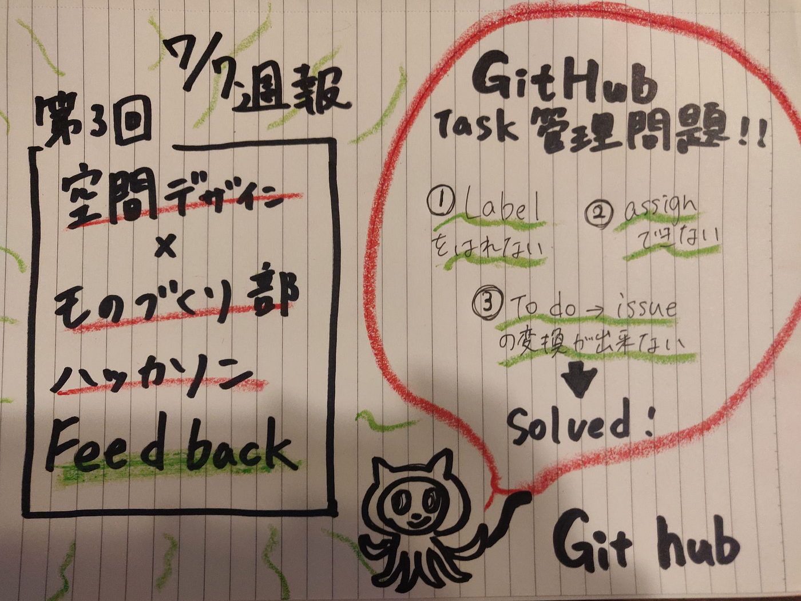

### ハッカソンFeedback

空間デザイン部の週報は一周分週報投稿がずれているため前回行ったハッカソンのFeedbackをまとめていきたいと思います。

今回一番の反省ポイントは古橋先生からご指摘いただいた通りタスク管理問題

#### Githubにおいてのタスク管理

です。今回のハッカソンではものづくり部と共同で行っていたためタスクの量も多く明確に分離されているのにも関わらずgithubを使いこなせていませんでした。

メンバー自身も詳しく理解できていなく放置してしまっていたことは古橋ゼミとしてあってはならぬ状況でした。反省、、、

> 具体的に私たちができていなかった操作としては

> ①labelを貼れてない

> ②assignできてない

> ③to do→issuesの変換ができてない

の三つでこれはハッカソン後に各メンバーでクリアしました。

反省と同時にgithubのタスク管理機能の便利さも実感し今後も活用していこうと思います。

