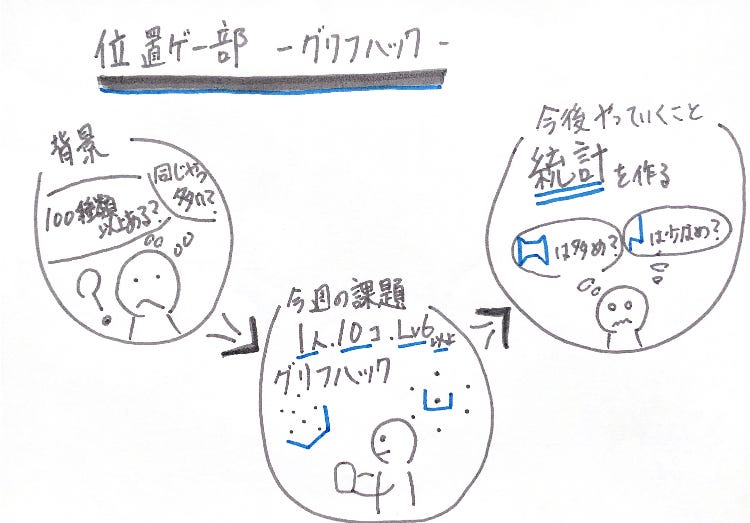
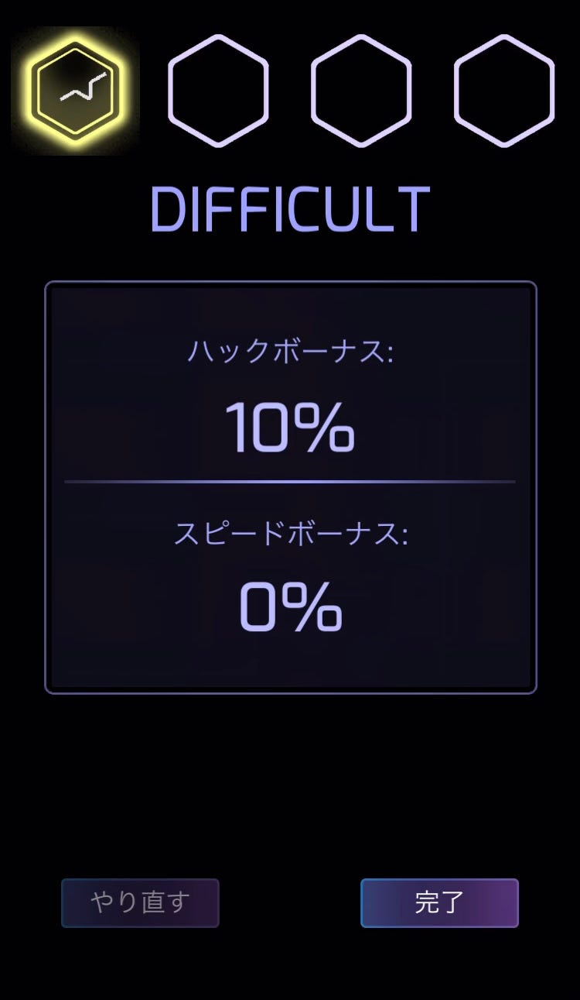

### 位置ゲー部 週報

こんにちは！ 位置ゲー部 平澤彰悟です！
今週位置ゲー部ではIngressのグリフハックについての調査を行いました！

Ingressのグリフハックってなに？って方はこれを参考にしてみてください
[ここをクリック](https://news.mynavi.jp/article/20150606-ingress/)

なんで、この内容で調査しようと考えたかというと、

> 100種類あるって言われる割には同じやつばっかでてこない？？

やってみたことある人なら、あるあるだと思うのですが、
これ前にも見たー！ってやつ結構出てくると思うんです！

これを確かめるために、班員一人につき、Lv.6のポータルを10個以上フリフハックするというのを今週の課題として、やってきました！

Lv.6のグリフハックは難しい….。ってことでせいぜい1つ、2つくらいしか覚えられませんでした泣

ネットで検索してみると、グリフハックのチートシートがありました！
今後、グリフハックの参考になるかもしれません！

[グリフ暗記用チートシート
Edit descriptionculage.github.io](https://culage.github.io/IngressInfo/glyph.html)

ネットで調べても、どのグリフが出やすいのか（統計的なもの）はなかったので、今回位置ゲー部として集めたもの、今後集めていくのを参考に統計を出していければ面白いかもしれません！
