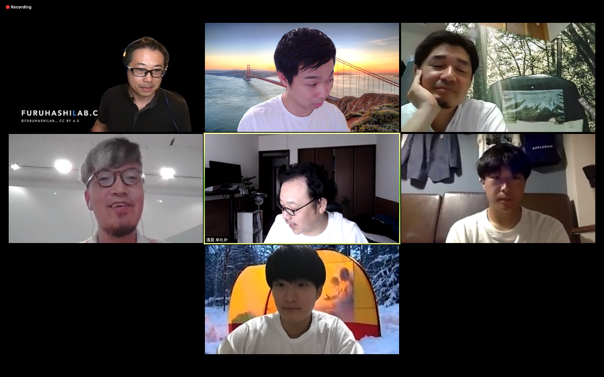
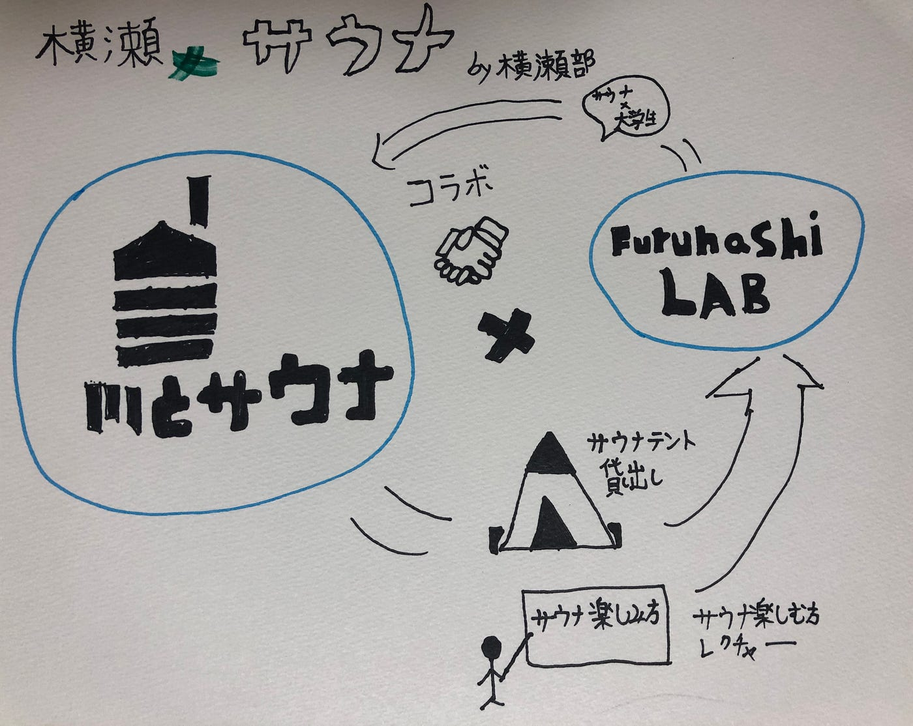

### 横瀬xサウナ週報

こんにちは！古橋研究室横瀬部4年のイジユルです。先週は横瀬xサウナのイベントでサ飯を企画であるホルモンカレーを紹介致しました。

そして、今週は実際に横瀬xサウナをクオリティー高く実現させる為に7月6日（月）16：00から「川とサウナ」チーム4名の方と古橋研究室の学生がZoomを利用した会議を行いました。

会議で決まった内容はこちらでこざいます。

**一つ目は「川とサウナ」チームから横瀬合宿際に企画参加できると言う事で「川とサウナ」チームと一緒に横瀬合宿の際コラボする事ができました。仮「川とサウナと古橋研究室（大学生）」などの名前でイベントを行う予定です。また、せっかく大学が沢山参加するイベントである為、その利点を生かした大学生ならではサウナの我々横瀬部の学生からアイデアを出して企画して行きたいと思います。**

**二つ目8月21日（金）夕方から「川とサウナ」チームからテントサウナの楽しみ方レクチャーをさせて頂く事ができましたので、プローのサウナーから色んな情報を教えて頂き、質高い横瀬xサウナを実現できると思います。**

**三つ目「川とサウナ」チームからテントサウナを借りて頂く事が出来たので、合宿の当日古橋研究室の「MORZH SKY」と「川とサウナ」のテント二つを併設してイベントを行う予定です。**

その意外にも川でサウナを楽しむ為に必要な情報（サ飯、サ酒など）を共有させていただいたので、それらも横瀬部からアイデアを精錬させて、形に作って行きたいと思います。

後１ヶ月と少し残った期間でできる限り、クオリティーを高めて、古橋研究室の名物に出来ように頑張ります。

