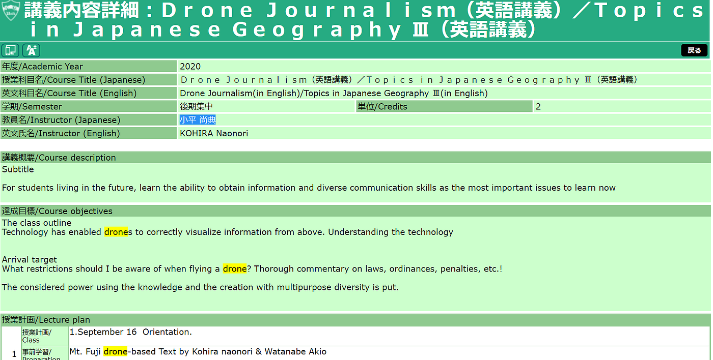
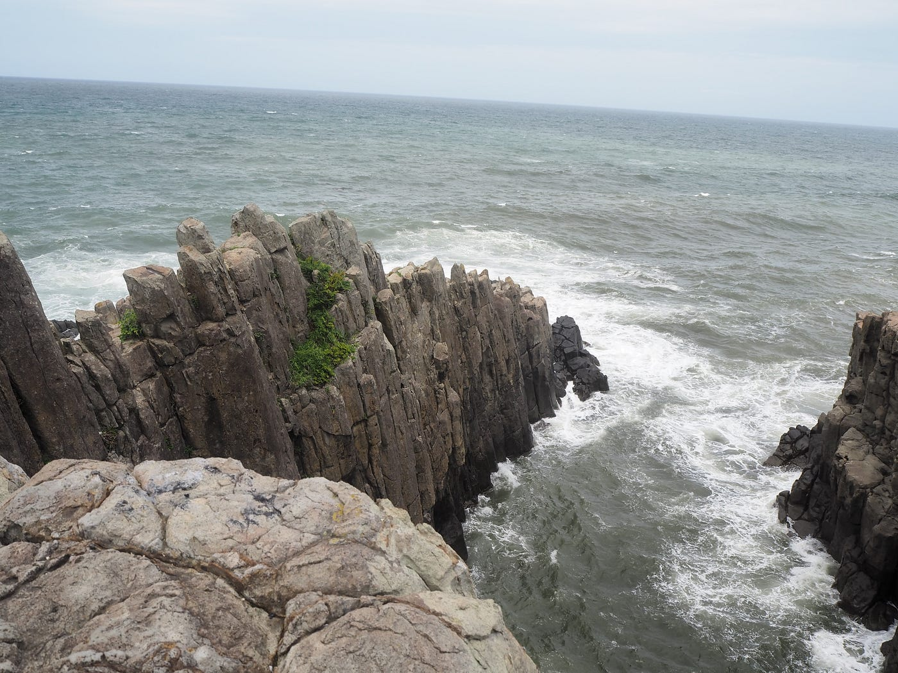
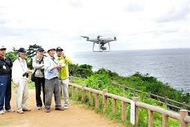
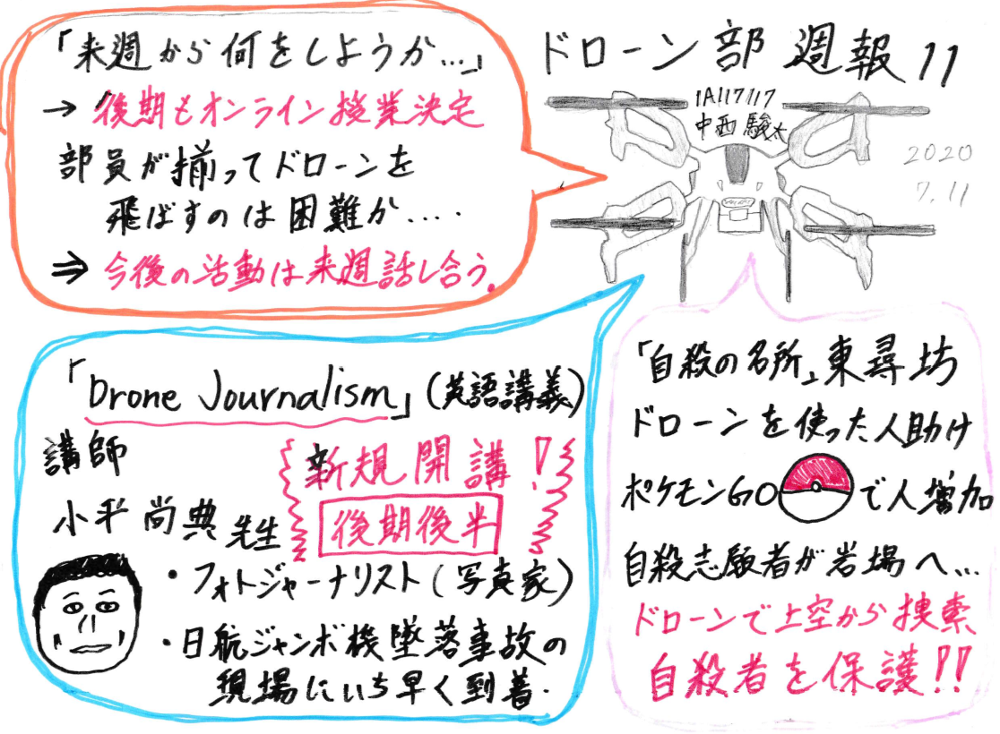

### Dead or Drone

#### ドローン部週報 第１１週目

こんにちは、古橋研究室４年の中西駿太です。
オンラインハッカソンも無事終了し、さあーいよいよドローンを飛ばすぞ！、と言いたいところですが、新型コロナウイルスの感染状況はなかなか落ち着く気配なし…
後期もオンライン授業が決まり、今後何を目標に活動していけばいいのか先が見通せない状況です。
部員と共にドローンを飛ばせる日はまだまだ先になりそうです。

#### **＃活動報告（ミーティング内容）**

ドローン部mtg#10

7月7日 18:35~18:55

欠席者：上田、佐野、伊藤、野崎

#### 議題「来週から何をしたいか」について

#### 議論内容

- ドローンバード訓練（高田橋）実施及び参加について

- STMの印刷がうまくいかなかった（神田くん）→Githubのissue案件へ

- 今後のコロナウイルス感染状況を鑑みて、ドローン部の活動をどうするか決めていきたい。

#### 話し合われた内容・今後について

- ハッカソン6/23~6/30が無事終了。各チーム、各メンバーお疲れ様でした。よく頑張りました！
→さあ、何やろうか…これから決めていこう（新たな目標が見いだせない。）

・新型コロナウイルス感染症の状況をみて今後の活動方針を決定していく_→**NEW 後期もオンライン授業決定_**

- 欠席者多数の為、来週のMTGで詳細を決定

#### ＃ドローンニュース

> **・地球社会共生学部 専門科目「Drone journalism」が後期後半に開講！
・自殺防止にドローン活用！**

#### 地球社会共生学部 専門科目[「Drone journalism」](https://aguinfo.jm.aoyama.ac.jp/kouginaiyou/shousai.ashx?YR=2020&FN=4611A10-0343&KW=drone&BQ=3f5e5d46524048535c48584c495933294f4e5745515b42564a5e4f5659534a22067e7d756d6071747c687e6e6b68606a6270667c660802750a7a0a7d7a04187d157c001675630d10752d3824222868041d6c74181d6870101a6818046c6078182b235f4520295b0d094f091f005d5e4a424531233c4453454c1b0e153718100ce1eaf7bea1c0b0a2c9bdafb2cfa8cbb8b5d3a6b6d5a7b3a5decafffaeefef6b9f3f59f85f4e29b81f8ea978dfce493)（英語講義）が後期後半に新規開講！

**講師：[小平 尚典](http://nkohira.shopdb.jp/index.html)先生（フォトジャーナリスト）**

・講義の概要（翻訳）

未来を生きる学生のために、今学ぶべき最も重要な問題として、情報を取得する能力と多様なコミュニケーションスキルを学びます。

・達成目標/目的

テクノロジーにより、ドローンが上からの情報を正しく視覚化できるようになりました。その技術を理解しましょう。

・到達目標

ドローンを飛行するときに注意すべき制限は何ですか？法律・条例・罰則等々を徹底解説！知識と多目的多様性のある創造に富んだ力を身につけましょう。

・成績評価方法

レポート（100％）

（後期も原則オンライン授業になったのでこの授業もWebexで行われる模様。）

#### 自殺予防にドローン活用 （[福井・東尋坊のNPOの取り組み](https://www.juraca.jp/article/555/)）

#### ～ドローンを使った人助け ポケモンGOが関係！？～

約１kmにもなる海食景観断崖に日本海の荒波が激しく打ち付ける日本屈指の景勝地「東尋坊」（福井県 坂井市）

有名な観光地と知られている一方で、山梨県にある青木ヶ原樹海と同様「自殺の名所」として知られています。崖から海面まではおよそ２３ｍ。ここで自殺を図ったうち成功するのは70%ほど。（自殺成功率70％）
毎年約24人、１か月に約2人がこの地で命を落としています。
最近は「ポケモンGO」のプレーヤーであふれかえり、月の自殺者が0人になるなど、訪問者の増加が影響したのか自殺者は減少傾向となっています。（ポケモンGOが関係しているかは不明）

自殺の名所と言われる場所だからこそ、聖書や10円玉が積まれた電話ボックス「救いの電話」という場所があったりと、少しでも自殺を思いとどまらせようと工夫をしています。

そのひとつとして「東尋坊」で自殺予防に取り組むNPO法人「心に響く文集・編集局」がドローンを飛ばして自殺者を発見し、自殺行為を阻止する取り組みを導入しました。

導入のきっかけとなったのは、実はこれも「ポケモンGO」が原因。珍しいキャラクターが多く出現する「聖地」として観光客が増え、自殺を考えている人が目立たない岩場に移動してしまうようになったのです。
以前は主に双眼鏡を使い徒歩でパトロールを行っていたのですが、「岩陰に隠れている人も発見したい」とドローンを購入したそうです。

実際に長時間崖の上から海をのぞき込むなど自殺者特有の行動をする10代の女性を、ドローンを使い上空から確認、保護したという実績もあります。

ドローンを使った人助けが様々な形で広まるといいですね。少しでも自殺者が減りますように－

### ＃今週のグラレコ

以上

1A117117 中西駿太

・参考文献・資料

東尋坊の自殺を防ぐためのドローン導入 地元のNPO | ドローンニュース [https://drone-school-navi.com/dronenews_column/column/n20170528/](https://drone-school-navi.com/dronenews_column/column/n20170528/)

自殺予防にドローン活用 福井・東尋坊のNPO :日本経済新聞[https://www.nikkei.com/article/DGXLASDG08H1X_Y7A900C1000000/](https://www.nikkei.com/article/DGXLASDG08H1X_Y7A900C1000000/)
