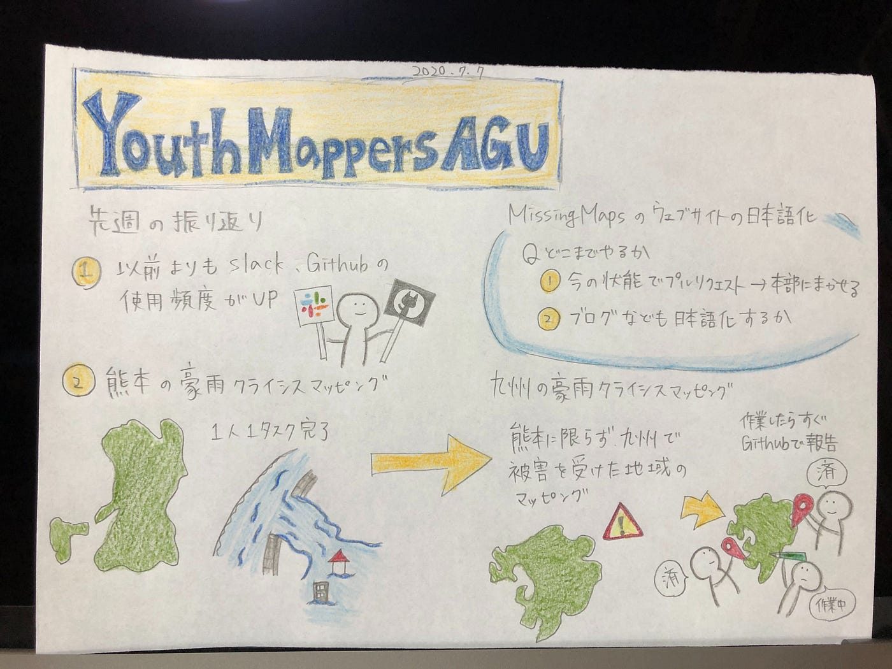
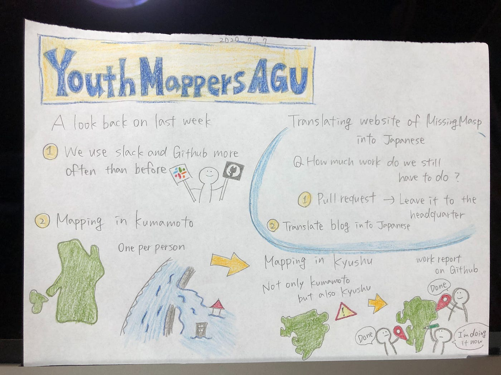

### 九州の豪雨被害のクライシスマッピング

こんにちは！3年の佐藤です。
梅雨の時期は洗濯物が外に干せず、部屋干しだと乾かなくて乾燥機をつけると電気代が怖い！！
早く晴れが続くといいですね🌞

それでは内容に移ります。

> **1. 先週の活動の振り返り**

・連絡手段の確認：スラックの使用頻度が上がった。
・[熊本の豪雨のクライシスマッピング](https://tasks.hotosm.org/projects/9023)：皆最低1タスク行った。
・マッパソン：SIVAの１年生が３人国際部門に入ったことで、マッパソンの人数も決まり、日程調整の段階に。７月中が望ましい。

> **2. missingmapsのウェブサイトについて**

言語化がほぼ終わった為、[MissingMaps](https://www.missingmaps.org)にプルリクエストを送る段階に入りました。

#### 議題：MissingMapsのウェブサイトの日本語化をどこまでやるか

①今の状態で、プルリクエストを送り、あとは本部に任せる。
②ブログなども日本語化し、今後定期的にブログの日本語化を行うことに
 する。
→➖他の言語には翻訳されていないから、日本語だけ作るのは変？
→➖今後も続けられるか？
→➖他にやるべきことがあるのでは？
→➕月１でできるならやってみるべき。
→➕お試しで２ヶ月やってみて決めればいい。

肯定的な意見と否定的な意見があり、引き続き検討していきます。

> **3. [Instagram](https://www.instagram.com/youthmappers4agu/)について**

今後は一人一個投稿内容を提供（日向野のマッピング説明動画など）（八尋はグラレコでOK)→文章ではなくインスタに投稿できる画像か動画を提出することを決定しました。

> **4. 今週の活動**

・九州の豪雨被害（熊本に限らず）のクライシスマッピング：githubの[issue](https://github.com/furuhashilab/youthmappers4agu/issues/43#issue-652259593)に報告していきます。
⚠︎量より質を！ノルマタスク数は決めず、大体建物2000件を目指す。

・インスタの投稿：吉田

### ※GitHubを積極的に使う事

今回のグラレコです。

