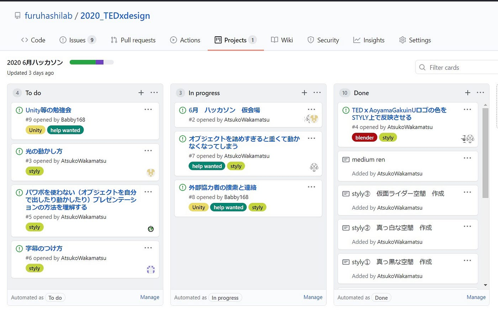
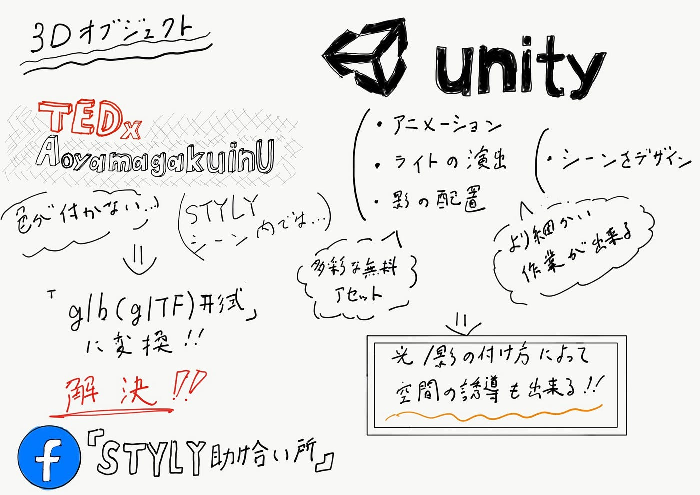

### オブジェクト色が反映されない問題解決！！

前回に引き続き空間デザイン部と共同で進めているSTYLY空間作成に関する課題解決プロジェクトに取り組みました。

まずは前回STYLY助け合い所に質問していたブレンダーで作成したTEDxaoyamagakuinUのロゴがSTYLY上で色が反映されない問題ですが回答を頂きました！

#### glb(gITF)形式でエクスポート

Blenderからエクスポートする際のファイル形式としてglbという形式を用いると反映されました。この形式は最近blenderでもサポートされたようです。glbは効率的で相互運用可能なアセット配布用フォーマットを意図しているらしく、外部データをSTYLYにエクスポートする際問題が起こったらこの形式を積極的に試してみるといいかもしれません。

またGitHubプロジェクトの活用も進んでおり、順次新たな課題に取り組みながら進捗を確認していきます！

#### Unityについて

STYLY上で空間を作る際にBlenderからインポートするだけでなくUnityで作成したアセットを利用できないか検討しています。

Unityの主な特徴は

> アニメーションを加えられる

> ライトの演出を作る

> 影を出す　影の形、場所を作り出す

> シーンを作れる

STYLYでもこれらと同じような作業を行えますがUnityではより細かい作業が行うことができます。

- 多くのアセットを無料で取り入れる事が出来る

- シーン全体のデザインをSTYLYより細かく出来る　などなど

空間作成初心者である我々にっとってSTYLY Studio やblenderをいじるよりもハードルが高く思えますが少しずつ触れながら勉強してうまくいけば導入を目指したいと思っています。

#### 〈参考〉

> ３Dモデルの魅力を引き出す配色とデザイン

> [https://styly.cc/ja/tips/colordesign_machio_3dmodel/](https://styly.cc/ja/tips/colordesign_machio_3dmodel/)

> おすすめアセット

> [tyly.cc/ja/tips/colordesign_machio_3dmodel/https://styly](tyly.cc/ja/tips/colordesign_machio_3dmodel/https://styly)

> パーティクル

> [https://styly.cc/ja/tips/unity_fireworks01/](https://styly.cc/ja/tips/unity_fireworks01/)

> ライトを使った演出の作り方

> [https://styly.cc/ja/tips/lightshadow_discont_light/#Unity](https://styly.cc/ja/tips/lightshadow_discont_light/#Unity)

> 光を使ったユーザ行動を誘導するデザイン

> [https://styly.cc/ja/tips/colorinduction_machio_light/](https://styly.cc/ja/tips/colorinduction_machio_light/)

#### グラレコ

