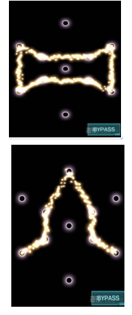
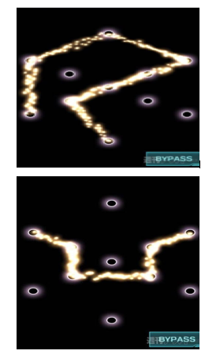
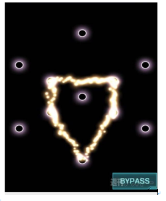
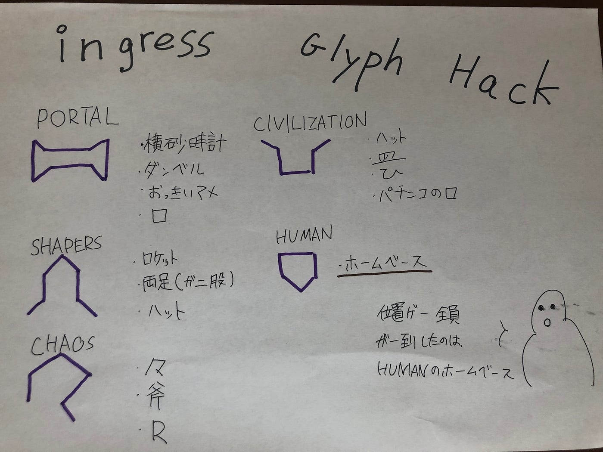

### グリフハック名前をつける！

位置ゲー部週報です。

今回は前回同様、イングレスでのグリハックについてです！前回、問題点であったグリフハックが覚えられないことを解決するための一手段のため試しにランダムで５つ自分たちで名付けてみました

PORTAL

#### 横砂時計、ダンベル、おっきいアメ、口

SHAPERS

#### ロケット、両足（ガニ股）、ハット

CHAOS

#### 々、斧、R

CIVILIZATION

#### ハット、皿、ひ、パチンコの口のところ

HUMAN

#### ホームベース

昔の人が、星座に名前をつけていた気持ちがわかりますね！位置ゲー部が全員揃ったのは、１番下のホームベースで、その他は自分の色がでますね！

例えば、２番目と４番目のchaosとcivilizationは、ハットで被っていますし、ハットが二つあることになってしまいます。また、civilizationの配置を逆にした、natureもハットに見えてしまう可能性もありますので、注意が必要です。

#### 話し合った感じ、、、

なかなかこれといったものが見つからない

[暗記用チートシート](https://culage.github.io/IngressInfo/glyph.html)での関連語やその他などの、名前をつけるのが難しいそれといった形がないものをどうやって覚えていくかが問題

グラレコ

