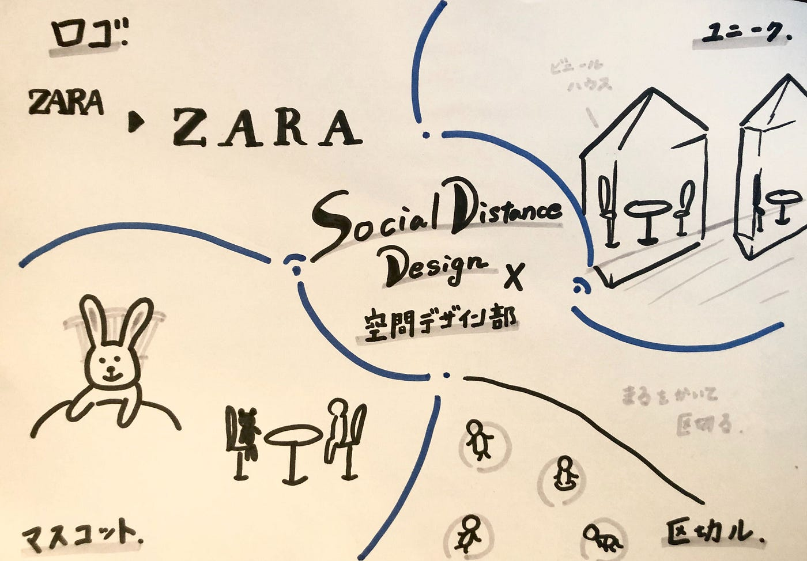

### コロナ禍のデザイン

今週はコロナウイルスによって生まれたデザインを空間デザイン部で各自調べてみようということになり、ソーシャルディスタンスのためのデザインを調べてみました！

TEDxのオフライン開催も可能性はあるのでその参考にしていけたらいいなと思います！

> コロナ禍におけるデザイン

ロゴのデザインは話題になりましたね！

各企業から距離を取ろうというメッセージが伝わってきます！

マネキンを使うことで人のように見えるので賑わっているように感じることができ、さらにお店に入ってきやすい効果もあるそうです!

ぬいぐるみやマスコット置いてあると可愛くて癒されそうですね＾＾

人は区切られている空間に入りたくなる習性があるらしく、白線の円の中に自然と人が入っていくのであまり意識しないでソーシャルディスタンスをとることができるそうです！

コインはその場に立つと音がなるような仕組みになっていて、楽しさがあります＾＾

こちらもぬいぐるみを使ったソーシャルディスタンスのためのデザイン！

日本だけでなく、タイでも行っているよう！

既にあるものの中にソーシャルディスタンスのためのデザインを組み込んでいくのではなくて、最初からそうなるようにデザインされた例ですね！

開放的かつプライベートな空間が守られるのは嬉しい！これなら行ってみたいです！

### ソーシャルディスタンスをネガティブに捉えるのではなく、ポジティブに捉えることで多くのデザインが生まれていきそうです！！

今回調べた例からtedxのオフライン開催時に使えるヒントを得られました！

また新型コロナをポジティブに捉えることで見方、考え方は大きく変わっていくのだろうと思います、、！

> 今週話し合ったTEDxAGUについて

・TEDxの会場は前回のハッカソンで作った１ステージで行うのか、プレゼンターごとに会場作成を行うのか

・オフラインorオンライン？

・メンタリングに空間デザイン部も加わる？

> グラレコ

