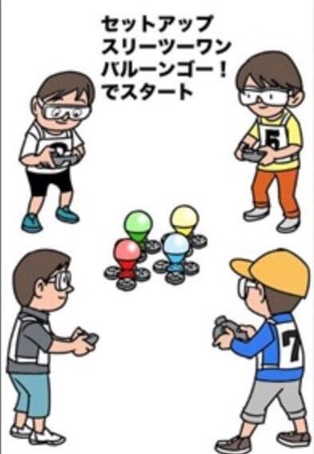
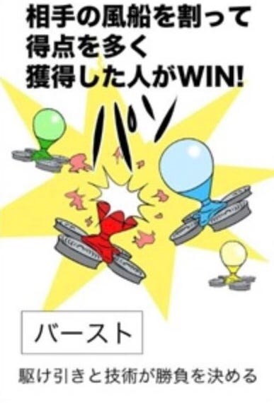
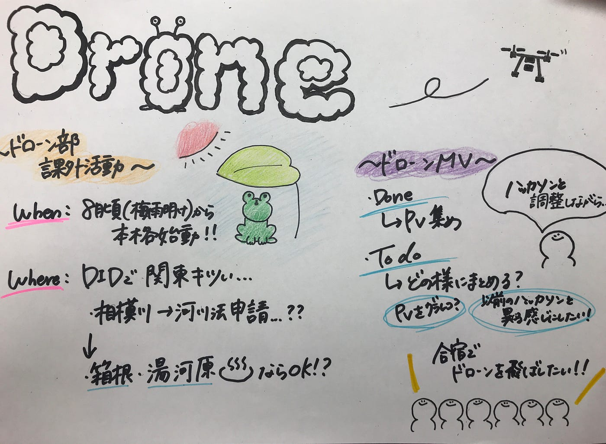

ドローン部週報⑫

こんにちは！4年のこやももはです！

今回ドローン部では、

「ドローン部課外活動」

「ドローンMV」

この２つについて話し合いました！

- ドローン部課外活動

梅雨が明けない限り外での練習は厳しい、、

ということで、

ドローン部全体での練習は、

#### 8月

ぐらいから本格的に始動していきたいと思ってます！

そして、関東圏で飛ばせるところを調べてみると、

### 箱根と湯河原

ならギリギリOKだったので、そこら辺で練習することになりそう？です！

- ドローンMV

PV集めが終わったので、、

> To do

集めたPVをどのようにまとめるかを話し合う

以前ハッカソンで行っていたPV手法まとめとは異なる形にしたいと思ってます！

ただ7月のハッカソンと調整しながら進めて行きたいとおもってます。

そして、最後にドローン部で

もし合宿に行けたら💭

ドローンを飛ばしたい！！！ということを話しました！

そして今回の週報では、、

バルーンバスターズについて書きたいと思います！

[バルーンバスターズ](https://balloonbusters.tokyo/)とは、、

[鹿股幸男](https://twitter.com/kanomatayukio)氏が考えたもので、

風船が装着されたドローンを複数人で飛ばし、対戦相手の風船を割るというバトルゲームです。

自粛期間中ではないけれど、なかなか外に出れない今、ドローン部でも家の中でドローンを飛ばしたい！という声が上がっていました。

ただドローンレースだと、

場所やスキル等が必要になってきてしまい、なかなかやりたくてもやれないと思います！

しかし！！このバルーンバスターズなら！

[そこまで広いスペース](https://www.youtube.com/watch?v=shYtiGoYroY)を必要としなさそう！（リビングで充分？）スキルがなくても誰でもできる！

のでおうちでドローンを使ったチャンバラが楽しめます！

そして、このゲーム考案者の鹿股氏によると、

「バルーンバスターズによりコミュニケーションが活性化し自主性や創造性を育むことができる」と語っており、

子供向けの施設にアピールしていきたいと語っています。

それ以外にも、企業のコミュニケーションツールや高齢者施設におけるメンタルヘルスの向上ツールとしてもアピールしていきたい考えだそうです。

また、このバルーンバスターズ、多くのエンターテインメント関係者も注目しており、

2019年7月に開催されたライブエンターテインメントサミット「[DAWN 2019](https://asobuild.com/dawn2019/)」でグランプリを獲得したそうです！

ドローンという最先端ツール×アナログの組み合わせがとても面白いなと思いました！

また、意外に風船を割るためには、操縦がしっかりできないと難しそうなので、ドローンの練習にもなり一石二鳥にもなりそうだな！と個人的に思いました！

今回の週報のグラレコです。

